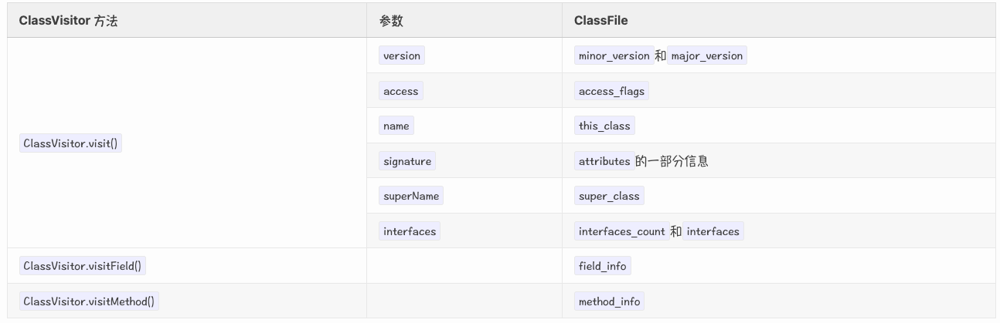
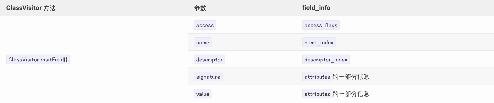
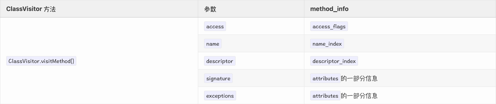

# ASM

> 作为博客：`https://lsieun.github.io/java/asm/` 的备份，防止博客没了，做了一丢丢改动

## 基本原理

ASM 处理字节码（ByteCode）数据的思路是这样的：

- 第一步，将 `.class` 文件拆分成多个部分；——decomposing
- 第二步，对某一个部分的信息进行修改；——modifying
- 第三步，将多个部分重新组织成一个新的 `.class` 文件。——recomposing

## 版本选择

- 针对 Java 8 版本，我们需要使用 ASM 5.0 版本，就能正常工作。
- 针对 Java 11 版本，我们需要使用 ASM 7.0 版本，就能正常工作。
- 针对 Java 17 版本，我们需要使用 ASM 9.1 版本，就能正常工作。

| ASM Release | Release Date | Java Support                              |
| ----------- | ------------ | ----------------------------------------- |
| 2.0         | 2005-05-17   | Java 5 language support                   |
| 3.2         | 2009-06-11   | support for the new `invokedynamic` code. |
| 4.0         | 2011-10-29   | Java 7 language support                   |
| 5.0         | 2014-03-16   | **Java 8 language support**               |
| 6.0         | 2017-09-23   | Java 9 language support                   |
| 6.1         | 2018-03-11   | Java 10 language support                  |
| 7.0         | 2018-10-27   | **Java 11 language support**              |
| 7.1         | 2019-03-03   | Java 13 language support                  |
| 8.0         | 2020-03-28   | Java 14 language support                  |
| 9.0         | 2020-09-22   | Java 16 language support                  |
| 9.1         | 2021-02-06   | **JDK 17 support**                        |
| 9.2         | 2021-06-26   | JDK 18 support                            |
| 9.3         | 2022-04-04   |                                           |
| 9.4         | 2022-10-02   |                                           |
| 9.5         | 2023-03-24   |                                           |

## 能做什么？

ASM is an all-purpose( 多用途的；通用的 ) Java ByteCode **manipulation**( 这里的 manipulation 应该是指 generate 和 transform 操作 ) and **analysis** framework. It can be used to modify existing classes or to dynamically generate classes, directly in binary form.

- **generation**：是从 0 到 1 的操作，是最简单的操作，也就是说，原来什么都没有，经过 generation 操作，会生成一个新的 `.class` 文件。
- **transformation**：是从 1 到 1 的操作，是中度复杂的操作， 也就是说，原来有一个 `.class` 文件，经过 transformation 操作，会生成一个新的 `.class` 文件。
- **analysis**：是从 1 到 0 的操作，是最复杂的操作。 也就是说，原来有一个 `.class` 文件，经过 analysis 操作，虽然有分析的结果，但是不会生成新的 `.class` 文件。


## 应用实例

### Spring 当中的 ASM

**第一个应用场景，是 Spring 框架当中的 AOP。** 在很多 Java 项目中，都会使用到 Spring 框架，而 Spring 框架当中的 AOP（Aspect Oriented Programming）是依赖于 ASM 的。 具体来说，Spring 的 AOP，可以通过 JDK 的动态代理来实现，也可以通过 CGLIB 实现。 其中，**CGLib** (**C**ode **G**eneration **Lib**rary) 是在**ASM**的基础上构建起来的， 所以，Spring AOP 是间接的使用了 ASM。 （参考自 [Spring Framework Reference Documentation](https://docs.spring.io/spring-framework/docs/3.0.0.M3/reference/html/index.html) 的 [8.6 Proxying mechanisms](https://docs.spring.io/spring-framework/docs/3.0.0.M3/reference/html/ch08s06.html)）。

### JDK 当中的 ASM

**第二个应用场景，是 JDK 当中的 Lambda 表达式**。 在 Java 8 中引入了一个非常重要的特性，就是支持 Lambda 表达式。 Lambda 表达式，允许把方法作为参数进行传递，它能够使代码变的更加简洁紧凑。 但是，我们可能没有注意到，其实，**在现阶段（Java 8 版本），Lambda 表达式的调用是通过 ASM 来实现的**。

在 `rt.jar` 文件的 `jdk.internal.org.objectweb.asm` 包当中，就包含了 JDK 内置的 ASM 代码。在 JDK 8 版本当中，它所使用的 ASM 5.0 版本。

如果我们跟踪 Lambda 表达式的编码实现，就会找到 `InnerClassLambdaMetafactory.spinInnerClass()` 方法。 在这个方法当中，我们就会看到：JDK 会使用 `jdk.internal.org.objectweb.asm.ClassWriter` 来生成一个类，将 lambda 表达式的代码包装起来。

- LambdaMetafactory.metafactory() 第一步，找到这个方法
  - InnerClassLambdaMetafactory.buildCallSite() 第二步，找到这个方法
    - InnerClassLambdaMetafactory.spinInnerClass() 第三步，找到这个方法

## ASM的组成部分

从组成结构上来说，ASM 分成两部分，一部分为 Core API，另一部分为 Tree API。

- 其中，Core API 包括 `asm.jar`、`asm-util.jar` 和 `asm-commons.jar`；
- 其中，Tree API 包括 `asm-tree.jar` 和 `asm-analysis.jar`。


从两者的关系来说，Core API 是基础，而 Tree API 是在 Core API 的这个基础上构建起来的。

```plaintext
                                                          ┌─── ClassReader
                                                          │
                                  ┌─── asm.jar ───────────┼─── ClassVisitor
                                  │                       │
                                  │                       └─── ClassWriter
                 ┌─── Core API ───┤
                 │                ├─── asm-util.jar
                 │                │
ObjectWeb ASM ───┤                └─── asm-commons.jar
                 │
                 │                ┌─── asm-tree.jar
                 └─── Tree API ───┤
                                  └─── asm-analysis.jar
```

### Core API 概览

就是对 `asm.jar`、`asm-util.jar` 和 `asm-commons.jar` 文件里包含的主要类（`.class`）成员进行介绍。

#### asm.jar

在 `asm.jar` 文件中，一共包含了 30 多个类，我们会介绍其中 10 个类。剩下的 20 多个主要起到“辅助”的作用，它们更多的倾向于是“幕后工作者”；而“登上舞台表演的”则是属于那 10 个类。

在这 10 个类当中，最重要的是三个类，即 `ClassReader`、`ClassVisitor` 和 `ClassWriter` 类。这三个类的关系，可以描述成下图：


这三个类的作用，可以简单理解成这样：

- `ClassReader` 类，负责读取 `.class` 文件里的内容，然后拆分成各个不同的部分。
- `ClassVisitor` 类，负责对 `.class` 文件中某一部分里的信息进行修改。
- `ClassWriter` 类，负责将各个不同的部分重新组合成一个完整的 `.class` 文件。

#### asm-util.jar

`asm-util.jar` 主要包含的是一些**工具类**。这些类主要分成两种类型：`Check` 开头和 `Trace` 开头。

- 以 `Check` 开头的类，主要负责检查（Check），也就是检查生成的 `.class` 文件内容是否正确。
- 以 `Trace` 开头的类，主要负责追踪（Trace），也就是将 `.class` 文件的内容打印成文字输出，根据输出的文字信息，可以探索或追踪（Trace）`.class` 文件的内部信息。


#### asm-commons.jar

`asm-commons.jar` 主要包含的是一些**常用功能类**。


#### **asm-util.jar**与**asm-commons.jar**有什么区别呢？

- 在 `asm-util.jar` 里，它提供的是通用性的功能，没有特别明确的应用场景。
- 在 `asm-commons.jar` 里，它提供的功能，都是为解决某一种特定场景中出现的问题而提出的解决思路。

## ClassFile简介

### 字节码的类库和 ClassFile 的关系

在下面列举了几个比较常见的字节码类库（按时间先后顺序）：

- [Apache Commons BCEL](https://commons.apache.org/proper/commons-bcel/)：其中 BCEL 为 Byte Code Engineering Library 首字母的缩写。
- [Javassist](http://www.javassist.org/)：Javassist 表示**Java** programming **assist**ant
- [ObjectWeb ASM](https://asm.ow2.io/)：本课程的研究对象。
- [Byte Buddy](https://bytebuddy.net/)：在 ASM 基础上实现的一个类库。

在实现相同的功能前提下，使用 ASM，运行速度更快（运行时间短，属于“时间维度”），占用的内存空间更小（内存空间，属于“空间维度”）。


对于上图，我们用三句来描述它们的关系：

- 中间层－多个 `.class` 文件，虽然每个类里面的内容各不相同，但它们里面的内容都称为字节码（ByteCode）。
- 中下层－不论这些 `.class` 文件内容有怎样大的差异，它们都共同遵守同一个数据结构，即 ClassFile。
- 中上层－为了方便于人们对于字节码（ByteCode）内容的操作，逐渐衍生出了各种操作字节码的类库。
- 上下层－不考虑中间层，我们可以说，不同的字节码类库是在同一个 ClassFile 结构上发展起来的。

### ASM的学习层次

学习 ASM 有三个不同的层次：

- 第一个层次，**ASM 的应用层面**。也就是说，**ASM 能够做什么**？对于一个 `.class` 文件来说，我们可以使用 ASM 进行 analysis、generation 和 transformation 操作。
- 第二个层次，**ASM 的源码层面**。也就是，**ASM 的两个组成部分**，它为分 Core API 和 Tree API 的内容。
- 第三个层次，**Java ClassFile 层面**。从 JVM 规范的角度，来理解 `.class` 文件的结构，来理解 ASM 中方法和参数的含义。


### ClassFile结构

在 `.class` 文件中，存储的是 ByteCode 数据。但是，这些 ByteCode 数据并不是杂乱无章的，而是遵循一定的数据结构。

这个 `.class` 文件遵循的数据结构就是由 [Java Virtual Machine Specification](https://docs.oracle.com/javase/specs/jvms/se8/html/index.html) 中定义的 [The class File Format](https://docs.oracle.com/javase/specs/jvms/se8/html/jvms-4.html)，如下所示。

```plaintext
ClassFile {
    u4             magic;
    u2             minor_version;
    u2             major_version;
    u2             constant_pool_count;
    cp_info        constant_pool[constant_pool_count-1];
    u2             access_flags;
    u2             this_class;
    u2             super_class;
    u2             interfaces_count;
    u2             interfaces[interfaces_count];
    u2             fields_count;
    field_info     fields[fields_count];
    u2             methods_count;
    method_info    methods[methods_count];
    u2             attributes_count;
    attribute_info attributes[attributes_count];
}
```

其中，

- `u1`: 表示占用 1 个字节
- `u2`: 表示占用 2 个字节
- `u4`: 表示占用 4 个字节
- `u8`: 表示占用 8 个字节

而 `cp_info`、`field_info`、`method_info` 和 `attribute_info` 表示较为复杂的结构，但它们也是由 `u1`、`u2`、`u4` 和 `u8` 组成的。

相应的，在 `.class` 文件当中，定义的字段，要遵循 `field_info` 的结构。

```plaintext
field_info {
    u2             access_flags;
    u2             name_index;
    u2             descriptor_index;
    u2             attributes_count;
    attribute_info attributes[attributes_count];
}
```

同样的，在 `.class` 文件当中，定义的方法，要遵循 `method_info` 的结构。

```plaintext
method_info {
    u2             access_flags;
    u2             name_index;
    u2             descriptor_index;
    u2             attributes_count;
    attribute_info attributes[attributes_count];
}
```

在 `method_info` 结构中，方法当中方法体的代码，是存在于 `Code` 属性结构中，其结构如下：

```plaintext
Code_attribute {
    u2 attribute_name_index;
    u4 attribute_length;
    u2 max_stack;
    u2 max_locals;
    u4 code_length;
    u1 code[code_length];
    u2 exception_table_length;
    {   u2 start_pc;
        u2 end_pc;
        u2 handler_pc;
        u2 catch_type;
    } exception_table[exception_table_length];
    u2 attributes_count;
    attribute_info attributes[attributes_count];
}
```

### 生成ASM代码

```java
import org.objectweb.asm.ClassReader;
import org.objectweb.asm.util.ASMifier;
import org.objectweb.asm.util.Printer;
import org.objectweb.asm.util.Textifier;
import org.objectweb.asm.util.TraceClassVisitor;

import java.io.IOException;
import java.io.PrintWriter;

/**
 * 这里的代码是参考自{@link org.objectweb.asm.util.Printer#main}
 */
public class ASMPrint {
    public static void main(String[] args) throws IOException {
        // (1) 设置参数
        String className = "sample.HelloWorld";
        int parsingOptions = ClassReader.SKIP_FRAMES | ClassReader.SKIP_DEBUG;
        boolean asmCode = true;

        // (2) 打印结果
        Printer printer = asmCode ? new ASMifier() : new Textifier();
        PrintWriter printWriter = new PrintWriter(System.out, true);
        TraceClassVisitor traceClassVisitor = new TraceClassVisitor(null, printer, printWriter);
        new ClassReader(className).accept(traceClassVisitor, parsingOptions);
    }
}
```

对于 `ASMPrint` 类来说，其中

- `className` 值设置为类的全限定名，可以是我们自己写的类，例如 `sample.HelloWorld`，也可以是 JDK 自带的类，例如 `java.lang.Comparable`。
- `asmCode` 值设置为 `true` 或 `false`。如果是 `true`，可以打印出对应的 ASM 代码；如果是 `false`，可以打印出方法对应的 Instruction。
- `parsingOptions` 值设置为 `ClassReader.SKIP_CODE`、`ClassReader.SKIP_DEBUG`、`ClassReader.SKIP_FRAMES`、`ClassReader.EXPAND_FRAMES` 的组合值，也可以设置为 `0`，可以打印出详细程度不同的信息。

## 生成新的类

在 ASM Core API 中，最重要的三个类就是 `ClassReader`、`ClassVisitor` 和 `ClassWriter` 类。在进行 Class Generation 操作的时候，`ClassVisitor` 和 `ClassWriter` 这两个类起着重要作用，而并不需要 `ClassReader` 类的参与。

### ClassVisitor 类

#### class info

`ClassVisitor` 是一个抽象类。 由于 `ClassVisitor 类 `是一个 `abstract` 类，所以不能直接使用 `new` 关键字创建 `ClassVisitor` 对象。

```
public abstract class ClassVisitor {}
```

同时，由于 `ClassVisitor` 类是一个 `abstract` 类，要想使用它，就必须有具体的子类来继承它。

第一个比较常见的 `ClassVisitor` 子类是 `ClassWriter` 类，属于 Core API：

```plaintext
public class ClassWriter extends ClassVisitor {}
```

第二个比较常见的 `ClassVisitor` 子类是 `ClassNode` 类，属于 Tree API：

```plaintext
public class ClassNode extends ClassVisitor {}
```

三个类的关系如下：

- ```plaintext
  org.objectweb.asm.ClassVisitor
  ```

  - `org.objectweb.asm.ClassWriter`
  - `org.objectweb.asm.tree.ClassNode`

#### fields

`ClassVisitor` 类定义的字段有哪些。

```java
public abstract class ClassVisitor {
    protected final int api;
    protected ClassVisitor cv;
}
```

- `api` 字段：它是一个 `int` 类型的数据，指出了当前使用的 ASM 版本，其可取值为 `Opcodes.ASM4`~`Opcodes.ASM9`。我们使用的 ASM 版本是 9.0，因此我们在给 `api` 字段赋值的时候，选择 `Opcodes.ASM9` 就可以了。
- `cv` 字段：它是一个 `ClassVisitor` 类型的数据，它的作用是将多个 `ClassVisitor` 串连起来。


#### constructors

```java
public abstract class ClassVisitor {
    public ClassVisitor(final int api) {
        this(api, null);
    }

    public ClassVisitor(final int api, final ClassVisitor classVisitor) {
        this.api = api;
        this.cv = classVisitor;
    }
}
```

#### methods

在 ASM 当中，使用到了 Visitor Pattern（访问者模式），所以 `ClassVisitor` 当中许多的 `visitXxx()` 方法。

虽然，在 `ClassVisitor` 类当中，有许多 `visitXxx()` 方法，但我们只需要关注这 4 个方法：`visit()`、`visitField()`、`visitMethod()` 和 `visitEnd()`。

为什么只关注这 4 个方法呢？因为这 4 个方法是 `ClassVisitor` 类的精髓或骨架，在这个“骨架”的基础上，其它的 `visitXxx()` 都容易扩展；同时，将 `visitXxx()` 方法缩减至 4 个，也能减少学习过程中的认知负担，学起来更容易。

```java
public abstract class ClassVisitor {
    public void visit(
        final int version,
        final int access,
        final String name,
        final String signature,
        final String superName,
        final String[] interfaces);
    public FieldVisitor visitField( // 访问字段
        final int access,
        final String name,
        final String descriptor,
        final String signature,
        final Object value);
    public MethodVisitor visitMethod( // 访问方法
        final int access,
        final String name,
        final String descriptor,
        final String signature,
        final String[] exceptions);
    public void visitEnd();
    // ......
}
```

在 `ClassVisitor` 的 `visit()` 方法、`visitField()` 方法和 `visitMethod()` 方法中都带有 `signature` 参数。这个 `signature` 参数与“泛型”密切相关；换句话说，如果处理的是一个带有泛型信息的类、字段或方法，那么就需要给 `signature` 参数提供一定的值；如果处理的类、字段或方法不带有“泛型”信息，那么将 `signature` 参数设置为 `null` 就可以了。

#### 方法的调用顺序

在 `ClassVisitor` 类当中，定义了多个 `visitXxx()` 方法。这些 `visitXxx()` 方法，遵循一定的调用顺序（可参考 API 文档）：

```plaintext
visit
[visitSource][visitModule][visitNestHost][visitPermittedSubclass][visitOuterClass]
(
 visitAnnotation |
 visitTypeAnnotation |
 visitAttribute
)*
(
 visitNestMember |
 visitInnerClass |
 visitRecordComponent |
 visitField |
 visitMethod
)* 
visitEnd
```

其中，涉及到一些符号，它们的含义如下：

- `[]`: 表示最多调用一次，可以不调用，但最多调用一次。
- `()` 和 `|`: 表示在多个方法之间，可以选择任意一个，并且多个方法之间不分前后顺序。
- `*`: 表示方法可以调用 0 次或多次。

我们主要关注 `ClassVisitor` 类当中的 `visit()` 方法、`visitField()` 方法、`visitMethod()` 方法和 `visitEnd()` 方法这 4 个方法，所以上面的方法调用顺序可以简化如下：

```plaintext
visit
(
 visitField |
 visitMethod
)* 
visitEnd
```

也就是说，先调用 `visit()` 方法，接着调用 `visitField()` 方法或 `visitMethod()` 方法，最后调用 `visitEnd()` 方法。

```plaintext
                ┌─── visit()
                │
                ├─── visitField()
ClassVisitor ───┤
                ├─── visitMethod()
                │
                └─── visitEnd()
```

#### visitXxx() 方法与 ClassFile的对应关系

##### visit() 方法

```plaintext
public void visit(
    final int version,
    final int access,
    final String name,
    final String signature,
    final String superName,
    final String[] interfaces
);
```

```plaintext
ClassFile {
    u4             magic;
    u2             minor_version;
    u2             major_version;
    u2             constant_pool_count;
    cp_info        constant_pool[constant_pool_count-1];
    u2             access_flags;
    u2             this_class;
    u2             super_class;
    u2             interfaces_count;
    u2             interfaces[interfaces_count];
    u2             fields_count;
    field_info     fields[fields_count];
    u2             methods_count;
    method_info    methods[methods_count];
    u2             attributes_count;
    attribute_info attributes[attributes_count];
}
```



##### visitField() 方法

```plaintext
public FieldVisitor visitField( // 访问字段
    final int access,
    final String name,
    final String descriptor,
    final String signature,
    final Object value
);
```

```plaintext
field_info {
    u2             access_flags;
    u2             name_index;
    u2             descriptor_index;
    u2             attributes_count;
    attribute_info attributes[attributes_count];
}
```



##### visitMethod() 方法

```plaintext
public MethodVisitor visitMethod( // 访问方法
    final int access,
    final String name,
    final String descriptor,
    final String signature,
    final String[] exceptions
);
```

```plaintext
method_info {
    u2             access_flags;
    u2             name_index;
    u2             descriptor_index;
    u2             attributes_count;
    attribute_info attributes[attributes_count];
}
```



##### visitEnd() 方法

`visitEnd()` 方法，它是这些 `visitXxx()` 方法当中最后一个调用的方法。

等到 `visitEnd()` 方法调用之后，就表示说再也不去调用其它的 `visitXxx()` 方法了，所有的“工作”已经做完了。

```java
/*
 * Visits the end of the class.
 * This method, which is the last one to be called,
 * is used to inform the visitor that all the fields and methods of the class have been visited.
 */
public void visitEnd() {
    if (cv != null) {
        cv.visitEnd();
    }
}
```

### ClassWriter 类

#### class info

 `ClassWriter` 的父类是 `ClassVisitor`，因此 `ClassWriter` 类继承了 `visit()`、`visitField()`、`visitMethod()` 和 `visitEnd()` 等方法。

```java
public class ClassWriter extends ClassVisitor {
}
```

#### fields

```java
public class ClassWriter extends ClassVisitor {
    private int version;
    private final SymbolTable symbolTable;

    private int accessFlags;
    private int thisClass;
    private int superClass;
    private int interfaceCount;
    private int[] interfaces;

    private FieldWriter firstField;
    private FieldWriter lastField;

    private MethodWriter firstMethod;
    private MethodWriter lastMethod;

    private Attribute firstAttribute;

    //......
}
```

这些字段与 ClassFile 结构密切相关：

```plaintext
ClassFile {
    u4             magic;
    u2             minor_version;
    u2             major_version;
    u2             constant_pool_count;
    cp_info        constant_pool[constant_pool_count-1];
    u2             access_flags;
    u2             this_class;
    u2             super_class;
    u2             interfaces_count;
    u2             interfaces[interfaces_count];
    u2             fields_count;
    field_info     fields[fields_count];
    u2             methods_count;
    method_info    methods[methods_count];
    u2             attributes_count;
    attribute_info attributes[attributes_count];
}
```

#### constructors

`ClassWriter` 定义的构造方法有两个，这里只关注其中一个，也就是只接收一个 `int` 类型参数的构造方法。在使用 `new` 关键字创建 `ClassWriter` 对象时，推荐使用 `COMPUTE_FRAMES` 参数。

```java
public class ClassWriter extends ClassVisitor {
    /* A flag to automatically compute the maximum stack size and the maximum number of local variables of methods. */
    public static final int COMPUTE_MAXS = 1;
    /* A flag to automatically compute the stack map frames of methods from scratch. */
    public static final int COMPUTE_FRAMES = 2;

    // flags option can be used to modify the default behavior of this class.
    // Must be zero or more of COMPUTE_MAXS and COMPUTE_FRAMES.
    public ClassWriter(final int flags) {
        this(null, flags);
    }
}
```

- `COMPUTE_MAXS`: 计算 max stack 和 max local 信息。
- `COMPUTE_FRAMES`: 既计算 stack map frame 信息，又计算 max stack 和 max local 信息。

#### methods

##### visitXxx() 方法

Implementation of the ClassVisitor abstract class

##### toByteArray() 方法

在 `ClassWriter` 类当中，提供了一个 `toByteArray()` 方法。这个方法的作用是将“所有的努力”（对 `visitXxx()` 的调用）转换成 `byte[]`，而这些 `byte[]` 的内容就遵循 ClassFile 结构。

在 `toByteArray()` 方法的代码当中，通过三个步骤来得到 `byte[]`：

- 第一步，计算 `size` 大小。这个 `size` 就是表示 `byte[]` 的最终的长度是多少。
- 第二步，将数据填充到 `byte[]` 当中。
- 第三步，将 `byte[]` 数据返回。

#### 创建 ClassWriter 对象

```java
ClassWriter cw = new ClassWriter(ClassWriter.COMPUTE_FRAMES);
```

在创建 `ClassWriter` 对象的时候，使用 `ClassWriter.COMPUTE_FRAMES`，ASM 会自动计算 max stacks 和 max locals，也会自动计算 stack map frames。

首先，来看一下 max stacks 和 max locals。在 ClassFile 结构中，每一个方法都用 `method_info` 来表示，而方法里定义的代码则使用 `Code` 属性来表示，其结构如下：

```plaintext
Code_attribute {
    u2 attribute_name_index;
    u4 attribute_length;
    u2 max_stack;     // 这里是 max stacks
    u2 max_locals;    // 这里是 max locals
    u4 code_length;
    u1 code[code_length];
    u2 exception_table_length;
    {   u2 start_pc;
        u2 end_pc;
        u2 handler_pc;
        u2 catch_type;
    } exception_table[exception_table_length];
    u2 attributes_count;
    attribute_info attributes[attributes_count];
}
```

如果我们在创建 `ClassWriter(flags)` 对象的时候，将 `flags` 参数设置为 `ClassWriter.COMPUTE_MAXS` 或 `ClassWriter.COMPUTE_FRAMES`，那么 ASM 会自动帮助我们计算 `Code` 结构中 `max_stack` 和 `max_locals` 的值。

接着，来看一下 stack map frames。在 `Code` 结构里，可能有多个 `attributes`，其中一个可能就是 `StackMapTable_attribute`。`StackMapTable_attribute` 结构，就是 stack map frame 具体存储格式，它的主要作用是对 ByteCode 进行类型检查。

```plaintext
StackMapTable_attribute {
    u2              attribute_name_index;
    u4              attribute_length;
    u2              number_of_entries;
    stack_map_frame entries[number_of_entries];
}
```

如果我们在创建 `ClassWriter(flags)` 对象的时候，将 `flags` 参数设置为 `ClassWriter.COMPUTE_FRAMES`，那么 ASM 会自动帮助我们计算 `StackMapTable_attribute` 的内容。


要想计算 max stacks、max locals 和 stack map frames，也不是一件容易的事情。出于方便的目的，推荐大家使用 `ClassWriter.COMPUTE_FRAMES`。在大多数情况下，`ClassWriter.COMPUTE_FRAMES` 都能帮我们计算出正确的值。在少数情况下，`ClassWriter.COMPUTE_FRAMES` 也可能会出错，比如说，有些代码经过混淆（obfuscate）处理，它里面的 stack map frame 会变更非常复杂，使用 `ClassWriter.COMPUTE_FRAMES` 就会出现错误的情况。针对这种少数的情况，我们可以使用 `ClassWriter.COMPUTE_MAXS`，让 ASM 只帮助我们计算 max stacks 和 max locals。

#### 如何使用 ClassWriter 类

使用 `ClassWriter` 生成一个 Class 文件，可以大致分成三个步骤：

- 第一步，创建 `ClassWriter` 对象。
- 第二步，调用 `ClassWriter` 对象的 `visitXxx()` 方法。
- 第三步，调用 `ClassWriter` 对象的 `toByteArray()` 方法。

##### visit()方法参数

- `version`: 表示当前类的版本信息。取值为 `Opcodes.V1_8`时，表示使用 Java 8 版本。
- `access`: 表示当前类的访问标识（access flag）信息。接口方法`access` 的取值是 `ACC_PUBLIC + ACC_ABSTRACT + ACC_INTERFACE`，也可以写成 `ACC_PUBLIC | ACC_ABSTRACT | ACC_INTERFACE`。如果想进一步了解这些标识的含义，可以参考 [Java Virtual Machine Specification](https://docs.oracle.com/javase/specs/jvms/se8/html/index.html) 的 Chapter 4. The class File Format 部分。
- `name`: 表示当前类的名字，它采用的格式是 Internal Name 的形式。
- `signature`: 表示当前类的泛型信息。当接口中不包含任何的泛型信息时，它的值为 `null`。
- `superName`: 表示当前类的父类信息，它采用的格式是 Internal Name 的形式。
- `interfaces`: 表示当前类实现了哪些接口信息。

##### Internal Name

在 `.java` 文件中，我们使用 Java 语言来编写代码，使用类名的形式是**Fully Qualified Class Name**，例如 `java.lang.String`；将 `.java` 文件编译之后，就会生成 `.class` 文件；在 `.class` 文件中，类名的形式会发生变化，称之为**Internal Name**，例如 `java/lang/String`。因此，将**Fully Qualified Class Name**转换成**Internal Name**的方式就是，将 `.` 字符转换成 `/` 字符。


##### visitXxx()方法参数

- `access` 参数：表示当前字段或方法带有的访问标识（access flag）信息，例如 `ACC_PUBLIC`、`ACC_STATIC` 和 `ACC_FINAL` 等。
- `name` 参数：表示当前字段或方法的名字。
- `descriptor` 参数：表示当前字段或方法的描述符。这些描述符，与我们平时使用的 Java 类型是有区别的。
- `signature` 参数：表示当前字段或方法是否带有泛型信息。换句话说，如果不带有泛型信息，提供一个 `null` 就可以了；如果带有泛型信息，就需要给它提供某一个具体的值。
- `value` 参数：是 `visitField()` 方法的第 5 个参数。这个参数的取值，与当前字段是否为常量有关系。如果当前字段是一个常量，就需要给 `value` 参数提供某一个具体的值；如果当前字段不是常量，那么使用 `null` 就可以了。
- `exceptions` 参数：是 `visitMethod()` 方法的第 5 个参数。这个参数的取值，与当前方法头（Method Header）中是否具有 `throws XxxException` 相关。

##### 描述符（descriptor）

在 ClassFile 当中，描述符（descriptor）是对“类型”的简单化描述。

- 对于字段（field）来说，描述符（descriptor）就是对**字段本身的类型**进行简单化描述。
- 对于方法（method）来说，描述符（descriptor）就是对方法的**接收参数的类型**和**返回值的类型**进行简单化描述。

| Java 类型             | ClassFile 描述符                                    |
| --------------------- | --------------------------------------------------- |
| `boolean`             | `Z`（Z 表示 Zero，零表示 `false`，非零表示 `true`） |
| `byte`                | `B`                                                 |
| `char`                | `C`                                                 |
| `double`              | `D`                                                 |
| `float`               | `F`                                                 |
| `int`                 | `I`                                                 |
| `long`                | `J`                                                 |
| `short`               | `S`                                                 |
| `void`                | `V`                                                 |
| `non-array reference` | `L<InternalName>;`                                  |
| `array reference`     | `[`                                                 |

对字段描述符的举例：

- `boolean flag`: `Z`
- `byte byteValue`: `B`
- `int intValue`: `I`
- `float floatValue`: `F`
- `double doubleValue`: `D`
- `String strValue`: `Ljava/lang/String;`
- `Object objValue`: `Ljava/lang/Object;`
- `byte[] bytes`: `[B`
- `String[] array`: `[Ljava/lang/String;`
- `Object[][] twoDimArray`: `[[Ljava/lang/Object;`

对方法描述符的举例：

- `int add(int a, int b)`: `(II)I`
- `void test(int a, int b)`: `(II)V`
- `boolean compare(Object obj)`: `(Ljava/lang/Object;)Z`
- `void main(String[] args)`: `([Ljava/lang/String;)V`

##### 类的`<init>()`和 `<clinit>()`方法

对于一个类（Class）来说，如果没有提供任何构造方法，Java 编译器会自动生成一个默认构造方法。在所有的 `.class` 文件中，构造方法的名字是 `<init>()`。

另外，如果在 `.class` 文件中包含静态代码块，那么就会有一个 `<clinit>()` 方法。

### FieldVisitor 类

通过调用 `ClassVisitor` 类的 `visitField()` 方法，会返回一个 `FieldVisitor` 类型的对象。

```java
public FieldVisitor visitField(int access, String name, String descriptor, String signature, Object value);
```

#### class info

```java
public abstract class FieldVisitor {}
```

#### fields

```java
public abstract class FieldVisitor {
    protected final int api;
    protected FieldVisitor fv;
}
```

#### constructors

```java
public abstract class FieldVisitor {
    public FieldVisitor(final int api) {
        this(api, null);
    }

    public FieldVisitor(final int api, final FieldVisitor fieldVisitor) {
        this.api = api;
        this.fv = fieldVisitor;
    }
}
```

#### methods

在 `FieldVisitor` 类当中，一共定义了 4 个 `visitXxx()` 方法，但是，我们只需要关注其中的 `visitEnd()` 方法就可以了。

```java
public abstract class FieldVisitor {
    // ......

    public void visitEnd() {
        if (fv != null) {
            fv.visitEnd();
        }
    }
}
```

#### 方法的调用顺序

在 `FieldVisitor` 类内定义的多个 `visitXxx()` 方法，也需要遵循一定的调用顺序，如下所示：

```plaintext
(
 visitAnnotation |
 visitTypeAnnotation |
 visitAttribute
)*
visitEnd
```

### FieldWriter 类

`FieldWriter` 类继承自 `FieldVisitor` 类。在 `ClassWriter` 类里，`visitField()` 方法的实现就是通过 `FieldWriter` 类来实现的。

#### class info

`FieldWriter` 类的父类是 `FieldVisitor` 类。需要注意的是，`FieldWriter` 类并不带有 `public` 修饰，因此它的有效访问范围只局限于它所处的 package 当中，不能像其它的 `public` 类一样被外部所使用。

```java
final class FieldWriter extends FieldVisitor {}
```

#### fields

```java
final class FieldWriter extends FieldVisitor {
    private final int accessFlags;
    private final int nameIndex;
    private final int descriptorIndex;
    private Attribute firstAttribute;
}
```

这些字段与 ClassFile 当中的 `field_info` 是对应的：

```plaintext
field_info {
    u2             access_flags;
    u2             name_index;
    u2             descriptor_index;
    u2             attributes_count;
    attribute_info attributes[attributes_count];
}
```

#### constructors

```java
final class FieldWriter extends FieldVisitor {
    FieldWriter(SymbolTable symbolTable, int access, String name, 
                String descriptor, String signature, Object constantValue) {
        super(Opcodes.ASM9);
        this.symbolTable = symbolTable;
        this.accessFlags = access;
        this.nameIndex = symbolTable.addConstantUtf8(name);
        this.descriptorIndex = symbolTable.addConstantUtf8(descriptor);
        if (signature != null) {
            this.signatureIndex = symbolTable.addConstantUtf8(signature);
        }
        if (constantValue != null) {
            this.constantValueIndex = symbolTable.addConstant(constantValue).index;
        }
    }
}
```

#### methods

在 `FieldWriter` 类当中，有两个重要的方法：`computeFieldInfoSize()` 和 `putFieldInfo()` 方法。这两个方法会在 `ClassWriter` 类的 `toByteArray()` 方法内使用到。

```java
final class FieldWriter extends FieldVisitor {
    int computeFieldInfoSize() {
        // The access_flags, name_index, descriptor_index and attributes_count fields use 8 bytes.
        int size = 8;
        // For ease of reference, we use here the same attribute order as in Section 4.7 of the JVMS.
        if (constantValueIndex != 0) {
            // ConstantValue attributes always use 8 bytes.
            symbolTable.addConstantUtf8(Constants.CONSTANT_VALUE);
            size += 8;
        }
        // ......
        return size;
    }

    void putFieldInfo(final ByteVector output) {
        boolean useSyntheticAttribute = symbolTable.getMajorVersion() < Opcodes.V1_5;
        // Put the access_flags, name_index and descriptor_index fields.
        int mask = useSyntheticAttribute ? Opcodes.ACC_SYNTHETIC : 0;
        output.putShort(accessFlags & ~mask).putShort(nameIndex).putShort(descriptorIndex);
        // Compute and put the attributes_count field.
        // For ease of reference, we use here the same attribute order as in Section 4.7 of the JVMS.
        int attributesCount = 0;
        if (constantValueIndex != 0) {
            ++attributesCount;
        }
        // ......
        output.putShort(attributesCount);
        // Put the field_info attributes.
        // For ease of reference, we use here the same attribute order as in Section 4.7 of the JVMS.
        if (constantValueIndex != 0) {
            output
              .putShort(symbolTable.addConstantUtf8(Constants.CONSTANT_VALUE))
              .putInt(2)
              .putShort(constantValueIndex);
        }
        // ......
    }
}
```

#### 核心调用

它主要出现在 `ClassWriter` 类当中的 `visitField()` 和 `toByteArray()` 方法内。

##### ClassWriter#visitField 方法

```java
public class ClassWriter extends ClassVisitor {
    public final FieldVisitor visitField(int access, String name, String descriptor, String signature, Object value) {
        FieldWriter fieldWriter = new FieldWriter(symbolTable, access, name, descriptor, signature, value);
        if (firstField == null) {
            firstField = fieldWriter;
        } else {
            lastField.fv = fieldWriter;
        }
        return lastField = fieldWriter;
    }
}
```

##### ClassWriter#toByteArray 方法

```java
public class ClassWriter extends ClassVisitor {
    public byte[] toByteArray() {

        // First step: compute the size in bytes of the ClassFile structure.
        // The magic field uses 4 bytes, 10 mandatory fields (minor_version, major_version,
        // constant_pool_count, access_flags, this_class, super_class, interfaces_count, fields_count,
        // methods_count and attributes_count) use 2 bytes each, and each interface uses 2 bytes too.
        int size = 24 + 2 * interfaceCount;
        int fieldsCount = 0;
        FieldWriter fieldWriter = firstField;
        while (fieldWriter != null) {
            ++fieldsCount;
            size += fieldWriter.computeFieldInfoSize();    // 这里是对 FieldWriter.computeFieldInfoSize() 方法的调用
            fieldWriter = (FieldWriter) fieldWriter.fv;
        }
        // ......


        // Second step: allocate a ByteVector of the correct size (in order to avoid any array copy in
        // dynamic resizes) and fill it with the ClassFile content.
        ByteVector result = new ByteVector(size);
        result.putInt(0xCAFEBABE).putInt(version);
        symbolTable.putConstantPool(result);
        int mask = (version & 0xFFFF) < Opcodes.V1_5 ? Opcodes.ACC_SYNTHETIC : 0;
        result.putShort(accessFlags & ~mask).putShort(thisClass).putShort(superClass);
        result.putShort(interfaceCount);
        for (int i = 0; i < interfaceCount; ++i) {
            result.putShort(interfaces[i]);
        }
        result.putShort(fieldsCount);
        fieldWriter = firstField;
        while (fieldWriter != null) {
            fieldWriter.putFieldInfo(result);             // 这里是对 FieldWriter.putFieldInfo() 方法的调用
            fieldWriter = (FieldWriter) fieldWriter.fv;
        }
        // ......

        // Third step: replace the ASM specific instructions, if any.
        if (hasAsmInstructions) {
            return replaceAsmInstructions(result.data, hasFrames);
        } else {
            return result.data;
        }
    }
}
```

### MethodVisitor 类

通过调用 `ClassVisitor` 类的 `visitMethod()` 方法，会返回一个 `MethodVisitor` 类型的对象。

```java
public MethodVisitor visitMethod(
  int access, String name, String descriptor, String signature, String[] exceptions
);
```

#### class info

```java
public abstract class MethodVisitor {}
```

#### fields

```java
public abstract class MethodVisitor {
    protected final int api;
    protected MethodVisitor mv;
}
```

#### constructors

```java
public abstract class MethodVisitor {
    public MethodVisitor(final int api) {
        this(api, null);
    }

    public MethodVisitor(final int api, final MethodVisitor methodVisitor) {
        this.api = api;
        this.mv = methodVisitor;
    }
}
```

#### methods

```java
public abstract class MethodVisitor {
    public void visitCode();

    public void visitInsn(final int opcode);
    public void visitIntInsn(final int opcode, final int operand);
    public void visitVarInsn(final int opcode, final int var);
    public void visitTypeInsn(final int opcode, final String type);
    public void visitFieldInsn(final int opcode, final String owner, final String name, final String descriptor);
    public void visitMethodInsn(final int opcode, final String owner, final String name, final String descriptor,
                                final boolean isInterface);
    public void visitInvokeDynamicInsn(final String name, final String descriptor, final Handle bootstrapMethodHandle,
                                       final Object... bootstrapMethodArguments);
    public void visitJumpInsn(final int opcode, final Label label);
    public void visitLabel(final Label label);
    public void visitLdcInsn(final Object value);
    public void visitIincInsn(final int var, final int increment);
    public void visitTableSwitchInsn(final int min, final int max, final Label dflt, final Label... labels);
    public void visitLookupSwitchInsn(final Label dflt, final int[] keys, final Label[] labels);
    public void visitMultiANewArrayInsn(final String descriptor, final int numDimensions);

    public void visitTryCatchBlock(final Label start, final Label end, final Label handler, final String type);

    public void visitMaxs(final int maxStack, final int maxLocals);
    public void visitEnd();

    // ......
}
```

对于这些 `visitXxx()` 方法，它们分别有什么作用呢？我们有三方面的资料可能参阅：

- 从 ASM API 的角度来讲，我们可以查看 API 文档，来具体了解某一个方法是要实现什么样的作用，该方法所接收的参数代表什么含义。
- 从 ClassFile 的角度来讲，这些 `visitXxxInsn()` 方法的本质就是组装 instruction 的内容。我们可以参考 [Java Virtual Machine Specification](https://docs.oracle.com/javase/specs/jvms/se8/html/index.html) 的 [Chapter 6. The Java Virtual Machine Instruction Set](https://docs.oracle.com/javase/specs/jvms/se8/html/jvms-6.html) 部分。
- 第三，《[Java ASM 系列二：OPCODE](https://lsieun.github.io/java/asm/java-asm-season-02.html)》，主要是对 opcode 进行介绍。

#### 方法的调用顺序

```plaintext
(visitParameter)*
[visitAnnotationDefault]
(visitAnnotation | visitAnnotableParameterCount | visitParameterAnnotation | visitTypeAnnotation | visitAttribute)*
[
    visitCode
    (
        visitFrame |
        visitXxxInsn |
        visitLabel |
        visitInsnAnnotation |
        visitTryCatchBlock |
        visitTryCatchAnnotation |
        visitLocalVariable |
        visitLocalVariableAnnotation |
        visitLineNumber
    )*
    visitMaxs
]
visitEnd
```

我们可以把这些 `visitXxx()` 方法分成三组：

- 第一组，在 `visitCode()` 方法之前的方法。这一组的方法，主要负责 parameter、annotation 和 attributes 等内容，这些内容并不是方法当中“必不可少”的一部分。
- 第二组，在 `visitCode()` 方法和 `visitMaxs()` 方法之间的方法。这一组的方法，主要负责当前方法的“方法体”内的 opcode 内容。其中，`visitCode()` 方法，标志着方法体的开始，而 `visitMaxs()` 方法，标志着方法体的结束。
- 第三组，是 `visitEnd()` 方法。这个 `visitEnd()` 方法，是最后一个进行调用的方法。

对这些 `visitXxx()` 方法进行精简之后，内容如下：

```plaintext
[
    visitCode
    (
        visitFrame |
        visitXxxInsn |
        visitLabel |
        visitTryCatchBlock
    )*
    visitMaxs
]
visitEnd
```

- 第一步，调用 `visitCode()` 方法，调用一次。
- 第二步，调用 `visitXxxInsn()` 方法，可以调用多次。对这些方法的调用，就是在构建方法的“方法体”。
- 第三步，调用 `visitMaxs()` 方法，调用一次。
- 第四步，调用 `visitEnd()` 方法，调用一次。

```plaintext
                 ┌─── visitCode()
                 │
                 │                      ┌─── visitXxxInsn()
                 │                      │
                 │                      ├─── visitLabel()
                 ├─── visitXxxInsn() ───┤
MethodVisitor ───┤                      ├─── visitFrame()
                 │                      │
                 │                      └─── visitTryCatchBlock()
                 │
                 ├─── visitMaxs()
                 │
                 └─── visitEnd()
```

### MethodWriter 类

#### class info

`MethodWriter` 类并不带有 `public` 修饰，因此它的有效访问范围只局限于它所处的 package 当中，不能像其它的 `public` 类一样被外部所使用。

```java
final class MethodWriter extends MethodVisitor {}
```

#### fields

下面的几个字段，是与方法的访问标识（access flag）、方法名（method name）和描述符（method descriptor）等直接相关的字段：

```java
final class MethodWriter extends MethodVisitor {
    private final int accessFlags;
    private final int nameIndex;
    private final String name;
    private final int descriptorIndex;
    private final String descriptor;
    private Attribute firstAttribute; // 使用链表实现attributes数组
}
```

这些字段与 `ClassFile` 当中的 `method_info` 也是对应的：

```plaintext
method_info {
    u2             access_flags;
    u2             name_index;
    u2             descriptor_index;
    u2             attributes_count;
    attribute_info attributes[attributes_count];
}
```

下面的几个字段，是与“方法体”直接相关的几个字段：

```java
final class MethodWriter extends MethodVisitor {
    private int maxStack;
    private int maxLocals;
    private final ByteVector code = new ByteVector();
    private Handler firstHandler;
    private Handler lastHandler;
    private final int numberOfExceptions;
    private final int[] exceptionIndexTable;
    private Attribute firstCodeAttribute;
}
```

些字段对应于 `Code` 属性结构：

```plaintext
Code_attribute {
    u2 attribute_name_index;
    u4 attribute_length;
    u2 max_stack;
    u2 max_locals;
    u4 code_length;
    u1 code[code_length];
    u2 exception_table_length;
    {   u2 start_pc;
        u2 end_pc;
        u2 handler_pc;
        u2 catch_type;
    } exception_table[exception_table_length];
    u2 attributes_count;
    attribute_info attributes[attributes_count];
}
```

#### constructors

```java
final class MethodWriter extends MethodVisitor {
    MethodWriter(SymbolTable symbolTable, int access, String name, String descriptor, String signature, String[] exceptions, int compute) {
        super(Opcodes.ASM9);
        this.symbolTable = symbolTable;
        this.accessFlags = "<init>".equals(name) ? access | Constants.ACC_CONSTRUCTOR : access;
        this.nameIndex = symbolTable.addConstantUtf8(name);
        this.name = name;
        this.descriptorIndex = symbolTable.addConstantUtf8(descriptor);
        this.descriptor = descriptor;
        this.signatureIndex = signature == null ? 0 : symbolTable.addConstantUtf8(signature);
        if (exceptions != null && exceptions.length > 0) {
            numberOfExceptions = exceptions.length;
            this.exceptionIndexTable = new int[numberOfExceptions];
            for (int i = 0; i < numberOfExceptions; ++i) {
                this.exceptionIndexTable[i] = symbolTable.addConstantClass(exceptions[i]).index;
            }
        } else {
            numberOfExceptions = 0;
            this.exceptionIndexTable = null;
        }
        this.compute = compute;
        if (compute != COMPUTE_NOTHING) {
            // Update maxLocals and currentLocals.
            int argumentsSize = Type.getArgumentsAndReturnSizes(descriptor) >> 2;
            if ((access & Opcodes.ACC_STATIC) != 0) {
                --argumentsSize;
            }
            maxLocals = argumentsSize;
            currentLocals = argumentsSize;
            // Create and visit the label for the first basic block.
            firstBasicBlock = new Label();
            visitLabel(firstBasicBlock);
        }
    }
}
```

#### methods

在 `MethodWriter` 类当中，也有两个重要的方法：`computeMethodInfoSize()` 和 `putMethodInfo()` 方法。这两个方法也是在 `ClassWriter` 类的 `toByteArray()` 方法内使用到。

```java
final class MethodWriter extends MethodVisitor {
    int computeMethodInfoSize() {
        // ......
        // 2 bytes each for access_flags, name_index, descriptor_index and attributes_count.
        int size = 8;
        // For ease of reference, we use here the same attribute order as in Section 4.7 of the JVMS.
        if (code.length > 0) {
            if (code.length > 65535) {
                throw new MethodTooLargeException(symbolTable.getClassName(), name, descriptor, code.length);
            }
            symbolTable.addConstantUtf8(Constants.CODE);
            // The Code attribute has 6 header bytes, plus 2, 2, 4 and 2 bytes respectively for max_stack,
            // max_locals, code_length and attributes_count, plus the ByteCode and the exception table.
            size += 16 + code.length + Handler.getExceptionTableSize(firstHandler);
            if (stackMapTableEntries != null) {
                boolean useStackMapTable = symbolTable.getMajorVersion() >= Opcodes.V1_6;
                symbolTable.addConstantUtf8(useStackMapTable ? Constants.STACK_MAP_TABLE : "StackMap");
                // 6 header bytes and 2 bytes for number_of_entries.
                size += 8 + stackMapTableEntries.length;
            }
            // ......
        }
        if (numberOfExceptions > 0) {
            symbolTable.addConstantUtf8(Constants.EXCEPTIONS);
            size += 8 + 2 * numberOfExceptions;
        }
        //......
        return size;
    }

    void putMethodInfo(final ByteVector output) {
        boolean useSyntheticAttribute = symbolTable.getMajorVersion() < Opcodes.V1_5;
        int mask = useSyntheticAttribute ? Opcodes.ACC_SYNTHETIC : 0;
        output.putShort(accessFlags & ~mask).putShort(nameIndex).putShort(descriptorIndex);
        // ......
        // For ease of reference, we use here the same attribute order as in Section 4.7 of the JVMS.
        int attributeCount = 0;
        if (code.length > 0) {
            ++attributeCount;
        }
        if (numberOfExceptions > 0) {
            ++attributeCount;
        }
        // ......
        // For ease of reference, we use here the same attribute order as in Section 4.7 of the JVMS.
        output.putShort(attributeCount);
        if (code.length > 0) {
            // 2, 2, 4 and 2 bytes respectively for max_stack, max_locals, code_length and
            // attributes_count, plus the ByteCode and the exception table.
            int size = 10 + code.length + Handler.getExceptionTableSize(firstHandler);
            int codeAttributeCount = 0;
            if (stackMapTableEntries != null) {
                // 6 header bytes and 2 bytes for number_of_entries.
                size += 8 + stackMapTableEntries.length;
                ++codeAttributeCount;
            }
            // ......
            output
                .putShort(symbolTable.addConstantUtf8(Constants.CODE))
                .putInt(size)
                .putShort(maxStack)
                .putShort(maxLocals)
                .putInt(code.length)
                .putByteArray(code.data, 0, code.length);
            Handler.putExceptionTable(firstHandler, output);
            output.putShort(codeAttributeCount);
            // ......
        }
        if (numberOfExceptions > 0) {
            output
                .putShort(symbolTable.addConstantUtf8(Constants.EXCEPTIONS))
                .putInt(2 + 2 * numberOfExceptions)
                .putShort(numberOfExceptions);
            for (int exceptionIndex : exceptionIndexTable) {
              output.putShort(exceptionIndex);
            }
        }
        // ......
    }
}
```


## 转换已有的类

## 工具类和常用类

## 参考资料

- 课程源码：[learn-java-asm](https://gitee.com/lsieun/learn-java-asm)
- [ASM 官网](https://asm.ow2.io/)
- ASM 源码：[GitLab](https://gitlab.ow2.org/asm/asm)
- ASM API 文档：[javadoc](https://asm.ow2.io/javadoc/index.html)
- ASM 使用手册：[英文版](https://asm.ow2.io/asm4-guide.pdf)、[中文版](https://www.yuque.com/mikaelzero/asm)
- [ASM mailing list](https://mail.ow2.org/wws/info/asm)
- 参考文献
  - 2002 年，[ASM: a code manipulation tool to implement adaptable systems(PDF)](https://lsieun.github.io/assets/pdf/asm-eng.pdf)
  - 2007 年，[Using the ASM framework to implement common Java bytecode transformation patterns(PDF)](https://lsieun.github.io/assets/pdf/asm-transformations.pdf)
- Oracle: The Java Virtual Machine Specification, Java SE 8 Edition
  - [Chapter 2. The Structure of the Java Virtual Machine](https://docs.oracle.com/javase/specs/jvms/se8/html/jvms-2.html)
  - [Chapter 4. The class File Format](https://docs.oracle.com/javase/specs/jvms/se8/html/jvms-4.html)
  - [Chapter 6. The Java Virtual Machine Instruction Set](https://docs.oracle.com/javase/specs/jvms/se8/html/jvms-6.html)