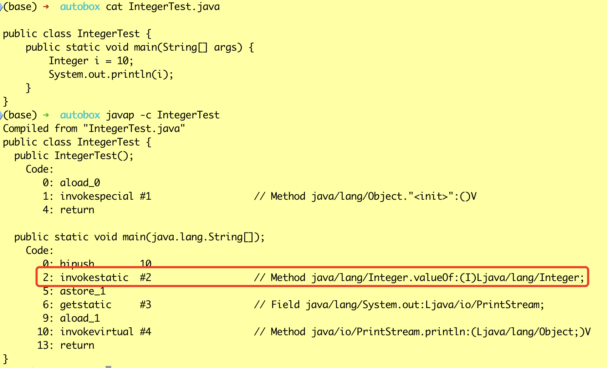
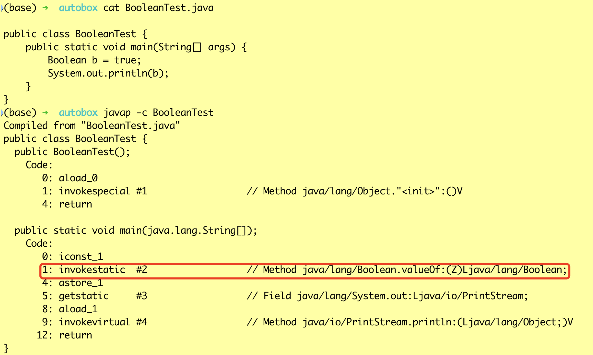
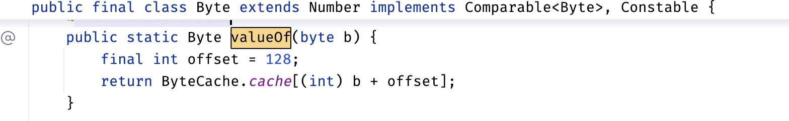
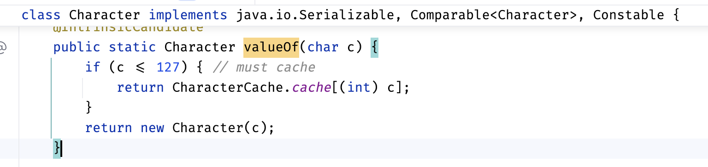
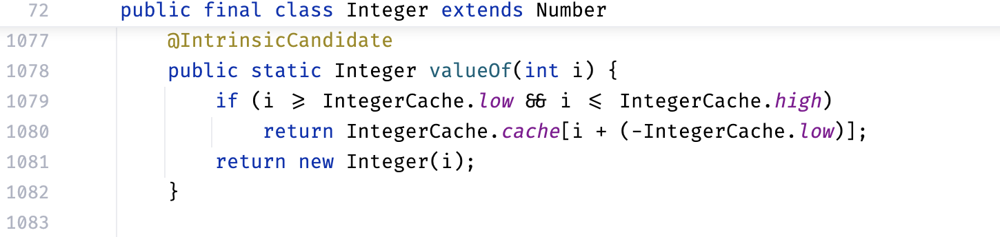
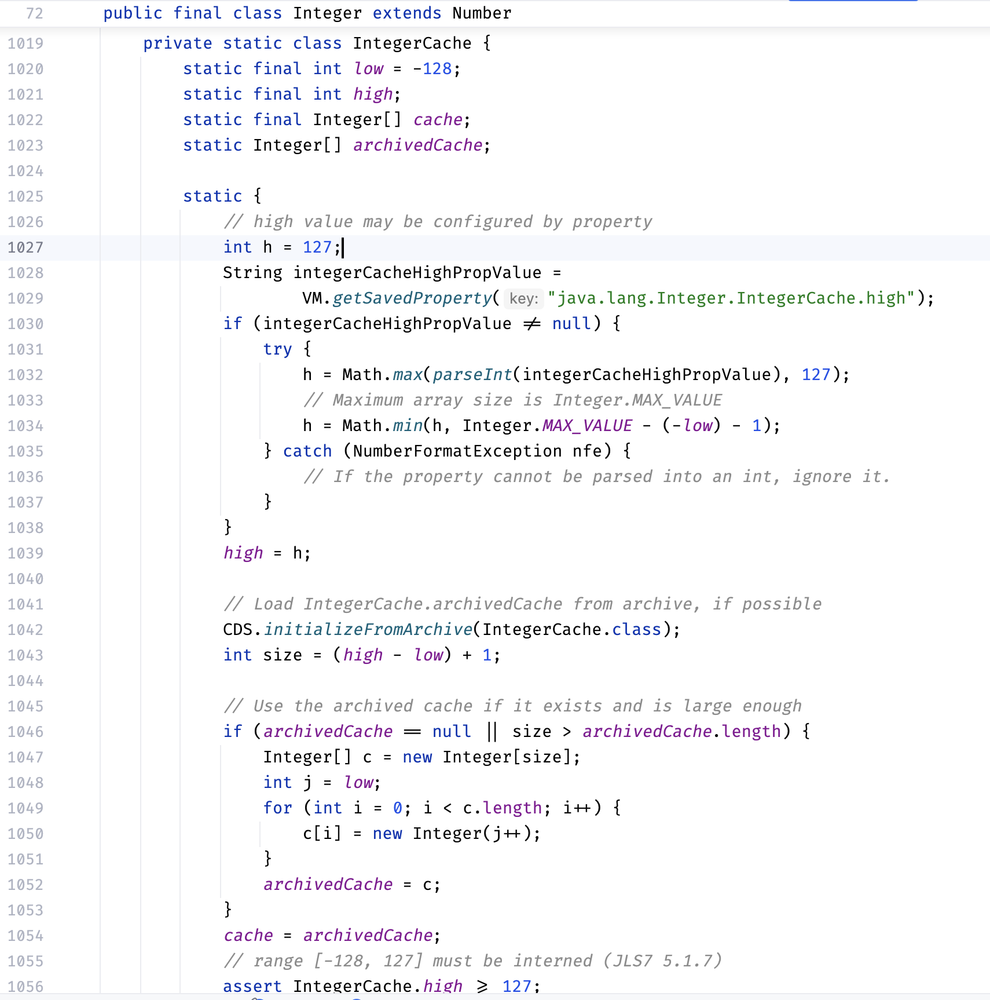
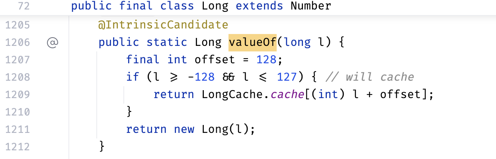
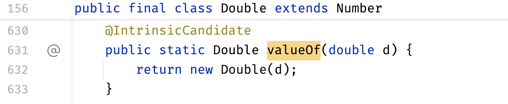
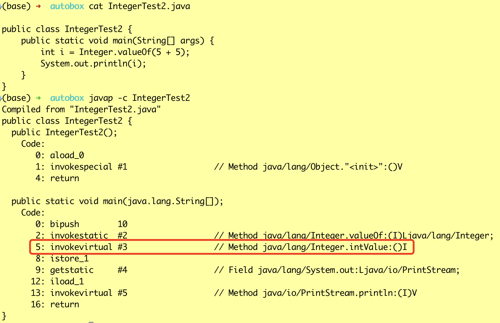
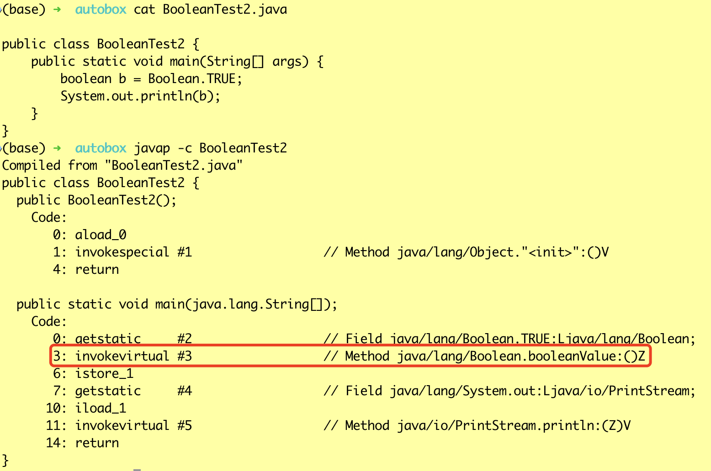

# JAVA自动装箱和拆箱(AutoBox)

## 自动装箱



可以看到将int类型变量赋值给Integer类型时编译器插入了`Integer.valueOf`方法的调用。



可以看到bool和Boolean的自动装箱也是类似的操作。

这种将原始类型赋值给对应的包装类型，由编译器自动插入相关的转换逻辑的操作，就叫做自动装箱。

### 自动装箱的对象缓存池

为了提升性能和节省内存。根据实践发现大部分的数据操作都集中在值比较小的范围，因此缓存这些对象可以减少内存分配和垃圾回收的负担，提升性能。


Boolean类型自动装箱返回的都是提前创建并缓存好的共用的TRUE和FALSE对象。



Byte也对可表示范围内的所有数字都提前创建并缓存了对象。


Short类型的对象缓存池固定为`[-128,127]`。



Character只缓存了`[0, 127]`之内的字符。





Integer对象缓存池的下界是-128，上界默认是127，但是可以通过属性或jvm参数来配置，配置值至少要大于等于127。



Long类型的对象缓存池固定为`[-128,127]`。




Float和Double类型的自动装箱对象都是新创建的对象，没有对象缓存池。

## 自动拆箱



可以看到将Integer类型对象赋值给int类型时编译器插入了`Integer.intValue`方法的调用。



可以看到将Boolean类型对象赋值给boolean类型时编译器插入了`Boolean.booleanValue`方法的调用。

这种将包装对象类型赋值给对应的原始类型，由编译器自动插入相关的转换逻辑的操作(`xxxValue`方法)，就叫做自动装箱。

这些`xxxValue`方法都是在抽象类`Number`中定义的。

```java
public abstract class Number implements java.io.Serializable {
    public Number() {super();}

    public abstract int intValue();

    public abstract long longValue();

    public abstract float floatValue();

    public abstract double doubleValue();

    public byte byteValue() {
        return (byte)intValue();
    }

    public short shortValue() {
        return (short)intValue();
    }
}
```


