# Java多线程

## Java主线程结束和子线程结束之间的关系

> `https://blog.csdn.net/aitangyong/article/details/16858273`

1. `Main`是个非守护进程，不能设置成守护进行

    ```java
    public class MainTest
    {
        // 会抛出：Exception in thread "main"     java.lang.IllegalThreadStateException
        public static void main(String[] args)
        {
            System.out.println(" parent thread begin ");
            Thread.currentThread().setDaemon(true);
        }
    }
    ```

2. `Main`线程结束，其他线程一样可以正常运行
3. `Main`线程结束，其他线程也可以立刻结束，当且仅当这些子线程都是守护线程

## Java - 天生的多线程

```java
public class ThreadPrint {
    public static void main(String[] args) throws JsonProcessingException, InterruptedException {
        // 获取Java线程管理MXBean
        ThreadMXBean threadMXBean = ManagementFactory.getThreadMXBean();
        // 不需要获取同步的monitor和synchronizer信息，仅获取线程和线程堆栈信息
        ThreadInfo[] threadInfos = threadMXBean.dumpAllThreads(false, false);
        // 遍历线程信息，仅打印线程ID和线程名称信息
        for (ThreadInfo threadInfo : threadInfos) {
            System.out.println("[" + threadInfo.getThreadId() + "] " + threadInfo.getThreadName());
        }
        Thread.sleep(1000000);
    }
}
```

执行时需要增加VM参数：`-XX:+StartAttachListener`，用于开启Attach Listener线程

执行结果

```plaintext
[6] Monitor Ctrl-Break
[5] Attach Listener
[4] Signal Dispatcher
[3] Finalizer
[2] Reference Handler
[1] main
```

jstack查看：

```plaintext

[6] Monitor Ctrl-Break：守护线程，优先级为5，是idea_rt.jar(com.intellij.rt.execution.application.AppMainV2)创建的，属于idea附加的线程
[5] Attach Listener：守护线程，优先级为5
[4] Signal Dispatcher：守护线程，优先级为9
[3] Finalizer：守护线程，优先级为8
[2] Reference Handler：守护线程，优先级为10
[1] main：优先级为5
```

## 线程优先级

线程优先级为MIN_PRIORITY-MAX_PRIORITY，即1-10，且其优先级不会超过所属线程组的最大优先级

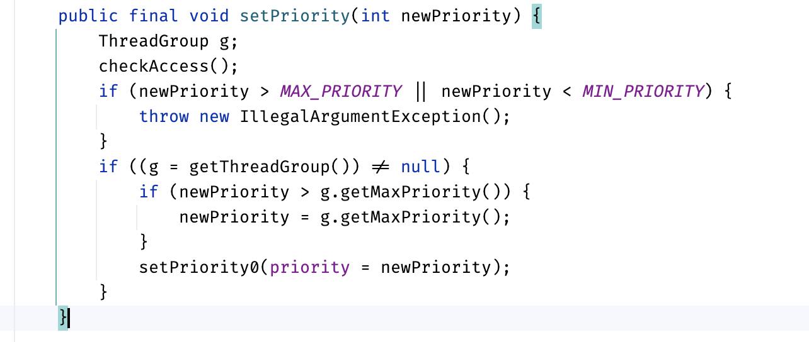

优先级决定线程获取 CPU 调度的机会：

1. windows使用 基于优先级的抢占式调度，高优先级线程更容易被调度执行
2. Linux 的 CFS（完全公平调度器）不会直接使用“时间片”的概念，而是基于调度周期和权重计算时间配额：线程优先级（通过 nice 值控制）影响时间配额的大小，优先级高的线程获得更多 CPU 时间，但时间片的具体长度由 CFS 调整。
3. Macos：优先级影响调度，但不直接影响时间片。

Java 线程的优先级 (Thread.setPriority(int)) 只是一个建议，最终由底层操作系统决定。
现在CPU都是多核的，线程优先级的效果不太明显，一般也不会通过优先级设置来控制线程的优先级。

## 守护线程

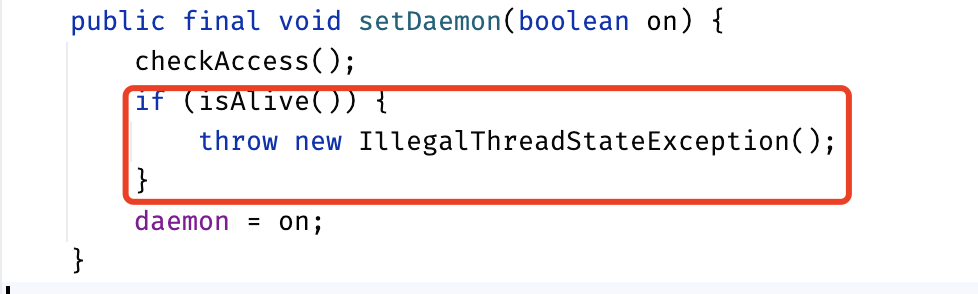

线程必须要还未启动（即未调用start方法），才能设置为守护进程，否则抛出非法线程状态异常。

在大多数情况下，守护线程的 finally 代码块不会被执行，具体取决于 JVM 终止的方式
1. 守护进程自己的代码逻辑导致执行finally，这时finally块会被执行
2. JVM主线程退出，JVM不会等待守护进程执行完毕finally块，这时守护进程的finally块大概率是不会被执行的
3. JVM直接被终止（`System.exit(0)`或`kill -9`），这时守护进程的finally块一定不会被执行

比如如下代码：
```java
public class ThreadDaemon {
    public static void main(String[] args) {
        Thread thread = new Thread(new DaemonThread(),"Daemon Thread!");
        thread.setDaemon(true); // 守护线程
        thread.start();
        // main 线程退出
    }
    static class DaemonThread implements Runnable {
        @Override
        public void run() {
            try {
                Thread.sleep(5000);
            } catch (InterruptedException e) {
                e.printStackTrace();
            } finally { //finally 不能够保证我们的守护线程的最终执行
                System.out.println("FINISH!");
            }
        }
    }
}
```

其打印结果中没有`FINISH!`

因此，**在构建Daemon线程时，不能依靠finally块中的内容来确保执行关闭或清理资源的逻辑**。

## 线程状态

```java
public enum State {
    NEW,
    RUNNABLE,
    BLOCKED,
    WAITING,
    TIMED_WAITING,
    TERMINATED;
}
```


图中`Object.join()`应为`Thread.join()`

### 线程初始化

```java
  public Thread() {
      init(null, null, "Thread-" + nextThreadNum(), 0);
  }
  public Thread(Runnable target) {
      init(null, target, "Thread-" + nextThreadNum(), 0);
  }
  public Thread(ThreadGroup group, Runnable target) {
      init(group, target, "Thread-" + nextThreadNum(), 0);
  }
  public Thread(String name) {
      init(null, null, name, 0);
  }
  public Thread(ThreadGroup group, String name) {
      init(group, null, name, 0);
  }
  public Thread(Runnable target, String name) {
      init(null, target, name, 0);
  }
  public Thread(ThreadGroup group, Runnable target, String name) {
      init(group, target, name, 0);
  }
  public Thread(ThreadGroup group, Runnable target, String name, long stackSize) {
      init(group, target, name, stackSize);
  }
```

可以看到所有的线程构造方法本质上都是调用的内部的init方法

init方法主要逻辑为：

1. 确定线程组：
   1. 有传入，则使用传入的线程组
   2. 否则尝试使用`System.getSecurityManager().getThreadGroup()`
   3. 否则尝试使用parent的线程组
2. 线程组未启动线程计数加1，即nUnstartedThreads计数加1
3. `this.daemon = parent.isDaemon()`
4. `this.priority = parent.getPriority()`
5. 确定contextClassLoader
6. 确定inheritedAccessControlContext
7. 确定inheritableThreadLocals
8. 生成tid

### 线程启动

```java
public synchronized void start() {
    if (threadStatus != 0)
        throw new IllegalThreadStateException();
    group.add(this);
    boolean started = false;
    try {
        start0();
        started = true;
    } finally {
        try {
            if (!started) {
                group.threadStartFailed(this);
            }
        } catch (Throwable ignore) {
            /* do nothing. If start0 threw a Throwable then it will be passed up the call stack */
        }
    }
}
```

主要逻辑为：

1. 检查线程状态`threadStatus`必须为`NEW`
2. 线程组nthreads计数加1，nUnstartedThreads计数减1
3. 调用本地方法`start0()`
4. 如果启动失败，则恢复线程组nthreads和nUnstartedThreads计数

`start0`对应着JVM的`JVM_StartThread`方法，

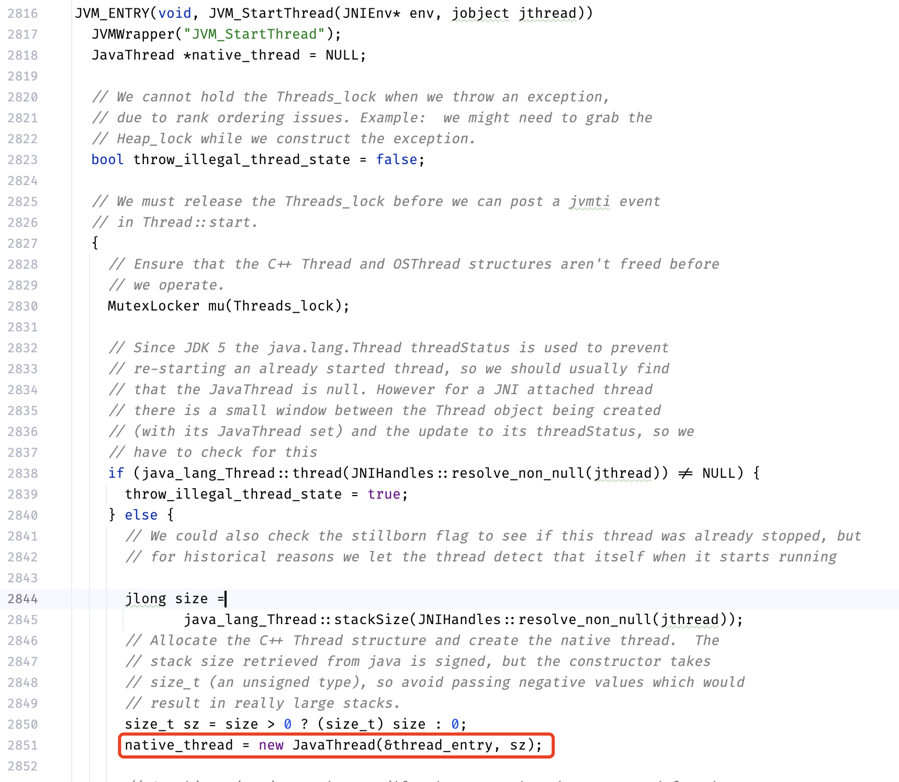

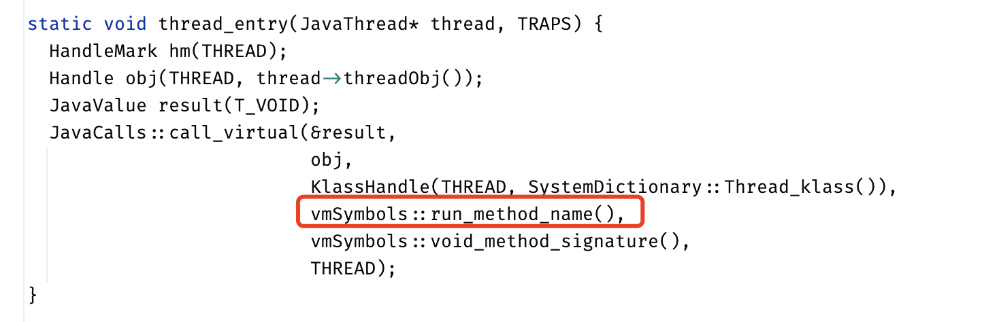


可以看到新创建的JavaThread的函数入口实际上是Java的Thread类的run方法。

当然这里省略了为啥执行了传入的`thread_entry`的逻辑，详细代码如下：

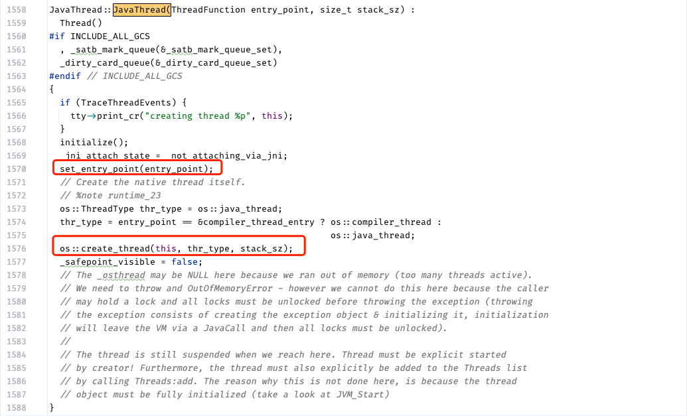

在`os_linux.cpp`中`bool os::create_thread(Thread* thread, ThreadType thr_type, size_t stack_size)`主要是调用了`int ret = pthread_create(&tid, &attr, (void* (*)(void*)) java_start, thread);`，而`static void *java_start(Thread *thread)`中执行了`thread->run();`。

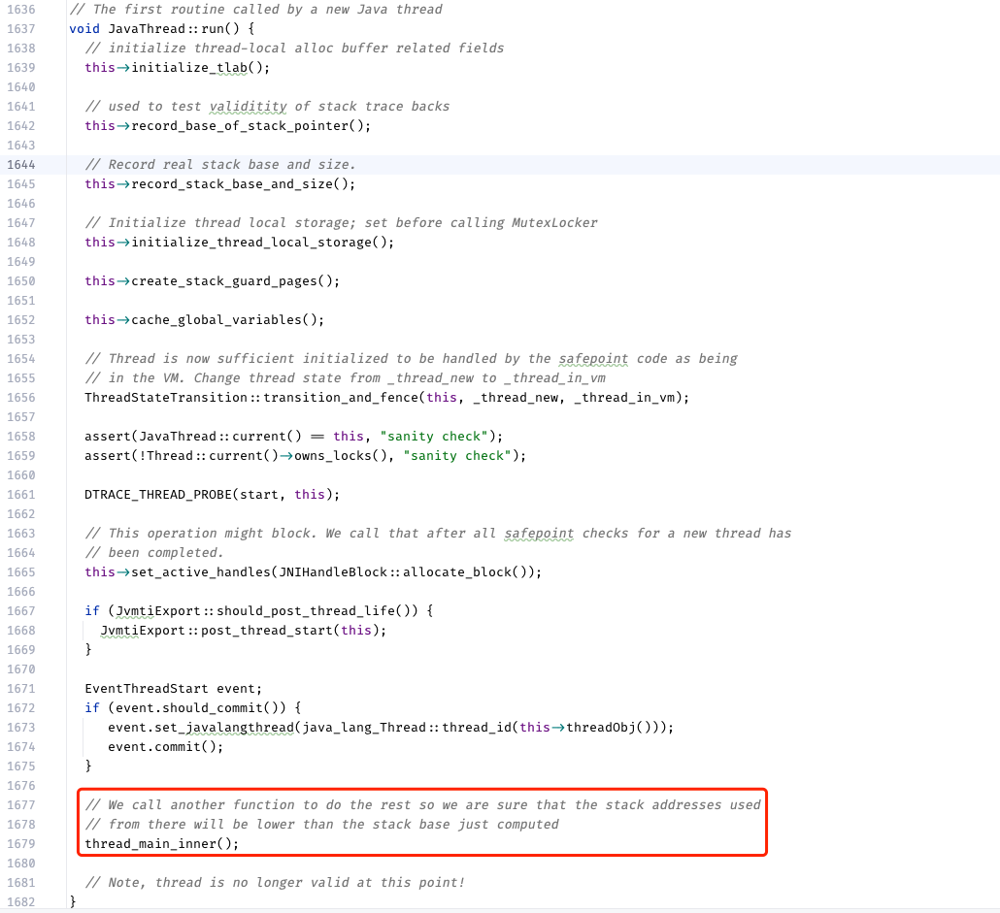

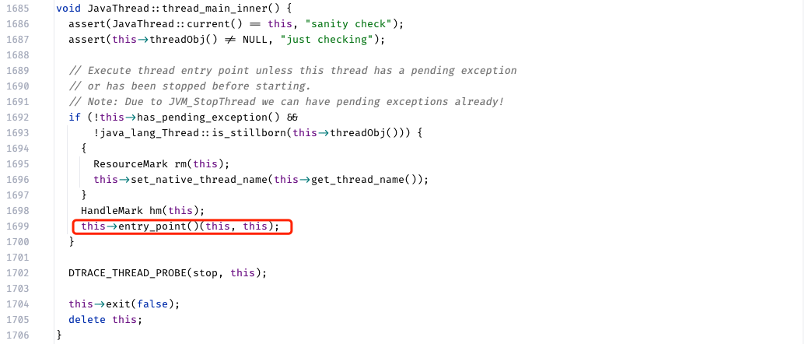

### Thread.sleep

1. 不释放`monitor`锁：`The thread does not lose ownership of any monitors`。JDK源码中也没有操作`monitor`的逻辑
2. 对中断敏感：可以看方法声明`public static native void sleep(long millis) throws InterruptedException`，有抛出`InterruptedException`异常。在JDK源码中也有对应的中断处理逻辑（将中断状态改为false，同时抛出`InterruptedException`异常）。具体包含两部分逻辑
   1. 一进入方法，就判断一次是否被中断，`bool Thread::is_interrupted(Thread* thread, bool clear_interrupted)`。如果被中断则清楚中断标志，然后抛出异常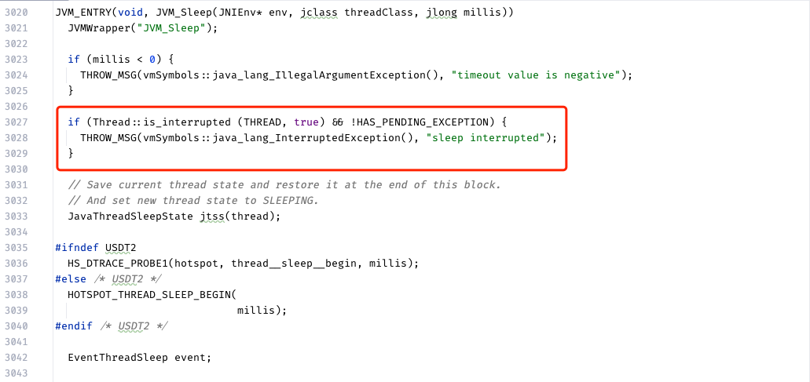
   2. 然后判断millis是否为0，如果为0，需要看一下要转化成调用`yield`，还是sleep最小的`MinSleepInterval`毫秒。这时就不处理中断了。如果不为0，则`int os::sleep(Thread* thread, jlong millis, bool interruptible) `，判断如果在执行sleep时出现中断，则清空中断位，并抛出异常。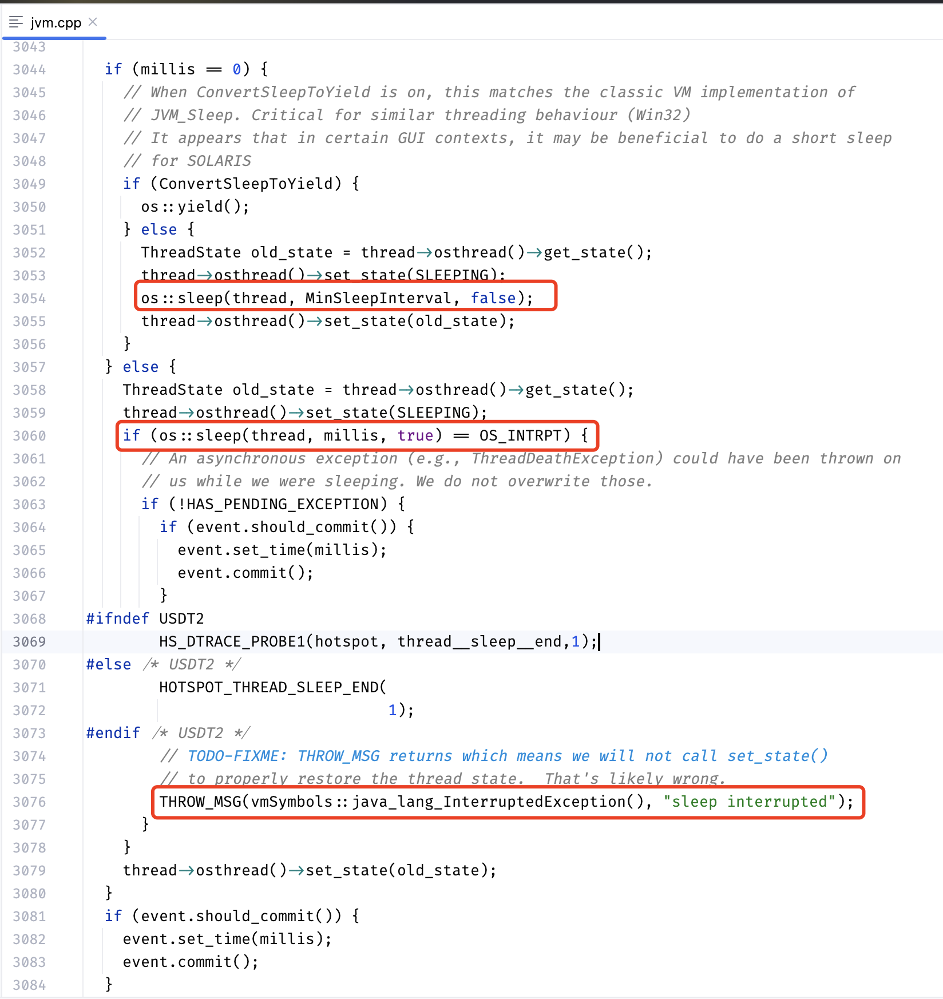
3. 会释放CPU：可以创建很多个线程，让线程一起sleep，观察CPU占用是否会飙升。在JDK8源码中`linux`系统是通过`pthread_cond_timedwait`函数实现的，其本身会释放CPU。linux实现如下：
   1. `os_linux.cpp`文件中`int os::sleep(Thread* thread, jlong millis, bool interruptible)`调用`slp->park(millis);`(`ParkEvent * const slp = thread->_SleepEvent`)。 `park.hpp`文件中声明了`class ParkEvent : public os::PlatformEvent`。回到`os_linux.cpp`，可以看到`int os::PlatformEvent::park(jlong millis)`的函数实现，其调用了`os::Linux::safe_cond_timedwait(_cond, _mutex, &abst)`，这个方法同样是在`os_linux.cpp`文件声明的，是对`pthread_cond_timedwait(_cond, _mutex, _abstime)`的包装。

### Object.wait

1. 释放`monitor`锁：`The current thread must own this object's monitor. The thread releases ownership of this monitor...`。JDK源码可以看到`void ObjectMonitor::wait(jlong millis, bool interruptible, TRAPS)`方法中有调用`void ATTR ObjectMonitor::exit(bool not_suspended, TRAPS)`用于释放锁。
2. 对中断敏感：可以看方法声明`public final native void wait(long timeout) throws InterruptedException`，有抛出`InterruptedException`异常。
3. 会释放CPU：可以创建很多个线程，让线程一起wait，观察CPU占用是否会飙升。JDK的`linux`源码中是靠`pthread_cond_wait`和`pthread_cond_timedwait`方法实现的，它们会释放CPU。

JDK源码片段：

`jvm.cpp`：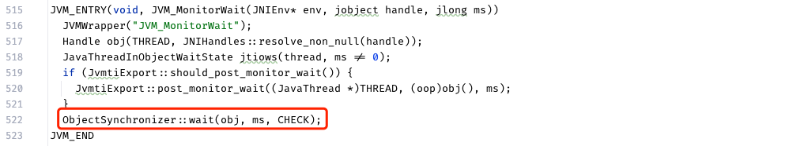

`synchronizer.cpp`: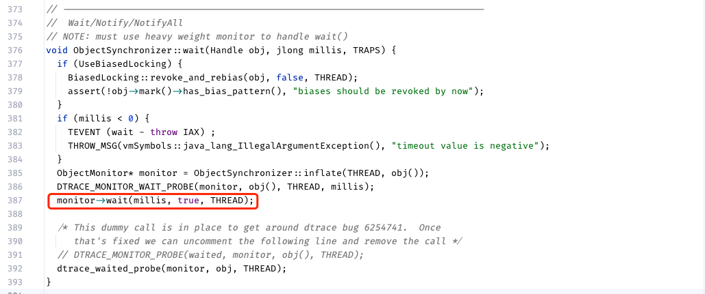

`objectMonitor.cpp`: 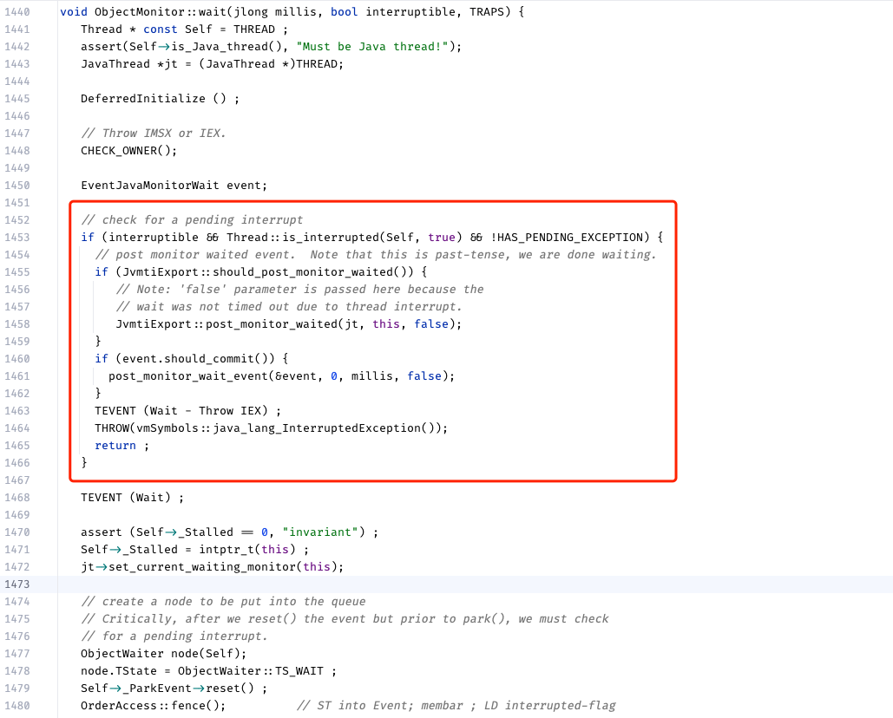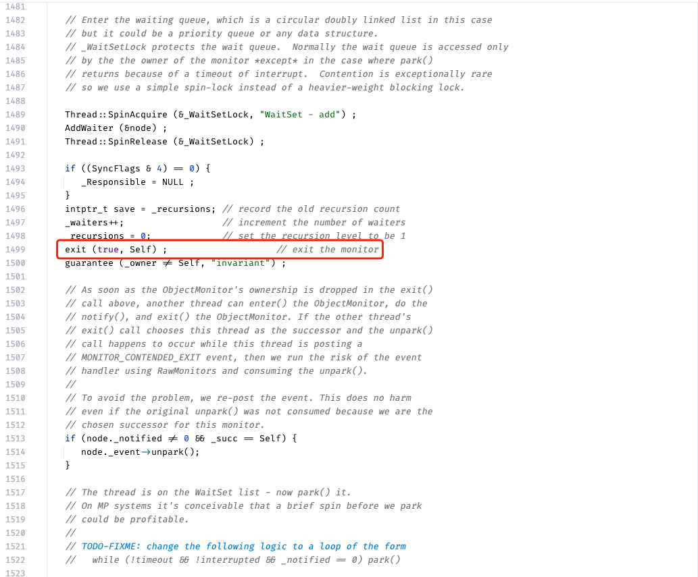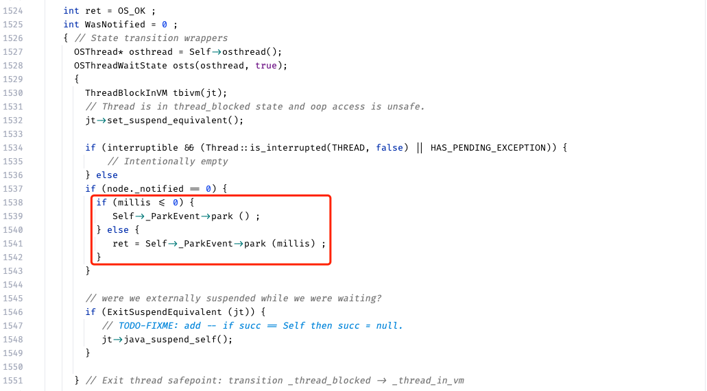

省略后续

### Thread.join

1. 释放`monitor`锁：本质上是调用的`thread.wait`，所以如果`monitor`锁在`thread`对象（即`Thread.currentThread()`），则会释放，否则不会。
2. 对中断敏感：是。同`Object.wait`。因为封装的它
3. 会释放CPU：会。同`Object.wait`。因为封装的它

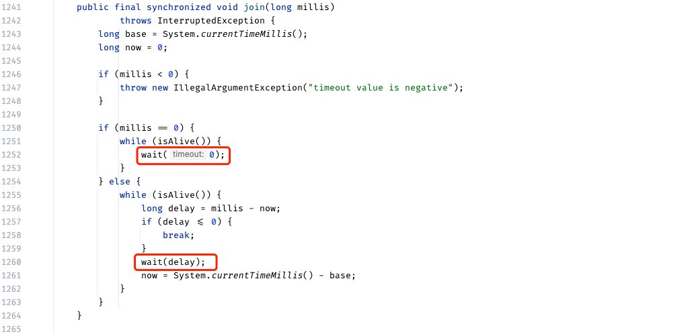

当子线程退出时，会唤醒父线程。

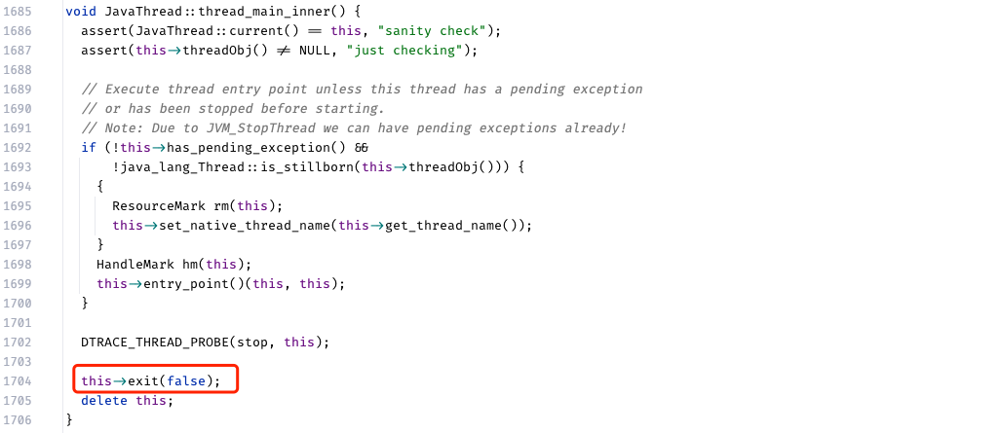

在`thread.hpp`中有声明`void exit(bool destroy_vm, ExitType exit_type = normal_exit);`，第二个参数有给予默认值。

而在`thread.cpp`中这里`void JavaThread::exit(bool destroy_vm, ExitType exit_type)`方法会调用`ensure_join(this)`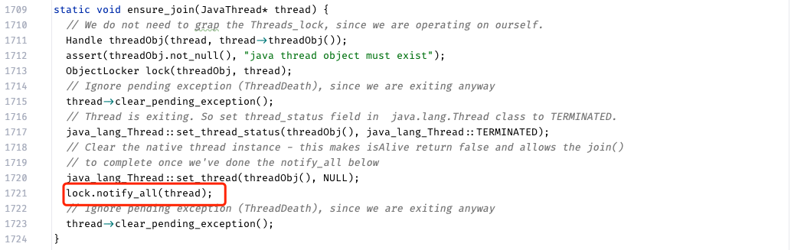

## Thread类native方法对应

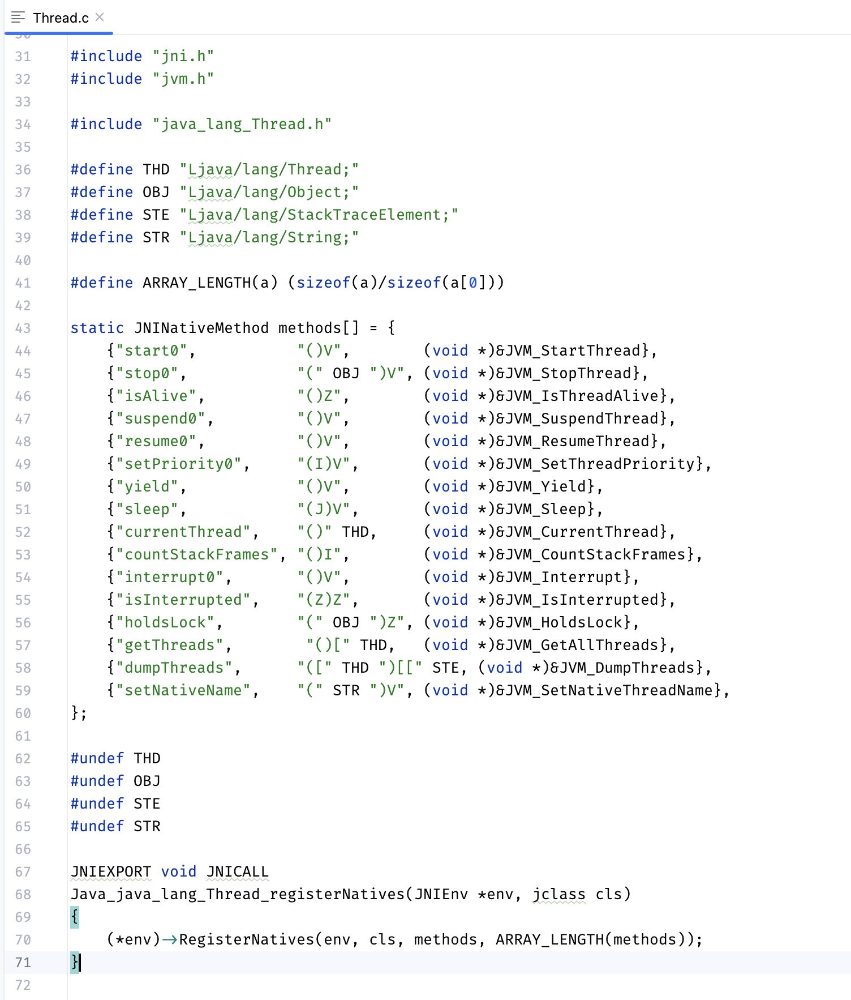

## Object类native方法对应

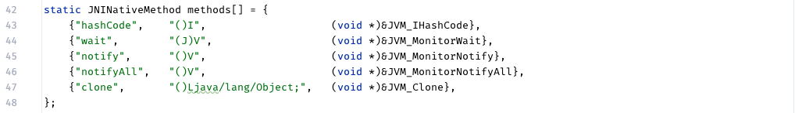
