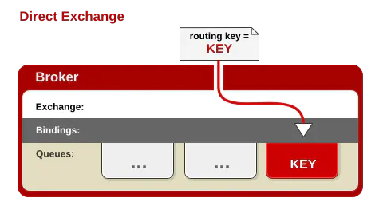
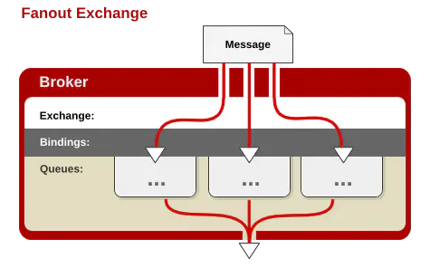
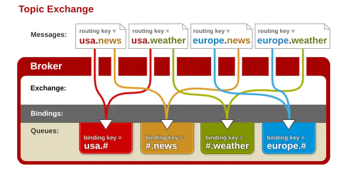
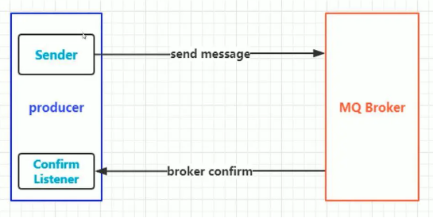

# RabbitMQ

## 四种Exchange

- fanout：只需要队列绑定到交换机，而不需要关注routingKey是什么
- direct：只需要处理routingKey
- topic：需要对routingKey进行模糊匹配
- header

header模式在实际使用中较少，另外三种的性能排序为： fanout > direct >> topic

### Direct Exchange

1. 一般情况下可以使用RabbitMQ自带的Exchange，其名字为`""`，空字符串
2. 这种模式不需要将Exchange进行任何绑定（binding）操作
3. 消息传递时需要一个“Routingkey”，可以简单的理解为要发送到的队列的名字
4. 如果vhost中不存在RoutingKey中指定的队列名，则该消息会被抛弃

### Fanout Exchange

1. 这种模式不需要Routingkey
2. 这种模式需要提前将Exchange与Queue进行绑定，一个Exchange可以绑定多个Queue，一个Queue可以同多个Exchange进行绑定
3. 如果接收消息的Exchange没有与任何Queue绑定，则消息会被抛弃

### Topic Exchange

1. 每个队列都有其关心的主题，所有的消息都带有一个“标题（Routingkey）”，Exchange会将消息转发到所有关注主题能与Routingkey模糊匹配的队列
2. 这种模式需要Routingkey，且需提前绑定Exchange和Queue
3. 在进行绑定时，要提供一个该队列关心的主题
4. 如果Exchange没有发现能够与Routingkey匹配的Queue，则会抛弃此消息

`#`表示0个或若干个关键字；`*`表示1个关键字。如：`log.*`能与`log.warn`匹配，无法与`log.warn.timeout`匹配；而`log.#`能与上述两者匹配

## RMQ的可靠性投递

### 可靠性投递的作用

1. 保障消息的成功发出
2. 保障MQ节点的成功接收
3. 发送端收到MQ节点（broker）确认应答
4. 完善的消息补偿机制（生产中无法对前三点做到完全可靠，因而需要补偿机制做补充）

### confirm机制

1. 在channel开启确认模式`channel.confirmSelect();`
2. 在channel添加监听`channel.addConfirmListener();`，并重写`handleNack()`和`handleAck()`方法

### 消费端削峰限流

rabbitmq提供了一种服务质量保障功能，即在非自动确认消息的前提下，如果一定数目的消息未被确认，不进行消费新的消息。

`channel.basicQos(0, 3, false);`

其中：

- prefetSize：单条消息大小限制，如果无限制，则为0
- prefetCount：一次性消费的消息数量。会告诉 RabbitMQ 不要同时给一个消费者推送多于`N`个消息，即一旦有`N`个消息还没有 `ack`，则该`consumer`将`block`掉，直到有消息`ack`。如果无限制，则为0
- global：true是channel；false是消费者级别
