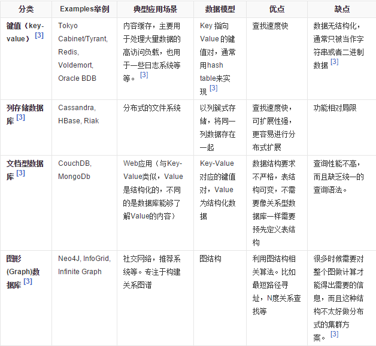

# 1. NoSQL入门和概述

## 入门概述

### 为什么用NoSQL

数据库和常用框架的演进

#### 1. 单机MySQL


在单机架构中，会出现数据存储的瓶颈：

1. 数据量的总大小，一个机器放不下
2. 数据的索引（B+ Tree），一个机器的内存放不下
3. 访问量（读写混合），一个实例不能承受

#### 2. Memcached（缓存）+ MySQL +　垂直拆分

随着访问量的上升，大部分使用MySQL架构的网站在数据库上都开始出现了性能问题，web程序不再仅仅关注在功能上，同时也在追求性能。程序员们开始大量的使用缓存技术来缓解数据库的压力，优化数据库的结构和索引。开始比较流行的是通过文件缓存来缓解数据库压力，但是当访问量继续增大时，多台web机器通过文件缓存不能共享，大量的小文件缓存也带来了比较高的IO压力。在这个时候，Memcached就自然的称为一个非常时尚的技术产品


#### 3. MySQL主从读写分离

由于数据库的写入压力增加，Memcached只能缓解数据库的读写压力。读写集中在一个数据库上让数据库不堪重负，大部分网站开始使用主从复制技术来达到读写分离，以提高读写性能和读库的可扩展性。MySQL的master-slave模式称为这个时候的网站标配了


#### 4. 分表分库 + 水平拆分 + MySQL集群

在Memcached的高速缓存，MySQL的主从复制、读写分离的基础上，MySQL主库的写压力开始出现瓶颈，而数据量的持续猛增，由于MyISAM使用表锁，在高并发下会出现严重的锁问题，大量的高并发MySQL应用开始使用InnoDB引擎代替MyISAM

同时，开始流行使用分表分库来缓解写压力和数据增长的扩展问题。这个时候，分表分库成了一个热门技术，是面试的热门问题，也是业界讨论的热门技术问题。也就在这个时候，MySQL推出了还不太稳定的表分区，这也给技术实力一般的公司带来了希望。虽然MySQL推出了MySQL Cluster集群，但性能也不能很好满足互联网的要求，只是在高可靠性上提供了非常大的保证


#### 5. MySQL的扩展性瓶颈

MySQL数据库也经常存储一些大文本字段，导致数据库表非常的大，在做数据库恢复的时候就导致非常的慢，不容易快速恢复数据库。比如1000万4KB大小的文本就接近40GB的大小，如果能把这些数据从MySQL省去，MySQL将变得非常的小。关系数据库很强大，但是它并不能很好地应付所有的应用场景。MySQL的扩展性差（需要复杂的技术来实现），大数据下IO压力大，表结构更改困难，正是当前使用MySQL的开发人员面临的问题

#### 6. 现在的架构


#### 7. 为什么使用NoSQL

今天我们可以通过第三方平台（如：Google、FaceBook等）可以很容易的访问和抓取数据。用户的个人信息、社交网络、地理位置、用户生成的数据和用户操作日志已经成倍的增长。我们如果要对这些用户数据进行挖掘，MySQL数据库已经不适合这些应用了，NoSQL数据库可以很好的处理这些大的数据

### NoSQL是什么

NoSQL（Not Only SQL），即“不仅仅是SQL”，泛指 **非关系型数据库** 。

随着互联网web2.0网站的兴起，传统的关系数据库在应付web2.0网站，特别是超大规模和高并发的SNS类型的web2.0纯动态网站已经显得力不从心，暴露了很多难以克服的问题，而非关系型数据库则由于其本身的特点得到了非常迅速的发展。NoSQL数据库的产生就是为了解决大规模数据集合多重数据种类带来的挑战，尤其是大数据应用难题，包括超大规模数据的存储。

**这些类型的数据存储不需要固定的模式，无需多余的操作就可以横向扩展**。（例如谷歌或Facebook每天为它们的用户收集万亿比特的数据）

### NoSQL的特点

#### 易扩展

NoSQL数据库种类繁多，但是一个共同的特点就是都去掉了关系数据库的关系型特性。

其数据之间无关系，这样就非常容易扩展。也无形之间，在架构的层面上带来了可扩展的能力。

#### 大数据量高性能

NoSQL数据库都具有非常高的读写性能，尤其在大数据量下，同样表现优秀。

这得益于它的无关性，数据库的结构简单。

一般MySQL使用Query Cache，每次表的更新Cache就失效，是一种大力度的Cache，在针对web2.0的交互频繁的应用，Cache性能不高。而NoSQL的Cache是记录级的，是一种粗粒度的Cache，所以NoSQL在这个层面上来说就要性能高很多了

#### 多样灵活的数据模型

NoSQL无需事先为要存储的数据建立字段，随时可以存储自定义的数据格式。而在关系数据库里，增删字段是一件非常麻烦的事情。如果是非常大数据量的表，增加字段简直就是一个噩梦。

### 传统的RDBMS vs NoSQL

RDBMS：

- 高度组织化结构化数据
- 结构化查询语言（SQL）
- 数据和关系都存储在单独的表中
- 数据操纵语言，数据定义语言
- 严格的一致性
- 基础事务

NoSQL：

- 代表着不仅仅是SQL
- 没有声明性查询语言
- 没有预定义的模式
- 键值对存储，列存储，文档存储，图形数据库
- 最终一致性，而非ACID属性
- 非结构化和不可预知的数据
- CAP定理
- 高性能、高可用性和可伸缩性

## 3V + 3高

### 大数据时代的3V

- 海量Volume
- 多样Variety
- 实时Velocity

### 互联网需求的3高

- 高并发
- 高可用
- 高性能

###　阿里巴巴中文站架构发展历程

时间|关键字
--|--
1999 第一代网站架构|Perl、CGI、Oracle
2000 进入JAVA时代|Java、Servlet
2001-2004 EJB时代|EJB（SLSB、CMP、MDB）， Pattern（ServiceLocator、Delegate、Facade、DAO、DTO）
2005-2007 WithoutEJB重构|去EJB重构：Spring+iBatis+Webx、Antx， 底层架构：iSearch、MQ+ESB、数据挖掘、CMS
2008-2009 海量数据|Memcached集群、MySQL+数据切分=Cobar、分布式存储、Hadoop、KV、CDN
2010 安全、镜像|安全、镜像、应用服务器升级、秒杀、NoSQL、SSD
2011 第五代网站架构|敏捷、开放、体验

#### 敏捷

- 业务快速增长、每天都要上线大量的小需求
- 应用系统日益膨胀，耦合恶化，架构越来越复杂，会带来更高的开发成本。如何保持业务开发的敏捷性？

#### 开放

- Facebook和AppStore带来的启示，如何提升网站的开发性，吸引第三方开发者加入网站的共建中来

#### 体验

- 网站的并发压力快速增长，用户却对体验提出了更高的要求

### 阿里巴巴数据存储的分析

1. 商品的基本信息（名称、价格、出厂日期等）：使用关系型数据库MySQL
2. 商品描述、详情、评价信息（多文字类）：多文字信息描述类，IO读写性能变差，存放于文档数据库MongDB中
3. 商品的图片：存放于分布式的文件系统中：
   1. 淘宝自己的TFS
   2. Google的GFS
   3. Hadoop的HDFS
4. 商品的关键字：搜索引擎，淘宝内用ISearch
5. 商品波段性的热点高频信息：内存数据库：Tair、Redis、Memcache
6. 商品的交易、价格计算、积分累计：外部系统，外部第三方支付接口，如支付宝

## NoSQL的数据模型简介

聚合模型：

- KV键值对：Redis
- BSON：MongoDB
- 列族：HBase
- 图形

### 面试题

以一个电商客户、订单、订购、地址模型来对比下关系数据库和非关系数据库

#### 关系数据库


#### NoSQL数据库

##### 什么是BSON

BSON是类json的一种二进制形式的存储格式，简称Binary JSON，它和JSON一样，支持内嵌的文档对象和数组对象

##### 使用BSON构建该题的数据模型

```BSON
{
    "customer":{
        "id":1136,
        "name":"Z3",
        "billingAddress":[{"city":"beijing"}],
        "orders":[{
            "id":17,
            "customerId":1136,
            "orderItems":[{"productId":27,"price":77.5,"productName":"thinking in java"}],
            "shippingAddress":[{"city":"beijing"}]
            "orderPayment":[{"ccinfo":"111-222-333","txnid":"asdfadcd334","billingAddress":{"city":"beijing"}}],
        }]
    }
}
```

## NoSQL数据库的四大分类

### KV键值对

- 新浪：BerkeleyDB + Redis
- 美团：Redis + Tair
- 阿里、百度：Memcache + Redis

### 文档型数据库（BSON格式比较多）

- CouchDB
- MongoDB

MongoDB是一个**基于分布式文件存储的数据库**。由C++语言编写。旨在为WEB应用提供可扩展的高性能数据存储解决方案

### 列存储数据库

- Cassandra
- HBase

### 图关系数据库

专注于构建关系图谱。常用语：朋友圈社交网络、广告推荐系统、社交网络、推荐系统等

- Neo4J
- InfoGrid

### 四者的比较



## 在分布式数据库中CAP原理CAP+BASE

### CAP

- Consistency 强一致性
- Availability 可用性
- Partition tolerance 分区容错性


NoSQL必须保证分区容错性，因而强一致性和高可用只能二选一

因而AP是大多数网站架构的选择

### BASE

- 基本可用（Basically Available）
- 软状态（Soft state）
- 最终一致（Eventually consistent）

它的思想是通过让系统放松对某一时刻数据一致性的要求来换取系统整体伸缩性和性能上改观。

## 分布式+集群简介

### 分布式系统（distributed system）

由多台计算机和通信的软件组件通过计算机网络连接（本地网络或广域网）组成。分布式系统是建立在网络之上的软件系统。正是因为软件的特性，所以分布式系统具有高度的内聚性和透明性。因此，网络和分布式系统之间的区别更多的在于高层软件（特别是操作系统），而不是硬件。分布式系统可以应用在不同的平台上。如：PC、工作站、局域网和广域网等

简单来说：

不同的多台服务器上面部署不同的服务模块（工程），它们之间通过RPC、RMI进行通信和调用，对外提供服务和组内协作

### 集群

不同的多台服务器上面部署相同的服务模块，通过分布式调度软件进行统一的调度，对外提供服务和访问
