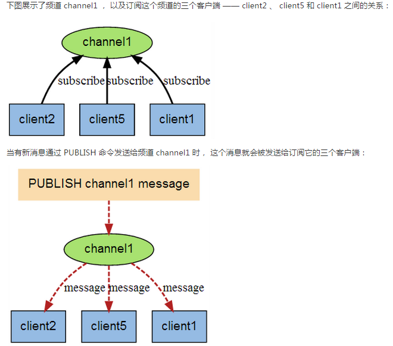

# 7. Redis的发布订阅

## 是什么

进程间的一种消息通信模式：发送者（pub）发送消息，订阅者（sub）接收消息

## 案例

**先订阅后发布** 后才能收到消息

1. 可以一次性订阅多个通道：`subscribe c1 c2 c3`
2. 消息发布：`publish c2 hello-redis`

使用通配符：

1. 使用通配符`*`，订阅多个，：`psubscribe new*`
2. 收取消息：`publish new1 redis2015`
