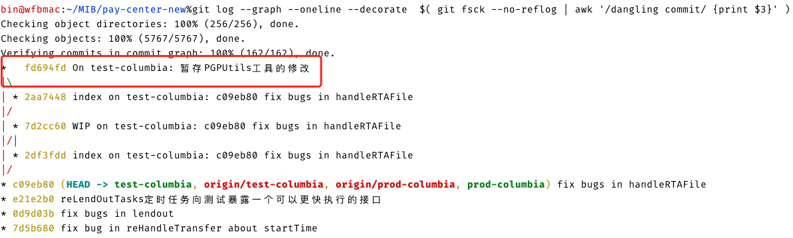

# git

***

## git的基本概念

1. 版本控制系统（version control system）包括两种：
   1. 集中式VCS：如SVN
   2. 分布式VCS：如Git
2. config的三个作用域（优先级从大到小）：
   1. local：只对某个仓库管用
   2. global：对当前用户的所有仓库有效
   3. system：对系统所有登录的用户有效
3. 显示config的配置：`git config --list --local`，不加作用域时会显示全部的配置
4. 对于初次安装的git要进行用户名和邮箱的设置：

    ```sh
    git config --global user.name 'wfb'
    git config --global user.email 'fubinsama@qq.com'
    ```

5. git变更：

    ```mermaid
        graph LR
        A[工作目录]
        -- <code>git add files</code> -->
        B[暂存区]
        -- <code>git commit</code> -->
        C[版本历史]
        -- git push -->
        D[远程仓库]
    ```

6. git的三个对象（它们的名都是内容的哈希）：

   1. commit：一个历史版本，记录了该历史版本的作者、提交者和tree的哈希值
   2. tree：一个文件夹的映射，记录了该文件夹中内容的blob或tree映射哈希值
   3. blob：一个压缩文件，对应于一个文件的内容。内容相同，名相同的文件映射同一个blob

7. HEAD是一个commit的拷贝，表示当前的分支。
8. refs/heads表示所有的分支集合，其下的每一个文件都代表一个分支，是一个commit的拷贝。

## git本地使用的常用命令（git命令格式： **git <命令> [<版本>...] -- [<文件>...]**）

|命令|作用|
|---|---|
|git init _项目名_|创建一个初始的git项目|
|git init|让一个已有的项目初始化成git项目|
|git status|显示git的状态：展示已跟踪和未跟踪的文件；展示被跟踪的已修改的文件；展示还未提交的变更|
|git add _文件名或文件夹名_|添加文件或文件夹到暂存区，实现对该文件或文件夹的跟踪|
|git add -u|将工作目录已跟踪并被修改的文件添加到暂存区|
|git mv _源文件名_ _要更改的文件名_|为文件改名，相当于三条命令(mv f1 f2;  git add f2;  git rm f1;)|
|git rm _文件名_|删除该文件，会同时删除工作区和暂存区|
|git commit -m "_message_"|将暂存区提交到版本历史，并添加本次修改的描述|
|git commit -am "_comment的内容_"|相当于git add -u和git commit -m "_message_"两条命令|
|git commit --amend|修改最近提交的commit的message|
|git rebase -i _想变更的commit的父亲_|弹出一个交互式界面，可以让你修改commit的后代commit|
|git checkout -- _文件1_ _文件2_|将文件1和文件2工作区恢复成暂存区的样子，不加--则恢复全部|
|git checkout _分支名_|切换分支|
|git checkout -b _分支名_ _commit_|使用某个历史版本即commit创建一个新分支，并切换分支|
|git checkout _历史版本哈希值即某一个commit_|分离头指针（detached HEAD），如果事后不进行分支的创建，当切换到别的分支后，该历史版本的所有修改会被git事后当做垃圾数据清理掉|
|git stach|将当前工作区的修改暂存到堆栈，以便进行其他工作后再恢复到当前状态|
|git stach list|展示当前堆栈的暂存情况|
|git stach apply|将工作区恢复到暂存时的状态，暂存区不变|
|git stach pop|将工作区恢复到暂存时的状态，暂存区弹栈|
|git log|显示当前分支的版本变更历史|
|git log --oneline|显示当前分支的版本变更历史，每个历史一行|
|git log -_n数字_|展示当前分支的最近几个版本变更历史|
|git log --all|显示所有分支的版本历史|
|git log --graph|图形化显示版本历史|
|git log _分支名_|查看该分支的版本历史|
|gitk|用可视化界面查看版本历史|
|git branch -v|查看本地的所有分支|
|git branch -d _分支名_|删除已被合并的分支|
|git branch -D _分支名_|强制删除分支|
|git diff|查看工作区和暂存区的差别|
|git diff --_文件名1_ _文件名2_|查看文件1、文件2工作区和暂存区的差别|
|git diff _commit1_ _commit2_|查看两个历史版本的差异|
|git diff HEAD HEAD^|查看当前分支和父分支的差异，每加一个^表示往上一级，也可以用Head~1表示父亲， ~2表示爷爷，以此类推|
|git diff --cached|比较暂存区和HEAD内容的差异|
|git reset HEAD -- _file_|将暂存区file文件恢复成和HEAD一样，不加_file_时会恢复全部|
|git reset --herd _commit_|将一切还原到该commit的历史版本，请谨慎使用|
|git help --web _命令_|用浏览器查看该命令的帮助文档|
|git cat-file -p _哈希值_|查看.git中该文件的内容|
|git cat-file -t _哈希值_|查看.git中该文件的类型|

## git的备份

1. 常用的传输协议：
    |常用协议|语法格式|说明|
    |---|---|---|
    |本地协议（1）|/path/to/repo/.git|哑协议|
    |本地协议（2）|file://path/to/repo/.git|智能协议|
    |http/https协议|<http://git-server.com:port/path/to/repo/.git>|智能协议|
    |ssh协议|user@git-server.com:path/to/repo/.git|智能协议|
2. 哑协议与智能协议：
   1. 直观区别：哑协议传输进度不可见；智能协议传输进度可见
   2. 传输速度：智能协议比哑协议传输速度快
3. 备份特点：

    ```mermaid
    graph LR
    S1[备份S1]
    S[源git库]
    S2[备份S2]
    S3[备份S3]
    S1 -- fetch --> S -- push --> S1
    S -- push --> S2 -- fetch --> S
    S -- push --> S3 -- fetch --> S
    ```

4. 常用命令：
    |命令|说明|
    |---|---|
    |git clone --bare _仓库路径_ _新的仓库名_|克隆仓库|
    |git remote -v|查看远程仓库，-v是verbose|
    |git remote add _仓库名_ _仓库路径_|添加远程仓库路径|
    |git remote remote _仓库名_|删除远程仓库|
    |git push _仓库名_ _分支名_|将本地仓库push到远端，不加分支则推送全部，若有分支产生冲突，则不push该分支|
    |git fetch _仓库名_ _分支名_|将远端仓库的某分支拉去到本地，不加分支则拉去全部|
    |git merge _分支名_|合并当前分支和指明的分支，--allow-unrelated-histories选项可以允许没有关联的两个分支就行合并|
    |git merge --abort|撤销merge操作|
    |git stash save "注释"|临时将已跟踪文件的变动暂存|
    |git stash list|展示所有暂存|
    |git stash pop|弹出并恢复之前的暂存|

## gitignore文件的编写

1. [github提供的各种语言的模板](https://github.com/github/gitignore)
2. 正则基本语法：
   1. *.class：忽略所有的以.class结尾的文件被忽略
   2. wfb/：忽略wfb文件夹下的文件，仍跟踪wfb文件夹
   3. wfb：忽略wfb文件夹或文件

## git出错的解决方法

1. gitk启动失败：安装tcl和tk
2. git help执行失败：

    ```sh
    sudo mkdir -p /usr/local/git/share/doc
    cd /usr/local/git/share/doc
    sudo git clone git://git.kernel.org/pub/scm/git/git-htmldocs.git git-doc
    git config --global help.htmlpath /usr/local/git/share/doc/git-doc
    git config --global help.format html
    ```

3. 修改git的默认编辑器为vim：`git config –-global core.editor vim`

## 提醒

1. 多人协作时不要使用rebase命令和-f选项，以防更改历史，导致其他人与分支有很大差异，很难修改。

## 问题解决方案

### 不小心 git stash clear后，如何找回并恢复代码

```sh
git log --graph --oneline --decorate  $( git fsck --no-reflog | awk '/dangling commit/ {print $3}' )
```



然后`git stash apply [对应的id]`即可。
