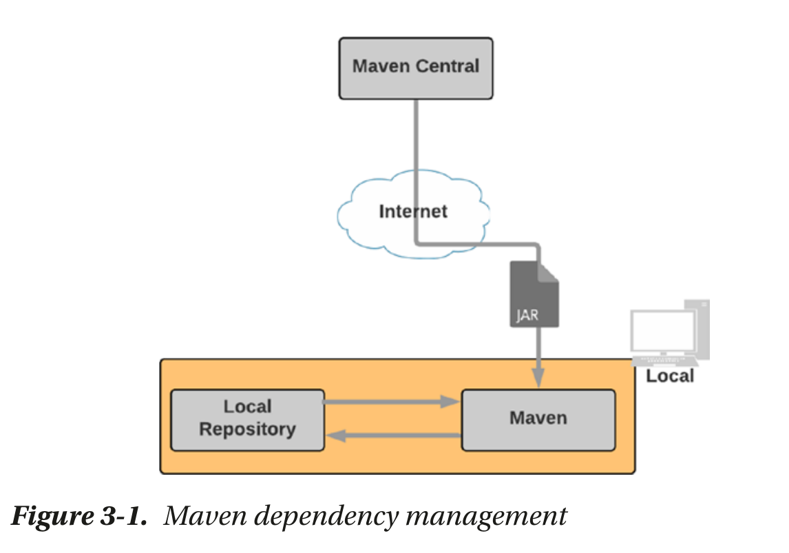
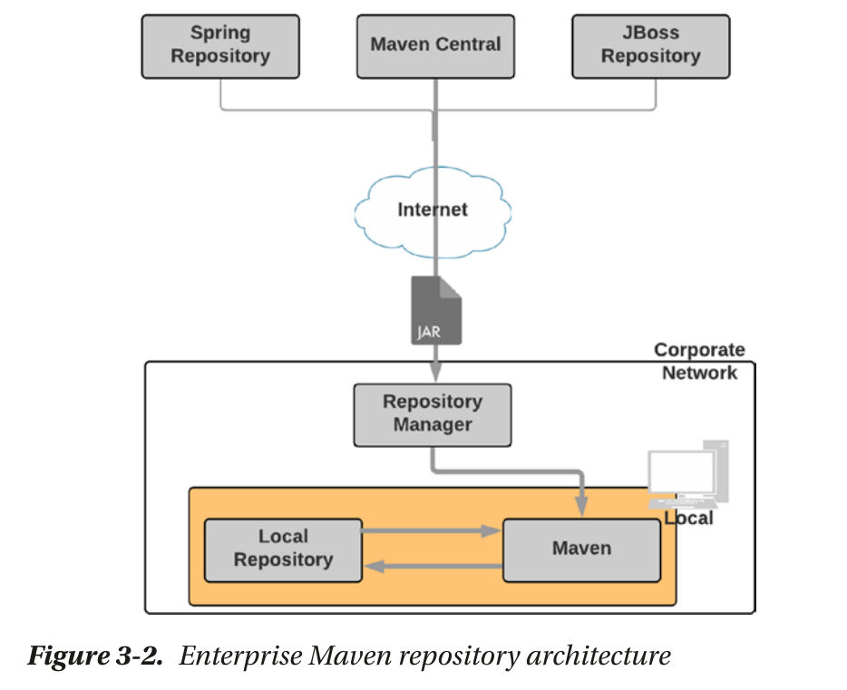
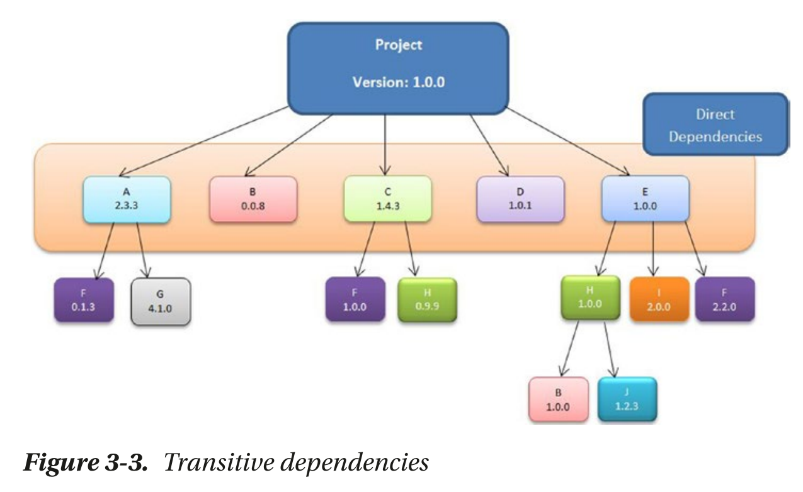
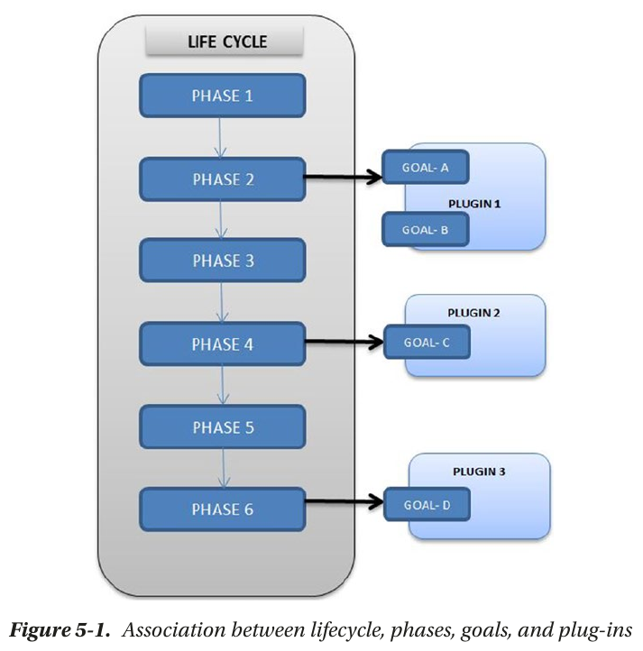
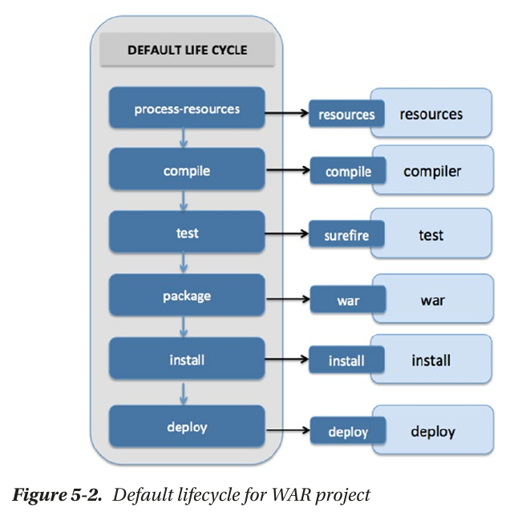
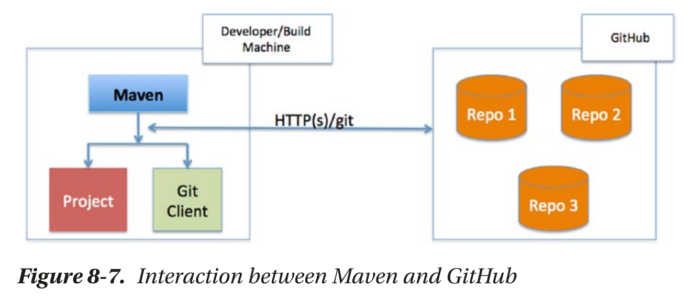

# maven概述

- [maven概述](#maven概述)
  - [依赖标识](#依赖标识)
  - [依赖传递和调解](#依赖传递和调解)
  - [maven组件](#maven组件)
    - [Maven SCM](#maven-scm)
    - [Maven Wagon](#maven-wagon)
    - [Maven Doxia](#maven-doxia)
  - [程序目录](#程序目录)
    - [setting.xml文件详解](#settingxml文件详解)
      - [在settings.xml中添加仓库](#在settingsxml中添加仓库)
      - [移除某个直接依赖的部分传递性依赖](#移除某个直接依赖的部分传递性依赖)
    - [加密](#加密)
  - [依赖作用域(scope)](#依赖作用域scope)
  - [项目组织结构](#项目组织结构)
    - [基于Maven的Java项目的结构](#基于maven的java项目的结构)
  - [maven的版本号(version)](#maven的版本号version)
  - [maven的生命周期相关概念](#maven的生命周期相关概念)
    - [maven的目标(goal)和插件(plugin)](#maven的目标goal和插件plugin)
    - [maven的生命周期(lifecycle)和过程(phase)](#maven的生命周期lifecycle和过程phase)
    - [maven插件开发](#maven插件开发)
  - [maven archetypes(原型)](#maven-archetypes原型)
  - [maven的文档和报告](#maven的文档和报告)
  - [maven版本](#maven版本)
    - [集成nexus私服](#集成nexus私服)
    - [项目发布](#项目发布)
      - [prepare目标](#prepare目标)
      - [perform目标](#perform目标)
  - [常用命令](#常用命令)





## 依赖标识

Maven依赖项通常是归档文件，如JAR、WAR、enterprise archive（EAR）和ZIP。

每个Maven依赖使用独一无二的GAV（group、artifact、version）标识，其中由`.`分割的`group`构成外层路径，`artifact`和`version`构成内层路径和对应的归档文件名

仍然处在开发状态的artifacts使用`SNAPSHOT`后缀标识version,如：`1.0-SNAPSHOT`

这告诉Maven每天从远程存储库查找依赖的更新版本。

## 依赖传递和调解



maven使用依赖调解来解决版本冲突。依赖调解允许Maven在依赖关系树中拉取最接近项目的依赖项。如果依赖处于同一层次，maven将使用最先发现的依赖的版本

## maven组件

### Maven SCM

Maven与多个源代码控制/代码管理（SCM）系统交互以执行诸如checkout代码或创建分支或标记之类的操作。Maven SCM项目为以上操作提供了一个通用的API。

它支持诸如Git、Subversion、Perforce等流行的SCM

### Maven Wagon

Maven自动地下载诸如JAR类型的项目依赖，这些依赖可能来自FTP、文件系统、Web站点等不同的位置。Maven Wagon项目提供了一个传输抽象，使Maven能够轻松地与不同的传输协议交互并检索依赖关系。

它支持如下流行的协议：

- File：允许使用文件系统协议检索依赖项
- HTTP：允许使用HTTP/HTTPS协议检索依赖项。有两种实现：一种基于Apache HttpClient,另一种基于标准的Java库
- FTP：允许使用FTP协议检索依赖项

### Maven Doxia

Maven Doxia是一个内容生成框架，可用于生成静态/动态内容，如PDF文件、Web站点。Doxia支持几种流行的标记语言，如：Markdown、Apt、XHTML、Confluence。Maven严重依赖于Doxia去生成项目文件和报告。

## 程序目录

- bin：cmd命令，包含`mvn`和`mvnDebug`
- boot：包含`plexus-classworlds-2.6.0.jar`，maven使用该jar包来生成类加载(classloader)图
- conf：包含程序的配置文件，包括`settings.xml`和`logging/simplelogger.properties`(用来配置日志)
- lib：程序依赖

### setting.xml文件详解

```XML
<settings xmlns="http://maven.apache.org/SETTINGS/1.0.0"
          xmlns:xsi="http://www.w3.org/2001/XMLSchema-instance"
          xsi:schemaLocation="http://maven.apache.org/SETTINGS/1.0.0 http://maven.apache.org/xsd/settings-1.0.0.xsd">
<localRepository>maven存储本地仓库的目录的路径</localRepository>
<!-- 这将确定maven是否在需要输入时提示您，默认值为true -->
<interactiveMode>true</interactiveMode>
<!-- 这将确定maven在build时是否采用离线模式（即不连接互联网），默认值为false -->
<offline>false</offline>
<!-- 配置插件组的默认groupId -->
<pluginGroups/>
<!-- 配置代理 -->
<proxies/>
<!-- 配置向服务器请求依赖时使用的用户名、密码 -->
<servers/>
<!-- 配置镜像 -->
<mirrors/>
<!-- 配置build进行的相关profiles配置 -->
<profiles/>
<!-- 配置build激活的profiles列表 -->
<activeProfiles/>
</settings>
```

#### 在settings.xml中添加仓库

```XML
<settings xmlns="http://maven.apache.org/SETTINGS/1.0.0"
          xmlns:xsi="http://www.w3.org/2001/XMLSchema-instance"
          xsi:schemaLocation="http://maven.apache.org/SETTINGS/1.0.0 http://maven.apache.org/xsd/settings-1.0.0.xsd">
<profiles>
    <profile>
        <id>your_company</id>
        <repositories>
            <repository>
            <id>spring_repo</id>
            <url>http://repo.spring.io/release/</url>
            </repository>
            <repository>
            <id>jboss_repo</id>
            <url>https://repository.jboss.org/</url>
            </repository>
        </repositories>
    </profile>
</profiles>
<activeProfiles>
    <activeProfile>your_company</activeProfile>
</activeProfiles>
</settings>
```

#### 移除某个直接依赖的部分传递性依赖

```XML
<dependencies>
    <!-- 移除junit依赖中的hamcrest依赖 -->
    <dependency>
        <groupId>junit</groupId>
        <artifactId>junit</artifactId>
        <version>${junit.version}</version>
        <scope>test</scope>
        <exclusions>
            <exclusion>
                <groupId>org.hamcrest</groupId>
                <artifactId>hamcrest</artifactId>
            </exclusion>
        </exclusions>
    </dependency>
</dependencies>

```

### 加密

详见P20

## 依赖作用域(scope)

maven提供了6种作用域：

- compile：默认的作用域。该依赖在build、test、run过程中都会被使用
- provided：在build、test过程中有效，在run过程中无效（即不会打进包中）。适用于`Servlet api`等会被容器（运行环境）提供的依赖
- runtime：在build过程中无效，test、run过程中有效。适用于`mysql-connector-java`等项目已有接口的特殊实现，因为一般都是使用接口操作，编译（build）时不需要实现库，运行时需要
- test：只在test过程中有效。适用于`Junit`等只有测试时才会使用的库
- system：与`provided`类似。只是这些依赖项不会从存储库中检索，相反，将指定文件系统的硬编码路径，从中使用依赖项。
- import：该作用域只适用于`.pom`文件依赖。它允许你从一个远程`.pom`文件`include`依赖管理信息

## 项目组织结构

### 基于Maven的Java项目的结构

- `gswm`：项目的根目录，文件名和项目的artifact相同
  - `src`：包含源代码和属性文件，一般会提交到SCM
    - `main`
      - `java`：包含Java源代码
    - `test`
      - `java`：包含Java单元测试
  - `target`：包含生成的artifacts,如：`.class`文件，一般不会提交到SCM
  - `LICENSE.txt`：包含项目的license信息
  - `NOTICE.txt`：包含将该包作为第三方库使用时的notice
  - `README.txt`：包含项目的信息和结构
  - `pom.xml`：包含项目和配置的信息，是该项目的maven配置文件

`src/main`和`src/test`目录下还可以包含如下路径：

- `src/main/resources`：存放资源，如：Spring配置文件、velocity模板等。这些资源需要导入到生成的artifact中
- `src/main/config`：存放配置文件，如：Tomcat上下文文件、James邮件服务配置文件等。这些资源不会导入到生成的artifact中
- `src/main/scripts`：存放系统管理员或开发者为程序写的脚本文件
- `src/test/resources`：存放test过程中需要的资源
- `src/main/webapp`：存放web相关的资源，如：`.jsp`文件、`.css`文件、图片等
- `src/it`：保存应用程序的集成测试。
- `src/main/db`：保存数据库文件，如：SQL脚本。
- `src/site`：保存生成项目站点期间所需的文件。

## maven的版本号(version)

maven的版本号遵循以下格式：`<major-version>.<minor-version>.<incremental-version>-qualifier`

主版本号、次版本号和增量版本号都是 __数值__，`qualifier`是一个枚举值：`RC`、`alpha`、`beta`、`SNAPSHOT`。

版本号的`qualifier`值为`SNAPSHOT`时，表示项目是一个开发版本。当项目使用`SNAPSHOT`依赖时，每次`build`项目，maven都会重新fetch该依赖，并确保使用的是最新的版本。

大多数maven仓库只接受一次版本发布。因此，当项目处在持续集成状态时，推荐使用`SNAPSHOT`作为版本号的`qualifier`

## maven的生命周期相关概念

### maven的目标(goal)和插件(plugin)

Maven使用goal的概念来表示编译源代码、运行单元测试等细化的task，它们打包在plugins中，这些plugins实际上是一个或多个goal的集合。

### maven的生命周期(lifecycle)和过程(phase)

maven的goal是精细的，一般执行一个task。一个复杂的操作（如：生成artifacts和文档）需要多个goal以一定的顺序执行。maven使用lifecycle和过程抽象简化了这些复杂的操作，从而可以通过少量命令完成与构建有关的操作。

maven的构建生命周期由一系列以相同顺序执行的过程构成，这些过程的执行顺序与所构建的artifact无关。maven称lifecycle中的这些过程为phase。

每个maven项目都有如下3个内置的lifecycle：

- `default`：此生命周期处理Maven项目的编译，打包和部署
- `clean`：该生命周期处理从目标目录中删除临时文件和生成的artifact的过程
- `site`：此生命周期处理文档和网站的生成

`default`生命周期与如下过程相关：

- `validate`：运行检查以确保项目正确，并且所有依赖项均已下载且可用
- `compile`：编译源代码
- `test`：使用框架运行单元测试。此步骤不需要将应用程序打包
- `package`：将编译后的代码组装为可分发的格式，例如JAR或WAR
- `install`：将打包的归档文件安装到本地存储库中。该档案现在可供该计算机上运行的任何项目使用
- `deploy`：将构建的存档推送到远程存储库中，以供其他团队和团队成员使用

maven的lifecycle是一个抽象的概念，无法直接执行。相反，应该执行一个或多个phase。如：`mvn package`将执行`default`生命周期的`package`过程。除了明确定义生命周期中各个阶段的顺序之外，Maven还会执行请求的phase之前的所有phase。因此，当你执行`mvn package`时，maven将会先执行`validate`、`compile`和`test`过程。

每个phase都需要执行许多task。为此，每个phase都与零个或多个goal相关联。该phase仅将这些task委托给其关联的goal。



如图所示，maven的phase可以不包含任何goal。在这种情况下，mavne将会跳过该phase的执行。这些phase充当用户或第三方供应商将其与定制化goal关联的占位符。

`pom.xml`文件中的`<packaging />`元素会自动会每个phase关联正确的goal（没有为goal定义任何附加的配置）。如：如果定义了`<packaging>jar</packaging>`，maven会自动为`package`过程关联`jar`插件中的`jar`目标。下图是`<packaging>war</packaging>`的`default`生命周期示意图



### maven插件开发

maven插件(plgin)由目标(goal)构成，因此开发maven插件就是开发maven目标。maven目标使用MOJOs（Maven Old Java Object，类似于POJO）实现。[一个简单的maven插件](./一个简单的maven插件.md)展示了创建一个SystemInfoPlugin插件（当运行maven命令时，在命令行展示Java版本、操作系统之类的系统信息）的过程

## maven archetypes(原型)

Maven原型是项目模板，可让用户轻松生成新项目。

maven提供了原型插件，其`generate`目标可以列出可选的原型，并根据选择的原型创建maven项目。如：[基于Maven构建一个简单的Java项目](./基于Maven构建一个简单的Java项目.md)的第二部分介绍了如何基于原型创建一个web项目

## maven的文档和报告

文档和报告是任何项目的关键方面。Maven的一些工具和插件，使在线文档的发布和维护变得轻而易举。详见：[创建项目站点和Javadoc报告](./创建项目站点和Javadoc报告.md)

## maven版本

maven提供了发布插件，该插件可以自动执行与发布软件有关的步骤。

### 集成nexus私服

首先安装`Sonatype Nexus`用作maven私服，详见[Sonatype Nexus](./Sonatype_Nexus私服.md)

distributionManagement发布配置：

```XML
<distributionManagement>
    <!-- 这里配置的id要和server中配置的id相对应 -->
    <repository>
        <id>nexusReleases</id>
        <name>Releases</name>
        <url>http://localhost:8081/repository/maven-releases</url>
    </repository>
    <snapshotRepository>
        <id>nexusSnapshots</id>
        <name>Snapshots</name>
        <url>http://localhost:8081/repository/maven-­snapshots</url>
    </snapshotRepository>
</distributionManagement>
```

Nexus有`Releases`和`Snapshots`两个仓库。默认情况下`SNAPSHOT artifacts`被存储在`Snapshots`仓库中;`release artifacts`被存储在`Releases`仓库中。

要想使用私服，需要在`settings.xml`中配置角色信息，用来获取访问权限：

```XML
<servers>
    <server>
        <id>nexusReleases</id>
        <username>admin</username>
        <password>1070952257wfb.</password>
    </server>
    <server>
        <id>nexusSnapshots</id>
        <username>admin</username>
        <password>1070952257wfb.</password>
    </server>
</servers>
```

为`gswm-maven-plugin`添加上述配置后，使用`mvn deploy`进行发布。可以发现`http://localhost:8081/#browse/browse:maven-releases`下出现了该项目。

然后，我们为`gswm`项目也进行上面的配置，使用`mvn deploy`进行发布。可以发现`http://localhost:8081/#browse/browse:maven-snapshots`下出现了该项目。

另外，可以在`settings.xml`配置全局的私服镜像，用来从私服下载：

```XML
<mirrors>
    <mirror>
        <id>maven-public</id>
        <!--*指的是访问任何仓库都使用我们的私服-->
        <mirrorOf>*</mirrorOf>
        <!-- 私服地址 -->
        <url>http://localhost:8081/repository/maven-public/</url>
    </mirror>
</mirrors>
```

也可以通过在项目的`pom.xml`中配置的方式引用私服：

```XML
<repositories>
    <repository>
        <id>maven-public</id>
        <url>http://localhost:8081/repository/maven-public/</url>
    </repository>
</repositories>
```

### 项目发布

发布项目是一个复杂的过程，通常涉及以下步骤：

1. 确认本地计算机上没有未提交的更改。
2. 从`pom.xml`文件的`version`元素中移除`SNAPSHOT`标识。
3. 确保该项目未使用任何`SNAPSHOT`依赖。
4. 将修改后的pom.xml文件签入到源代码管理中。
5. 创建源代码的源代码控制标签。
6. 构建工件的新版本，并将其部署到仓库管理器。
7. 在pom.xml文件中增加版本，并为下一个开发周期做准备。

使用maven版本发布，需要使用两个目标[`prepare`](#prepare目标)和[`perform`](#perform目标)，另外它还提供了一个`clean`目标在出现问题时使用。

Maven有一个发布插件，该插件提供了执行上述步骤和发布项目工件的标准机制，下图是使用git作为源代码控制，并使用github作为远程仓库的集成图：



配置流程如下：

1. 在Github上创建一个新的仓库`gswm`
2. 将我们的`gswm`项目初始化并提交到该仓库：

    ```SHELL
    echo "# gswm" >> README.md
    echo "target/" >> .gitignore
    git init
    git add .
    git commit -m "first commit"
    git branch -M main
    git remote add origin https://github.com/{your_git_hub_account}/gswm.git
    git push -u origin main
    ```

3. 因为maven发布插件绑定在`release`分支，因此，我们需要创建并切换到该分支：

    ```SHELL
    git checkout -b release
    git push origin release
    ```

4. 在项目的`pom.xml`文件中配置SCM信息

    ```XML
    <scm>
        <connection>scm:git:https://github.com/{your_git_hub_account}/gswm.git</connection>
        <developerConnection>scm:git:https://github.com/{your_git_hub_account}/gswm.git</developerConnection>
        <url>https://github.com/{your_git_hub_account}/gswm</url>
    </scm>
    ```

5. 将修改推送到SCM(这里用的Github)，并在`settings.xml`文件中配置github账户

    ```SHELL
    git commit -am "Added SCM Information"
    git push origin release
    ```

    ```XML
    <server>
        <id>github</id>
        <username>[your_github_account_name]</username>
        <password>[your_github_account_password]</password>
    </server>
    ```

6. 使用`mvn release:prepare`命令执行`prepare`目标

#### prepare目标

顾名思义，prepare目标是准备发布项目。maven执行一下操作：

- check-poms：检查`pom.xml`文件中配置的`version`是否含有`SNAPSHOT`
- scm-check-modifications：检查是否有未提交的更改，有则报错(Cannot prepare the release because you have local modifications)
- check-dependency-snapshots：检查`pom.xml`文件中是否有`SNAPSHOT`的依赖。
- map-release-versions：当以交互方式运行prepare时，将提示用户输入发行版本(What is the release version for "项目名"?)
- map-development-versions：当以交互方式运行prepare时，将提示用户输入下一个开发版本(What is the new development version for "项目名")
- generate-release-poms：生成要发布版本的pom文件
- scm-commit-release：提交要发布版本的`pom`文件到SCM
- scm-tag：为在SCM中的要发布版本打版本标签(What is SCM release tag or label for "项目名"?)
- rewrite-poms-for-development：为新的开发周期更新`pom`文件
- remove-release-poms：删除为要发布版本生成的`pom`文件
- scm-commit-development：提交开发版本的`pom`文件
- end-release：完成发布版本的准备过程

#### perform目标

## 常用命令

`mvn plugin_identifier:goal_identifier`：mvn执行某个插件中的某个目标。

- `mvn -h`： 查看帮助
- `mvn help:describe -Dplugin=compiler`：查看`compiler`插件的帮助
- `mvn dependency:tree`：查看依赖树
- `mvn install:install-file -DgroupId=groupId -DartifactId=artifactId -Dversion=version -Dfile=file_path - Dpackaging=jar -DgeneratePom=true`：添加本地依赖到本地依赖库
- `mvn package`：对项目进行打包（执行default生命周期的package过程）
- `mvn clean`：清除`target`目录（执行clean周明周期的clean过程）
- `mvn package -Dmaven.test.skip=true`：执行`package`过程，并跳过`test`过程（即跳过单元测试）
- `mvn archetype:generate`：调用原型生成目标来生成maven项目
- `mvn site`：使用maven的site插件生成项目的网站
