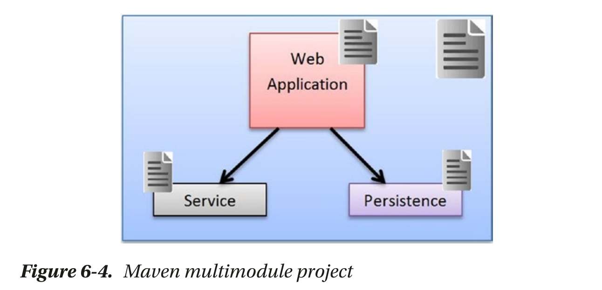

# 基于maven的多模块项目

maven的多项目模块目录如下所示：

- Parent Project
  - pom.xml
  - Module 1
    - pom.xml
  - Module 2
    - pom.xml
  - Module 3
    - pom.xml

下面介绍如何构建一个多模块的web项目：



利用maven的原型生成目标生成一个父项目（使用原型为`pom-root`，其groupId为`com.apress.gswmbook`,artifactId为`gswm-parent`）：

```SHELL
mvn archetype:generate -DgroupId=com.apress.gswmbook -DartifactId=gswm-parent -Dversion=1.0.0-SNAPSHOT -DarchetypeGroupId=org.codehaus.mojo.archetypes -DarchetypeArtifactId=pom-root -DarchetypeVersion=1.1
```

可以注意到生成的maven项目的`pom.xml`文件中`<packaging>pom</packaging>`元素表示这是一个父pom，且其没有`src`文件夹，因为它是一个父maven项目。

使用`cd swm-parent`命令进入该项目。在项目中创建相应的子模块`gswm-book`和`gswm-service`，其命令如下：

```SHELL
mvn archetype:generate -DgroupId=com.apress.gswmbook -DartifactId=gswm-web -Dversion=1.0.0-SNAPSHOT -Dpackage=war -DarchetypeArtifactId=maven-archetype-webapp

mvn archetype:generate -DgroupId=com.apress.gswmbook -DartifactId=gswm-service -Dversion=1.0.0-SNAPSHOT -DarchetypeArtifactId=maven-archetype-quickstart -DinteractiveMode=false

mvn archetype:generate -DgroupId=com.apress.gswmbook -DartifactId=gswm-repository -Dversion=1.0.0-SNAPSHOT -DarchetypeArtifactId=maven-archetype-quickstart -DinteractiveMode=false
```

执行完以上步骤后，可以发现`gswm-parent`下多了`gswm-web`、`gswm-service`、`gswm-repository`项目。浏览`gswm-parent`的`pom.xml`文件，可以看到其`packaging`元素被声明为`pom`，且含有了对应的`<modules />`元素声明，如下所示：

```XML
<?xml version="1.0" encoding="UTF-8" standalone="no"?>
<project xmlns="http://maven.apache.org/POM/4.0.0" xmlns:xsi="http://www.w3.org/2001/XMLSchema-instance" xsi:schemaLocation="http://maven.apache.org/POM/4.0.0 http://maven.apache.org/xsd/maven-4.0.0.xsd">
  <modelVersion>4.0.0</modelVersion>
  <groupId>com.apress.gswmbook</groupId>
  <artifactId>gswm-parent</artifactId>
  <version>1.0.0-SNAPSHOT</version>
  <packaging>pom</packaging>
  <name>gswm-parent</name>
  <modules>
    <module>gswm-web</module>
    <module>gswm-service</module>
    <module>gswm-repository</module>
  </modules>
</project>
```

查看`gswm-web`、`gswm-service`、`gswm-repository`项目的`pom.xml`文件，发现其均声明了`<parent />`元素，并指到了`gswm-parent`项目。

我们可以在父项目`gswm-parent`下运行`mvn package`过程，对项目进行验证、构建和打包。
