# MySQL基础讲座笔记

- [MySQL基础讲座笔记](#mysql基础讲座笔记)
  - [InnoDB索引](#innodb索引)
    - [B+树索引](#b树索引)
      - [主键索引](#主键索引)
      - [二级索引](#二级索引)
      - [聚合索引](#聚合索引)
      - [小测验](#小测验)
      - [经验之谈](#经验之谈)
        - [自增ID主键索引该不该用？](#自增id主键索引该不该用)
        - [复杂的查询语句](#复杂的查询语句)
          - [多表JOIN：笛卡尔积](#多表join笛卡尔积)
          - [子查询](#子查询)
          - [对复杂查询的使用建议](#对复杂查询的使用建议)
        - [索引数量是否越多越好?](#索引数量是否越多越好)
        - [如何检查自己写的SQL是否有性能问题？](#如何检查自己写的sql是否有性能问题)
        - [MySQL InnoDB 擅⻓的场景](#mysql-innodb-擅的场景)
    - [自适应Hash索引](#自适应hash索引)
    - [全文索引](#全文索引)
  - [数据安全](#数据安全)
    - [对系统的基本要求](#对系统的基本要求)
    - [系统环境的各种异常和不稳定因素](#系统环境的各种异常和不稳定因素)
    - [如何处理各种异常因素](#如何处理各种异常因素)
    - [为何MySQL InnoDB是比较靠谱的选择](#为何mysql-innodb是比较靠谱的选择)
    - [内存为虚,落盘为实](#内存为虚落盘为实)
    - [用Redo Log和Checkpoint恢复脏页数据](#用redo-log和checkpoint恢复脏页数据)
      - [Redo Log](#redo-log)
      - [Checkpoint](#checkpoint)
      - [应对非原子写的Double Write机制](#应对非原子写的double-write机制)
        - [尴尬的「写数据写了一半」](#尴尬的写数据写了一半)
        - [Double Write](#double-write)
        - [应用Double Write进行数据恢复](#应用double-write进行数据恢复)
        - [Double Write机制不是必须的](#double-write机制不是必须的)
        - [其他家的产品是怎么做的](#其他家的产品是怎么做的)
  - [事务和一致性](#事务和一致性)

先贴两张从官网download的图，它们分别是MySQL存储引擎架构和InnoDB架构图：


MySQL存储引擎主要由：客户端(各种语言的MySQL链接驱动、MySQL shell)和MySQL服务器(mysqld)组成。MySQL服务由`NoSQL接口`、`SQL Interface`、`语法解析器`、`优化器`、`各种cache和buffer`、`存储引擎`和`文件系统(数据文件和日志文件)`组成。


InnoDB架构图中包含了`内存组织架构`(包含`Buffer Pool`、`Change Buffer`、`Adaptive Hash Index`、`Log Buffer`等)、和`文件组织架构`(包含：`表`、`索引`、`表空间`、`双写缓冲区`、`Redo日志`、`Undo日志`等)，它们之间要经过`操作系统缓存`。

本次讲座主要从`InnoDB索引`、`数据安全`、`事务和一致性`三个方面讲解`InnoDB`引擎下的`MySQL`基础知识。

## InnoDB索引

InnoDB引擎有两种索引，一种是B+树索引，一种是Hash索引。因为`Hash索引`比较简单，主要讲解的`B+树索引`。

InnoDB索引在数据文件是使用名叫`Tablespaces`的结构存储的，它是一种段页式的存储结构，页是基本调度单位。

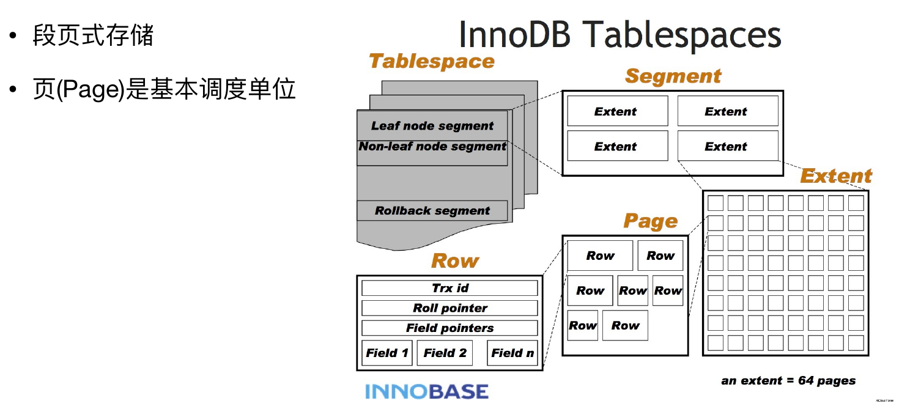

让我们通过如下的数据表(表名为：student_score)，分别讨论其使用B+树索引和Hash索引时的不同：

| id(PK) | name | gender | score | update_time         |
| ------ | ---- | ------ | ----- | ------------------- |
| 1      | 张三 | 1      | 60    | 2021-01-01 08\:00\:00 |
| 2      | 李四 | 1      | 65    | 2021-01-01 08\:01\:00 |
| 3      | 王五 | 1      | 55    | 2021-01-01 08\:00\:10 |
| 4      | 赵六 | 2      | 95    | 2021-01-01 08\:00\:10 |
| 5      | 张三 | 1      | 100   | 2021-01-01 08\:02\:00 |
| 6      | 李四 | 2      | 100   | 2021-01-01 08\:02\:00 |
| 7      | 王五 | 2      | 80    | 2021-01-01 08\:03\:00 |
| 8      | 赵六 | 1      | 85    | 2021-01-01 08\:03\:06 |
| 9      | 小妮 | 2      | 90    | 2021-01-01 08\:04\:10 |

### B+树索引

#### 主键索引

对于该数据表，假如其使用的是3分叉的B+树索引，则其主键(PK)索引的简图如下图所示：

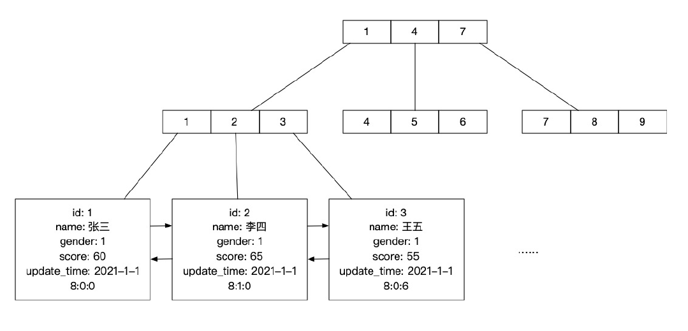

其全部数据存储在叶子节点。每个叶子都对应着表中的一条完整的记录。非叶子节点只负责记录索引信息。叶子节点使用双向链表按主键大小顺序相互链接。
这种索引被称作聚簇索引。

在命中主键索引进行单条记录查询时，只需要使用B+树的查询算法即可查询到相应数据;当进行范围查询时，只需要用单条记录查询的方式找到最左和最右范围的记录，然后从一端遍历双向链表到另一端即可。

#### 二级索引

假如我们在score列上建立了二级索引。其简图如下所示：

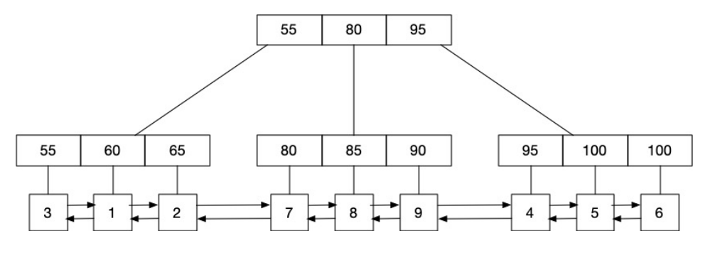

其叶子节点存储着跟该索引对应的记录的主键值。非叶子节点负责记录索引信息。叶子节点使用双向链表按照其对应的二级索引值的大小顺序进行链接。
这种索引被称为非聚簇索引。

在命中二级索引进行单条记录查询时，先使用B+树的查询算法从二级索引中查到该记录对应的主键，再从主键索引上通过该主键值进行查询;如果是范围查询，则先从二级索引上查询到最左和最右范围的叶子节点，然后遍历叶子节点找到所有的主键，遍历这些主键，依次在主键索引上应用查询单条记录的算法找到相对应的记录。

ps：**当二级索引的区分度(该列不同值的数量/该列的总记录)不够大时，mysql的优化器可能会选择不命中索引**。此时mysql会直接使用主键索引的叶子节点上的双向链表对所有记录进行查询，即进行全标扫描。这是因为：mysql优化器认为使用索引的效率远没有不使用来得高。如：对上表中的gender建立索引，那么我们使用`where gender = ?`的查询一般都不会命中索引，因为该字段只有两个值，区分度太低了。

#### 聚合索引

假如我们建立了一个(name, gender)的聚合索引，相当于建立了一个`name+gender`(两个列的值当作字符串拼接在一起)二级索引。其简图如下所示：

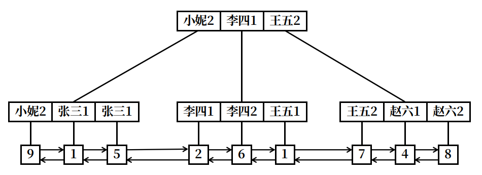

因为对于字符串的比较是从左到右的，这样建立的索引使用时也就要满足最左匹配原则了。如：查询条件`gender=1`是无法命中索引的，但是`gender=1 and name='张三'`会命中这个聚合索引(不要在意查询条件的写法顺序，mysql优化器会主动为我们进行查询条件顺序的调整。因而`gender=1 and name='张三'`和`name='张三 and gender=1'`经过优化器后是一样的，它们会同样的命中该聚合索引)。

#### 小测验

定义如下函数：

- `search_eq(index, x)`：在该索引index树下查询索引值等于x的叶子节点
- `search_max_lt(index, x)`：在该索引index树下查询索引值最大的小于x的叶子节点
- `search_max_leq(index, x)`：在该索引index树下查询索引值最大的小于等于x的叶子节点
- `search_min_gt(index, x)`：在该索引index树下查询索引值最小的大于x的叶子节点
- `search_min_geq(index, x)`：在该索引index树下查询索引值最小的大于等于x的叶子节点
- `traverse_node(st_node, ed_node, func)`：在叶子节点依靠其双向链表遍历st_node到ed_node的所有记录，返回满足func函数的记录。func函数的形式为`func(node): bool`,传入该叶子节点，返回值为bool类型，表示该节点是否满足条件。
- 使用`head_<index>`表示该索引叶子节点的第一个元素
- 使用`tail_<index>`表示该索引叶子节点的最后一个元素
- 将最后得到的结果赋值给`res`

请描述下列语句的执行算法：

1. `select * from student_score where id = 3;`，命中主键，等值查找:

    ```python
    res = search_eq(id, 3);
    ```

2. `select * from student_score where id >= 2 and id <= 6;`，命中主键，范围查找：

    ```python
    st_node = search_min_geq(id, 2);
    ed_node = search_max_leq(id, 6);
    res = traverse_node(st_node, ed_node, lambda x: True);
    ```

3. `select * from student_score where score = 100;`，命中二级索引，等值查找：

    ```python
    x = search_eq(score, 100);
    res = search_eq(id, x);
    ```

4. `select * from student_score where score >= 60 and score < 70;`，命中二级索引，范围查找：

    ```python
    st_node = search_min_geq(score, 2);
    ed_node = search_max_leq(score, 6);
    pk_list = traverse_node(st_node, ed_node, lambda x: True);
    res = list(map(lambda x: search_eq(id, x), pk_list));
    ```

5. `select * from student_score where minute(update) > 2;`，无论update是否建有索引，都不会命中索引，这是因为建立索引时使用的是`update`而不是`minute(update)`：

    ```python
    res = traverse_node(head_pk, tail_pk, lambda x: minute(x.update) > 2)
    ```

6. `select * from student_score where gender = 1;`，无论`gender`是否建有索引，都不会命中索引，这是因为该字段区分度太小，mysql的优化器认为不使用索引效率更高：

    ```python
    res = traverse_node(head_pk, tail_pk, lambda x: minute(x.update) > 2)
    ```

#### 经验之谈

##### 自增ID主键索引该不该用？

- 自增索引的主要不足：
  - 业务上容易被人猜到规律。例如：已知有id是1000的记录，那么很大可能也有id是1～999的数据。
  - 如果以后要做分库分表，自增索引的表无法平滑迁移。
- 自增ID的可用情景：
  - 公开的不敏感数据。例如：贷款的产品数据、支持的银行类型
  - 如果一张表的数据量可以确保在将来也不会变得太大，不需要分库分表。如：贷款的产品数据、支持的银行类型
- 自增ID的替代方案：
  - 雪花ID：雪花ID是有时序性的，同一个生成器后生成的雪花ID字典序比之前的大。
  - UUID：UUID没有时序性，如果需要时序性，此时可以依靠表示为时间戳的创建时间字段(不要使用时间字符串，因为可能有夏令时、冬令时切换和其他时区调整导致后创建的记录的时间字符串反而更小。)。
  - 其他碰撞率很低的ID生成算法

##### 复杂的查询语句

###### 多表JOIN：笛卡尔积

- 在MySQL优化器层面会有限选用结果集最小的那张表作为驱动表，来和其他的表连接(Nested Loop算法)。(一般编程也是把最大的数量集放入最内层循环，这是为了多命中几次缓存。)
  - 如何得到结果集最小的表？MySQL会估算每个表的结果集大小
  - 如何估算？会使用`WHERE`/`ON`中的查询条件，调用存储引擎提供的接口来估算。
- JOIN表的数量越多，循环层数就越多，性能就越低;覆盖的数据范围越广，计算量就越大，性能就越低。

###### 子查询

- 基本规则:子查询先于主查询之前执行完成,子查询的结果供主查询使用
- 几种常⻅的子查询场景:

    | 子查询在SELECT语句中出现的位置        | Mysql内部处理的大概逻辑(可能描述的不是太准确,仅供参考)                 |
    | ------------------------------------- | ---------------------------------------------------------------------- |
    | 在SELECT的字段列表中包含子查询        | 这种情况只支持标量子查询,最终的效果类似于多表JOIN                      |
    | 在FROM里面包含子查询                  | 将内层的查询结果生成一个临时表,这个表数据再供外层SQL查询               |
    | 在WHERE、HAVING条件表达式里包含子查询 | 把内层查询的结果作为外层查询的比较条件(有机会可以命中索引)             |
    | 在EXISTS条件里包含子查询              | 相关子查询。将外层SQL的结果拿到内层去测试,如果内层SQL成立,则将这行取出 |

- 小结：
  - 子查询最好的情况是和JOIN一样,只做笛卡尔积运算(多层循环),有些情况下还会生成临时表;
  - 主查询和子查询的结合很容易无法使用索引,不容易优化;
  - 一般而言,嵌套的层级越深,写得越复杂,性能就越差。

###### 对复杂查询的使用建议

- 谨慎使用,能少用就少用
- 如果一定要这样写(业务逻辑要求就是这样),那在使用的时候要尽量优化:
  - 严格控制层级
  - 尽量命中索引
- 如果业务代码中会大量使用到复杂查询语句,考虑以下的优化方法:
  - 可能是代码写得不好,优化它;
  - 可能是表结构设计不合理,修改它;
  - 算法层面的优化:例如设立冗余表/冗余列/缓存表,用空间换时间;
  - 重新审视业务规则,和产品经理讨论,在产品规则和系统性能之间取一个平衡。

##### 索引数量是否越多越好?

- 索引能优化SELECT查询,但会给写操作(`INSERT`/`UPDATE`/`DELETE`)带来负担
- 要在读写操作之间取得一个平衡

##### 如何检查自己写的SQL是否有性能问题？

- 最直观的办法:在接近生产环境的数据量情况下执行一遍,看要花多⻓时间
- 日常用好`explain`命令,检查是否命中索引
- 打开`slow log`,针对查询时间太⻓的语句进行重点优化
- 复杂的SELECT语句(特别是多表JOIN和嵌套子查询)，能少用就尽量少用，能简单就不要复杂

##### MySQL InnoDB 擅⻓的场景

- InnoDB特别适合的场景:
  - 较小批量数据、可频繁并发访问、要求低延时的**范围查询**操作;
  - 要求严格ACID事务保证的写操作(典型的比如电商交易、金融场景);
  - 比较强调读性能,而对写操作性能的要求不是特别高的场合。
- 特别不适合的场景：
  - 存放大文件、单条数据体积大的应用(例如存放视频文件的网盘);
  - 数据吞吐量特别大的计算任务(例如典型的大数据离线计算);
  - 非常强调写性能、但不要求ACID事务支持的应用场景(例如一些常⻅的互联网应用);

### 自适应Hash索引

它是由数据库自身根据你的使用情况创建的，并不能人为的干预，所以叫作自适应哈希索引，采用的是哈希表数据结构，所以对于字典类型的查询就非常的快，但是对于范围查询就无能为力啦。

### 全文索引

全文索引是一种比较特殊的索引，一般都是基于倒排索引来实现的，es 也是使用倒排索引。倒排索引跟 B-Tree 索引一样也是一种数据结构，在辅助表中存储了单词与单词自身在一个或多个文档中所在位置的映射。专门用来优化`select * from blog where content like '%xxxx%'`之类的查询语句。

## 数据安全

广义的数据安全包括：数据内容的安全、访问权限控制、数据底层存储方面的安全保障。本次培训主要讨论数据磁层存储方面的安全话题。

### 对系统的基本要求

- 业务代码逻辑要正确,账要算对;
- 系统内部不能丢消息、丢数据;
- 系统内部的数据要保证事务的原子性、某种一致性、操作幂等性,等等;
- 面对各种故障和异常情况要有足够的容错度。当发生异常时,如果系统还能工作,仍然要保证上述几项要求能做得到。

### 系统环境的各种异常和不稳定因素

- 单台服务器或者进程:
  - 内存爆了
  - CPU跑满了，处理不过来了
  - 系统文件句柄数耗尽
  - Socket网络端口号耗尽
  - 硬盘满了或者坏了
  - 机器突然断电或者被关机了
  - 服务进程自己崩溃了，或者被Kill了
  - 。。。。。。
- 多机系统层面:
  - 网络突然断了或者不稳定
  - 某个模块服务停了，导致消息在中途传不下去
  - 中控节点挂了，系统停止服务了
  - 通常模块链条越长，系统整体的可靠性就越差
  - 。。。。。。

哪怕遇到这些事情，业务系统也要想法设法摆平：

- 要么你能事先识别出⻛险所在,提前做好预案;
- 要么你能用技术手段容错,令服务不受影响;
- 次一级的办法:如果故障真的发生了,你能尽力减少停服务的时间,尽量减少业务损失。

### 如何处理各种异常因素

- 提前预判和识别分析
  - 哪些因素必须实时监控和提前预防
  - CPU、内存、磁盘等指标的实时监控和提前预警
  - 使用磁盘阵列,或者找云服务商提供可靠磁盘保证
  - 数据定时备份方案
  - ...
- 哪些异常情况是需要通过代码或者局部技术手段来容错解决的
  - 异常容错代码:只考虑正常业务逻辑的代码还算是简单的,通常难的地方都在处理各种异常情况
  - 通过配置项解决:Mysql、MQ等的关键配置项
- 哪些因素是通过架构设计来规避和解决的
  - 例如从单点模块升级为主从复制小集群、引入可靠的消息队列、引入分布式锁/元数据集群等等

另外，还要考虑方法的成本代价。**最高级别的技术事故，一定是数据事故。**所以必须要选择一个十分靠谱的数据存储系统方案。

### 为何MySQL InnoDB是比较靠谱的选择

MySQL提供了`Redo Log`、`Double Write`、`Undo Log`、`Bin Log`等技术来保证数据的存储安全性。

### 内存为虚,落盘为实

让我们先认识一下`Buffer Pool`，它是一个大型的内存数据缓存池，主要作用是保存热点数据，减少磁盘IO,减速数据的访问和修改。

其主要特点如下：

- 以页为单位存放和调度数据;
- 主要使用LRU算法淘汰那些最久未被使用的页;
- 加载数据时有预读机制（线性预读和随机预读）。


我们在使用`select`、`update`等命令操作MySQL时，实际操作的是`Buffer Pool`中的数据，即操作的结果会在内存中。而 **任何数据，如果只在内存中，没有写入磁盘，都是易失的、不安全的**。再我们编程操作文件时，即使调用了`write`命令，实际上也不能保证内容写入到了磁盘，因为**操作系统也有I/O的缓冲机制**。只有通过调用`fsync`指令，才能强制立即将数据写入磁盘。另外，也可以使用`O_SYNC`或`O_DIRECT`打开文件，即`fd = open("myfile", O_DIRECT|O_SYNC)`，这样操作系统会保证我们每次写入的数据会立即刷入磁盘。
频繁刷盘的主要不足之处是**性能不好**。，因而需要权衡：数据安全、性能和价格成本。

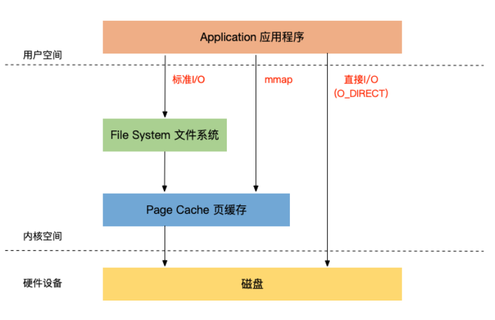

与之对应MySQL提供了不同的刷盘配置来确保日志文件的数据安全性，主要通过配置`innodb_flush_log_at_trx_commit`选项实现：

取值|含义说明
--|--
0|大约每秒刷写一次各种log文件。如果有已提交(commit)的事务来不及刷写到磁盘中,万一mysql挂了,那这些事务数据极有可能就丢失了。
1(默认值)|每当有事务提交(commit)时,确保各种log文件立即刷写到磁盘中(调用fsync)。事务数据丢失的概率比较低。
2|每当有事务提交(commit)时,各种log文件会”写”出去,但没有调用fsync,而是等待mysql大约每隔一秒执行一次真正的刷写操作。期间如果有mysql挂了,没刷写到磁盘的事务数据极有可能就丢失了。

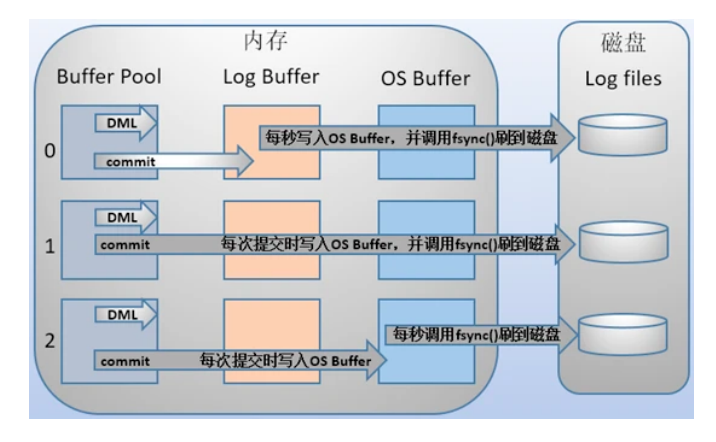

通过图，我们可以很直观的得出结论：当该选项值为1时，可以保证log更准确的说是`redo log`的持久性（redo的持久性保证了事务的持久性，即保证了MySQL发生崩溃重启后可以恢复还未被写入到磁盘的脏页，具体的策略看后面的[用Redo Log和Checkpoint恢复脏页数据](#用redo-log和checkpoint恢复脏页数据)），此时受制于磁盘的I/O性能，会导致MySQL性能明显下降。而0和2能获得更高的性能。可以通过`select @@innodb_flush_log_at_trx_commit;`查询数据库该选项的配置值。

### 用Redo Log和Checkpoint恢复脏页数据

为了性能，InnoDB在执行更新命令时，并不立即把数据直接更新到磁盘，而是**先写入到内存的Buffer Pool中**，等一段时间后才真正刷写到磁盘。为了保证不丢失数据，MySQL使用了**WAL技术**（Write Ahead Log：先将事物的写操作记录到redo log文件，再处理数据），这也就意味着只要有一个合适的快照点（即`Checkpoint`）和在该点之后所做的全部写操作的日志（即`Redo Log`）就可以在数据库发生意外重启时，通过在快照点重新执行操作还原出已经commit的事务数据。

#### Redo Log

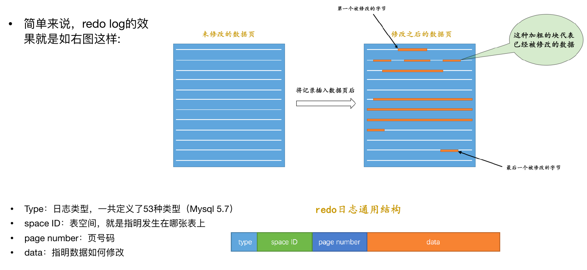

innodb_flush_log_at_trx_commit值为1时，执行一条更新SQL语句（如：UPDATE）的大致过程如下：

1. 从内存`Buffer Pool`中找到相关的页，如果找不到就从磁盘数据文件中调出来;
2. 直接在这些内存页上做数据修改，并标记为“脏页”（Dirty Page）;
3. 生成一条对应的`Redo Log`，暂存到内存中的`Log Buffer`中;
4. 如果遇到了`commit`指令，在执行该指令前，立即将`redo log`刷写到磁盘中;
5. 内存中的脏页按照一定的机制，再之后分批次写入到磁盘。

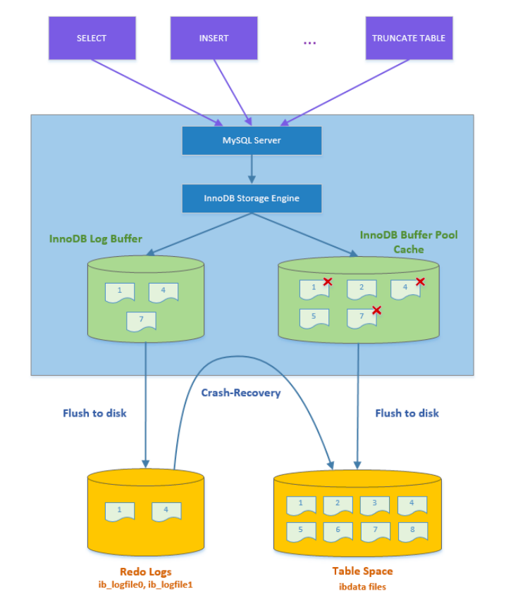

#### Checkpoint

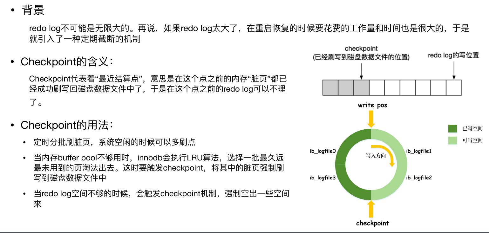

如下图所示,假设LSN(log sequence number)10000之前的脏⻚数据都已经刷写到了磁盘，那么MySQL在重启时只需要重做LSN 1000之后的redo log内容即可。

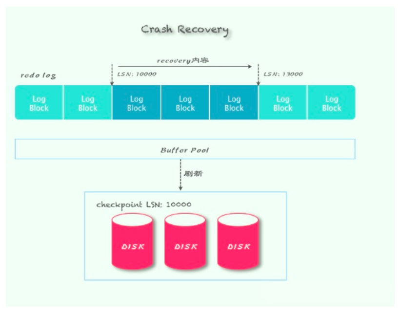

但是如果磁盘是非原子性写的，就有可能导致数据写入一半时崩掉了，为了解决这个问题，MySQL又引入了`Double Write`机制。

#### 应对非原子写的Double Write机制

##### 尴尬的「写数据写了一半」

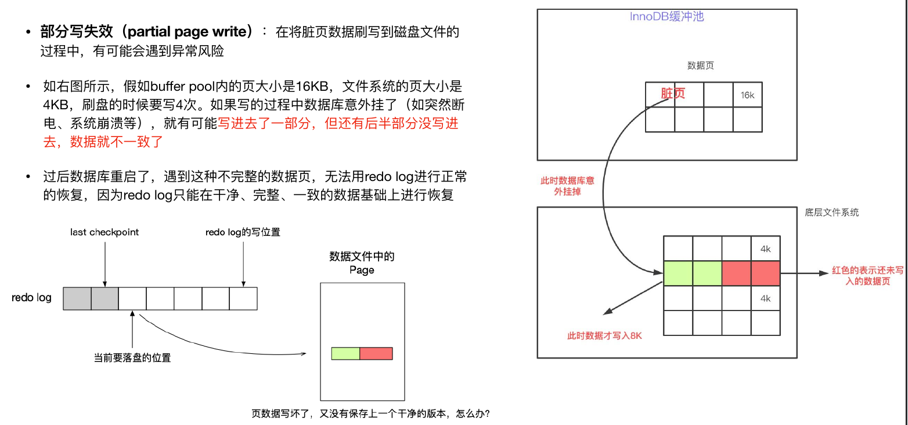

##### Double Write

MySQL在数据文件中设立一块2MB的特殊buffer区域(对于16KB大小的⻚,可一次存放128个⻚),相当于留了一个备份。

1. 在刷写脏页数据的时候，先将数据拷贝(使用memcpy函数)到内存中的`Double Write`区域（这是一个被mmap声明的内存映射文件），并调用`msync`写入磁盘。
2. 之后，再将这批页数据分别写入到应该写入的数据文件中。

##### 应用Double Write进行数据恢复

每个页都有checksum字段，因而我们可以通过算法来检查这页的数据是否完整。加入了`double write`后，可能出现如下几种情况：

1. 如果`double write`和数据文件中的数据均完整且相同，则说明该`checkpoint`写入成功了或者还未开始写，那么直接用该`checkpoint`和其标识的`LSN`之后的`redo log`进行恢复即可。
2. 如果`double write`中的数据检查`checksum`发现不完整，则说明在将数据拷贝到`double write`的过程中数据出错了，那么直接使用数据文件中的这个老版本`checkpoint`，使用其标识的`LSN`之后的`redo log`进行恢复。
3. 如果`double write`和数据文件中的数据均完整但不相同，那说明刚完成了`double write`的写入，还未开始数据文件的写入，此时先将`double write`中的内容写入到数据文件，然后直接使用`double write`中的`checkpoint`，使用其标识的`LSN`号之后的`redo log`进行恢复。
4. 如果`double write`中的数据完整，但数据文件的`checksum`不对，那说明完成了`double write`的写入后，再进行数据文件的写入时出错了，此时先将`double write`中的内容写入到数据文件，然后直接使用`double write`中的`checkpoint`，使用其标识的`LSN`号之后的`redo log`进行恢复。

可以发现可能的5种情况（上面写的1中包含了两种情况）均可以成功用`checkpoint`和`redo log`恢复完整的数据。

##### Double Write机制不是必须的

 如果底层存储设备支持原子性写(例如Fusion IO和PCIE SSD),或者底层文件系统支持原子写,那么double write机制可以取消。`Dobule Write`本质上就是为了让`checkpoint`的写入操作拥有原子性，MySQL默认会在不支持原子写的系统上开启`Double Write`，在支持的系统上关闭。

##### 其他家的产品是怎么做的

- PostgreSQL采用full page write的办法来解决部分写失效的问题(也就是直接粗暴地将整个⻚的数据写进WAL日志里)
- Oracle本身有很多数据块的完整性校验机制,如果发生写失败就直接回滚

## 事务和一致性
