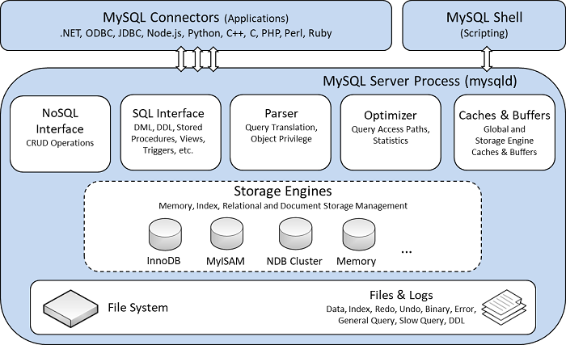

# MySQL基础讲座笔记

- [MySQL基础讲座笔记](#mysql基础讲座笔记)
  - [InnoDB索引](#innodb索引)
    - [B+树索引](#b树索引)
      - [主键索引](#主键索引)
      - [二级索引](#二级索引)
      - [聚合索引](#聚合索引)
      - [小测验](#小测验)
      - [经验之谈](#经验之谈)
        - [自增ID主键索引该不该用？](#自增id主键索引该不该用)
        - [复杂的查询语句](#复杂的查询语句)
          - [多表JOIN：笛卡尔积](#多表join笛卡尔积)
          - [子查询](#子查询)
          - [对复杂查询的使用建议](#对复杂查询的使用建议)
        - [索引数量是否越多越好?](#索引数量是否越多越好)
        - [如何检查自己写的SQL是否有性能问题？](#如何检查自己写的sql是否有性能问题)
        - [MySQL InnoDB 擅⻓的场景](#mysql-innodb-擅的场景)
    - [自适应Hash索引](#自适应hash索引)
    - [全文索引](#全文索引)
  - [数据安全](#数据安全)
    - [对系统的基本要求](#对系统的基本要求)
    - [系统环境的各种异常和不稳定因素](#系统环境的各种异常和不稳定因素)
    - [如何处理各种异常因素](#如何处理各种异常因素)
    - [为何MySQL InnoDB是比较靠谱的选择](#为何mysql-innodb是比较靠谱的选择)
    - [内存为虚,落盘为实](#内存为虚落盘为实)
    - [用Redo Log和Checkpoint恢复脏页数据](#用redo-log和checkpoint恢复脏页数据)
      - [Redo Log](#redo-log)
      - [Checkpoint](#checkpoint)
      - [应对非原子写的Double Write机制](#应对非原子写的double-write机制)
        - [尴尬的「写数据写了一半」](#尴尬的写数据写了一半)
        - [Double Write](#double-write)
        - [应用Double Write进行数据恢复](#应用double-write进行数据恢复)
        - [Double Write机制不是必须的](#double-write机制不是必须的)
        - [其他家的产品是怎么做的](#其他家的产品是怎么做的)
    - [Undo Log](#undo-log)
    - [Bin Log](#bin-log)
    - [数据更新操作时，`Redo Log`、`Undo Log`、`Bin Log`的操作时机](#数据更新操作时redo-logundo-logbin-log的操作时机)
  - [事务和一致性](#事务和一致性)
    - [事务的ACID](#事务的acid)
    - [Innodb事务的重要字段](#innodb事务的重要字段)
    - [隔离级](#隔离级)
      - [可重复度](#可重复度)
      - [幻读](#幻读)
    - [MVCC：多版本并发控制](#mvcc多版本并发控制)
      - [基本原理](#基本原理)
    - [Innodb的锁](#innodb的锁)
      - [乐观锁和悲观锁](#乐观锁和悲观锁)
      - [共享、排它锁(读写锁)](#共享排它锁读写锁)
      - [意向锁](#意向锁)
      - [间隙锁](#间隙锁)
      - [死锁](#死锁)
        - [死锁产生的四个条件](#死锁产生的四个条件)
        - [避免死锁的方法](#避免死锁的方法)
      - [如何正确地使用锁](#如何正确地使用锁)
    - [分布式事务](#分布式事务)
      - [CAP](#cap)
      - [BASE](#base)
      - [常用的一致性概念](#常用的一致性概念)
      - [常用的事务解决方案](#常用的事务解决方案)
        - [XA：两阶段提交协议](#xa两阶段提交协议)
        - [TCC:Try-Confirm-Cancel](#tcctry-confirm-cancel)
        - [消息驱动](#消息驱动)
      - [分布式事务的工程实践](#分布式事务的工程实践)

先贴两张从官网download的图，它们分别是MySQL存储引擎架构和InnoDB架构图：



MySQL存储引擎主要由：客户端(各种语言的MySQL链接驱动、MySQL shell)和MySQL服务器(mysqld)组成。MySQL服务由`NoSQL接口`、`SQL Interface`、`语法解析器`、`优化器`、`各种cache和buffer`、`存储引擎`和`文件系统(数据文件和日志文件)`组成。


InnoDB架构图中包含了`内存组织架构`(包含`Buffer Pool`、`Change Buffer`、`Adaptive Hash Index`、`Log Buffer`等)、和`文件组织架构`(包含：`表`、`索引`、`表空间`、`双写缓冲区`、`Redo日志`、`Undo日志`等)，它们之间要经过`操作系统缓存`。

本次讲座主要从`InnoDB索引`、`数据安全`、`事务和一致性`三个方面讲解`InnoDB`引擎下的`MySQL`基础知识。

## InnoDB索引

InnoDB引擎有两种索引，一种是B+树索引，一种是Hash索引。因为`Hash索引`比较简单，主要讲解的`B+树索引`。

InnoDB索引在数据文件是使用名叫`Tablespaces`的结构存储的，它是一种段页式的存储结构，页是基本调度单位。


让我们通过如下的数据表(表名为：student_score)，分别讨论其使用B+树索引和Hash索引时的不同：

| id(PK) | name | gender | score | update_time         |
| ------ | ---- | ------ | ----- | ------------------- |
| 1      | 张三 | 1      | 60    | 2021-01-01 08&#58;00&#58;00 |
| 2      | 李四 | 1      | 65    | 2021-01-01 08&#58;01&#58;00 |
| 3      | 王五 | 1      | 55    | 2021-01-01 08&#58;00&#58;10 |
| 4      | 赵六 | 2      | 95    | 2021-01-01 08&#58;00&#58;10 |
| 5      | 张三 | 1      | 100   | 2021-01-01 08&#58;02&#58;00 |
| 6      | 李四 | 2      | 100   | 2021-01-01 08&#58;02&#58;00 |
| 7      | 王五 | 2      | 80    | 2021-01-01 08&#58;03&#58;00 |
| 8      | 赵六 | 1      | 85    | 2021-01-01 08&#58;03&#58;06 |
| 9      | 小妮 | 2      | 90    | 2021-01-01 08&#58;04&#58;10 |

### B+树索引

#### 主键索引

对于该数据表，假如其使用的是3分叉的B+树索引，则其主键(PK)索引的简图如下图所示：


其全部数据存储在叶子节点。每个叶子都对应着表中的一条完整的记录。非叶子节点只负责记录索引信息。叶子节点使用双向链表按主键大小顺序相互链接。
这种索引被称作聚簇索引。

在命中主键索引进行单条记录查询时，只需要使用B+树的查询算法即可查询到相应数据;当进行范围查询时，只需要用单条记录查询的方式找到最左和最右范围的记录，然后从一端遍历双向链表到另一端即可。

#### 二级索引

假如我们在score列上建立了二级索引。其简图如下所示：


其叶子节点存储着跟该索引对应的记录的主键值。非叶子节点负责记录索引信息。叶子节点使用双向链表按照其对应的二级索引值的大小顺序进行链接。
这种索引被称为非聚簇索引。

在命中二级索引进行单条记录查询时，先使用B+树的查询算法从二级索引中查到该记录对应的主键，再从主键索引上通过该主键值进行查询;如果是范围查询，则先从二级索引上查询到最左和最右范围的叶子节点，然后遍历叶子节点找到所有的主键，遍历这些主键，依次在主键索引上应用查询单条记录的算法找到相对应的记录。

ps：**当二级索引的区分度(该列不同值的数量/该列的总记录)不够大时，mysql的优化器可能会选择不命中索引**。此时mysql会直接使用主键索引的叶子节点上的双向链表对所有记录进行查询，即进行全标扫描。这是因为：mysql优化器认为使用索引的效率远没有不使用来得高。如：对上表中的gender建立索引，那么我们使用`where gender = ?`的查询一般都不会命中索引，因为该字段只有两个值，区分度太低了。

#### 聚合索引

假如我们建立了一个(name, gender)的聚合索引，相当于建立了一个`name+gender`(两个列的值当作字符串拼接在一起)二级索引。其简图如下所示：


因为对于字符串的比较是从左到右的，这样建立的索引使用时也就要满足最左匹配原则了。如：查询条件`gender=1`是无法命中索引的，但是`gender=1 and name='张三'`会命中这个聚合索引(不要在意查询条件的写法顺序，mysql优化器会主动为我们进行查询条件顺序的调整。因而`gender=1 and name='张三'`和`name='张三 and gender=1'`经过优化器后是一样的，它们会同样的命中该聚合索引)。

#### 小测验

定义如下函数：

- `search_eq(index, x)`：在该索引index树下查询索引值等于x的叶子节点
- `search_max_lt(index, x)`：在该索引index树下查询索引值最大的小于x的叶子节点
- `search_max_leq(index, x)`：在该索引index树下查询索引值最大的小于等于x的叶子节点
- `search_min_gt(index, x)`：在该索引index树下查询索引值最小的大于x的叶子节点
- `search_min_geq(index, x)`：在该索引index树下查询索引值最小的大于等于x的叶子节点
- `traverse_node(st_node, ed_node, func)`：在叶子节点依靠其双向链表遍历st_node到ed_node的所有记录，返回满足func函数的记录。func函数的形式为`func(node): bool`,传入该叶子节点，返回值为bool类型，表示该节点是否满足条件。
- 使用`head_<index>`表示该索引叶子节点的第一个元素
- 使用`tail_<index>`表示该索引叶子节点的最后一个元素
- 将最后得到的结果赋值给`res`

请描述下列语句的执行算法：

1. `select * from student_score where id = 3;`，命中主键，等值查找:

    ```python
    res = search_eq(id, 3);
    ```

2. `select * from student_score where id >= 2 and id <= 6;`，命中主键，范围查找：

    ```python
    st_node = search_min_geq(id, 2);
    ed_node = search_max_leq(id, 6);
    res = traverse_node(st_node, ed_node, lambda x: True);
    ```

3. `select * from student_score where score = 100;`，命中二级索引，等值查找：

    ```python
    x = search_eq(score, 100);
    res = search_eq(id, x);
    ```

4. `select * from student_score where score >= 60 and score < 70;`，命中二级索引，范围查找：

    ```python
    st_node = search_min_geq(score, 2);
    ed_node = search_max_leq(score, 6);
    pk_list = traverse_node(st_node, ed_node, lambda x: True);
    res = list(map(lambda x: search_eq(id, x), pk_list));
    ```

5. `select * from student_score where minute(update) > 2;`，无论update是否建有索引，都不会命中索引，这是因为建立索引时使用的是`update`而不是`minute(update)`：

    ```python
    res = traverse_node(head_pk, tail_pk, lambda x: minute(x.update) > 2)
    ```

6. `select * from student_score where gender = 1;`，无论`gender`是否建有索引，都不会命中索引，这是因为该字段区分度太小，mysql的优化器认为不使用索引效率更高：

    ```python
    res = traverse_node(head_pk, tail_pk, lambda x: minute(x.update) > 2)
    ```

#### 经验之谈

##### 自增ID主键索引该不该用？

- 自增索引的主要不足：
  - 业务上容易被人猜到规律。例如：已知有id是1000的记录，那么很大可能也有id是1～999的数据。
  - 如果以后要做分库分表，自增索引的表无法平滑迁移。
- 自增ID的可用情景：
  - 公开的不敏感数据。例如：贷款的产品数据、支持的银行类型
  - 如果一张表的数据量可以确保在将来也不会变得太大，不需要分库分表。如：贷款的产品数据、支持的银行类型
- 自增ID的替代方案：
  - 雪花ID：雪花ID是有时序性的，同一个生成器后生成的雪花ID字典序比之前的大。
  - UUID：UUID没有时序性，如果需要时序性，此时可以依靠表示为时间戳的创建时间字段(不要使用时间字符串，因为可能有夏令时、冬令时切换和其他时区调整导致后创建的记录的时间字符串反而更小。)。
  - 其他碰撞率很低的ID生成算法

##### 复杂的查询语句

###### 多表JOIN：笛卡尔积

- 在MySQL优化器层面会有限选用结果集最小的那张表作为驱动表，来和其他的表连接(Nested Loop算法)。(一般编程也是把最大的数量集放入最内层循环，这是为了多命中几次缓存。)
  - 如何得到结果集最小的表？MySQL会估算每个表的结果集大小
  - 如何估算？会使用`WHERE`/`ON`中的查询条件，调用存储引擎提供的接口来估算。
- JOIN表的数量越多，循环层数就越多，性能就越低;覆盖的数据范围越广，计算量就越大，性能就越低。

###### 子查询

- 基本规则:子查询先于主查询之前执行完成,子查询的结果供主查询使用
- 几种常⻅的子查询场景:

    | 子查询在SELECT语句中出现的位置        | Mysql内部处理的大概逻辑(可能描述的不是太准确,仅供参考)                 |
    | ------------------------------------- | ---------------------------------------------------------------------- |
    | 在SELECT的字段列表中包含子查询        | 这种情况只支持标量子查询,最终的效果类似于多表JOIN                      |
    | 在FROM里面包含子查询                  | 将内层的查询结果生成一个临时表,这个表数据再供外层SQL查询               |
    | 在WHERE、HAVING条件表达式里包含子查询 | 把内层查询的结果作为外层查询的比较条件(有机会可以命中索引)             |
    | 在EXISTS条件里包含子查询              | 相关子查询。将外层SQL的结果拿到内层去测试,如果内层SQL成立,则将这行取出 |

- 小结：
  - 子查询最好的情况是和JOIN一样,只做笛卡尔积运算(多层循环),有些情况下还会生成临时表;
  - 主查询和子查询的结合很容易无法使用索引,不容易优化;
  - 一般而言,嵌套的层级越深,写得越复杂,性能就越差。

###### 对复杂查询的使用建议

- 谨慎使用,能少用就少用
- 如果一定要这样写(业务逻辑要求就是这样),那在使用的时候要尽量优化:
  - 严格控制层级
  - 尽量命中索引
- 如果业务代码中会大量使用到复杂查询语句,考虑以下的优化方法:
  - 可能是代码写得不好,优化它;
  - 可能是表结构设计不合理,修改它;
  - 算法层面的优化:例如设立冗余表/冗余列/缓存表,用空间换时间;
  - 重新审视业务规则,和产品经理讨论,在产品规则和系统性能之间取一个平衡。

##### 索引数量是否越多越好?

- 索引能优化SELECT查询,但会给写操作(`INSERT`/`UPDATE`/`DELETE`)带来负担
- 要在读写操作之间取得一个平衡

##### 如何检查自己写的SQL是否有性能问题？

- 最直观的办法:在接近生产环境的数据量情况下执行一遍,看要花多⻓时间
- 日常用好`explain`命令,检查是否命中索引
- 打开`slow log`,针对查询时间太⻓的语句进行重点优化
- 复杂的SELECT语句(特别是多表JOIN和嵌套子查询)，能少用就尽量少用，能简单就不要复杂

##### MySQL InnoDB 擅⻓的场景

- InnoDB特别适合的场景:
  - 较小批量数据、可频繁并发访问、要求低延时的**范围查询**操作;
  - 要求严格ACID事务保证的写操作(典型的比如电商交易、金融场景);
  - 比较强调读性能,而对写操作性能的要求不是特别高的场合。
- 特别不适合的场景：
  - 存放大文件、单条数据体积大的应用(例如存放视频文件的网盘);
  - 数据吞吐量特别大的计算任务(例如典型的大数据离线计算);
  - 非常强调写性能、但不要求ACID事务支持的应用场景(例如一些常⻅的互联网应用);

### 自适应Hash索引

它是由数据库自身根据你的使用情况创建的，并不能人为的干预，所以叫作自适应哈希索引，采用的是哈希表数据结构，所以对于字典类型的查询就非常的快，但是对于范围查询就无能为力啦。

### 全文索引

全文索引是一种比较特殊的索引，一般都是基于倒排索引来实现的，es 也是使用倒排索引。倒排索引跟 B-Tree 索引一样也是一种数据结构，在辅助表中存储了单词与单词自身在一个或多个文档中所在位置的映射。专门用来优化`select * from blog where content like '%xxxx%'`之类的查询语句。

## 数据安全

广义的数据安全包括：数据内容的安全、访问权限控制、数据底层存储方面的安全保障。本次培训主要讨论数据磁层存储方面的安全话题。

### 对系统的基本要求

- 业务代码逻辑要正确,账要算对;
- 系统内部不能丢消息、丢数据;
- 系统内部的数据要保证事务的原子性、某种一致性、操作幂等性,等等;
- 面对各种故障和异常情况要有足够的容错度。当发生异常时,如果系统还能工作,仍然要保证上述几项要求能做得到。

### 系统环境的各种异常和不稳定因素

- 单台服务器或者进程:
  - 内存爆了
  - CPU跑满了，处理不过来了
  - 系统文件句柄数耗尽
  - Socket网络端口号耗尽
  - 硬盘满了或者坏了
  - 机器突然断电或者被关机了
  - 服务进程自己崩溃了，或者被Kill了
  - 。。。。。。
- 多机系统层面:
  - 网络突然断了或者不稳定
  - 某个模块服务停了，导致消息在中途传不下去
  - 中控节点挂了，系统停止服务了
  - 通常模块链条越长，系统整体的可靠性就越差
  - 。。。。。。

哪怕遇到这些事情，业务系统也要想法设法摆平：

- 要么你能事先识别出⻛险所在,提前做好预案;
- 要么你能用技术手段容错,令服务不受影响;
- 次一级的办法:如果故障真的发生了,你能尽力减少停服务的时间,尽量减少业务损失。

### 如何处理各种异常因素

- 提前预判和识别分析
  - 哪些因素必须实时监控和提前预防
  - CPU、内存、磁盘等指标的实时监控和提前预警
  - 使用磁盘阵列,或者找云服务商提供可靠磁盘保证
  - 数据定时备份方案
  - ...
- 哪些异常情况是需要通过代码或者局部技术手段来容错解决的
  - 异常容错代码:只考虑正常业务逻辑的代码还算是简单的,通常难的地方都在处理各种异常情况
  - 通过配置项解决:Mysql、MQ等的关键配置项
- 哪些因素是通过架构设计来规避和解决的
  - 例如从单点模块升级为主从复制小集群、引入可靠的消息队列、引入分布式锁/元数据集群等等

另外，还要考虑方法的成本代价。**最高级别的技术事故，一定是数据事故。**所以必须要选择一个十分靠谱的数据存储系统方案。

### 为何MySQL InnoDB是比较靠谱的选择

MySQL提供了`Redo Log`、`Double Write`、`Undo Log`、`Bin Log`等技术来保证数据的存储安全性。

### 内存为虚,落盘为实

让我们先认识一下`Buffer Pool`，它是一个大型的内存数据缓存池，主要作用是保存热点数据，减少磁盘IO,减速数据的访问和修改。

其主要特点如下：

- 以页为单位存放和调度数据;
- 主要使用LRU算法淘汰那些最久未被使用的页;
- 加载数据时有预读机制（线性预读和随机预读）。


我们在使用`select`、`update`等命令操作MySQL时，实际操作的是`Buffer Pool`中的数据，即操作的结果会在内存中。而 **任何数据，如果只在内存中，没有写入磁盘，都是易失的、不安全的**。在我们编程操作文件时，即使调用了`write`命令，实际上也不能保证内容写入到了磁盘，因为**操作系统也有I/O的缓冲机制**。只有通过调用`fsync`指令，才能强制立即将数据写入磁盘。另外，也可以使用`O_SYNC`或`O_DIRECT`打开文件，即`fd = open("myfile", O_DIRECT|O_SYNC)`，这样操作系统会保证我们每次写入的数据会立即刷入磁盘。
频繁刷盘的主要不足之处是**性能不好**。，因而需要权衡：数据安全、性能和价格成本。


与之对应MySQL提供了不同的刷盘配置来确保日志文件的数据安全性，主要通过配置`innodb_flush_log_at_trx_commit`选项实现：

取值|含义说明
--|--
0|大约每秒刷写一次各种log文件。如果有已提交(commit)的事务来不及刷写到磁盘中,万一mysql挂了,那这些事务数据极有可能就丢失了。
1(默认值)|每当有事务提交(commit)时,确保各种log文件立即刷写到磁盘中(调用fsync)。事务数据丢失的概率比较低。
2|每当有事务提交(commit)时,各种log文件会“写”入,但没有调用fsync,而是等待mysql大约每隔一秒执行一次真正的刷写操作。期间如果有mysql挂了,没刷写到磁盘的事务数据极有可能就丢失了。


通过图，我们可以很直观的得出结论：当该选项值为1时，可以保证log更准确的说是`redo log`的持久性（redo的持久性保证了事务的持久性，即保证了MySQL发生崩溃重启后可以恢复还未被写入到磁盘的脏页，具体的策略看后面的[用Redo Log和Checkpoint恢复脏页数据](#用redo-log和checkpoint恢复脏页数据)），此时受制于磁盘的I/O性能，会导致MySQL性能明显下降。而0和2能获得更高的性能。可以通过`select @@innodb_flush_log_at_trx_commit;`查询数据库该选项的配置值。

### 用Redo Log和Checkpoint恢复脏页数据

为了性能，InnoDB在执行更新命令时，并不立即把数据直接更新到磁盘，而是**先写入到内存的Buffer Pool中**，等一段时间后才真正刷写到磁盘。为了保证不丢失数据，MySQL使用了**WAL技术**（Write Ahead Log：先将事物的写操作记录到redo log文件，再处理数据），这也就意味着只要有一个合适的快照点（即`Checkpoint`）和在该点之后所做的全部写操作的日志（即`Redo Log`）就可以在数据库发生意外重启时，通过在快照点重新执行操作还原出已经commit的事务数据。

#### Redo Log


innodb_flush_log_at_trx_commit值为1时，执行一条更新SQL语句（如：UPDATE）的大致过程如下：

1. 从内存`Buffer Pool`中找到相关的页，如果找不到就从磁盘数据文件中调出来;
2. 直接在这些内存页上做数据修改，并标记为“脏页”（Dirty Page）;
3. 生成一条对应的`Redo Log`，暂存到内存中的`Log Buffer`中;
4. 如果遇到了`commit`指令，在执行该指令前，立即将`redo log`刷写到磁盘中;
5. 内存中的脏页按照一定的机制，在之后分批次写入到磁盘。


redo日志采用的`Physiological Logging`方式，其格式为：`(Page ID, Record Offset, (Filed1, Value1), ..., (Filedn, Valuen))`。其中`Page ID`指定要操作的Page页，`Record Offset`记录了该记录在页中的偏移量，后面的数组记录了需要修改的字段和修改后的值。由于这种日志记录格式，导致了两个问题：

1. **需要基于正确的Page状态才能重放Redo**：InnoDB中采用了`Double Write Buffer`的方式来通过写两次的方式保证恢复的时候找到一个正确的Page状态。
2. **需要保证Redo重放的幂等性**：`Double Write Buffer`能够保证找到一个正确的Page状态，我们还需要知道这个状态对应REDO上的哪个记录，来避免对Page的重复修改。为此，InnoDB给每个REDO记录一个全局唯一递增的标号`LSN(Log Sequence Number)`。**Page在修改时，会将对应的REDO记录的LSN记录在Page上（FIL_PAGE_LSN字段），这样恢复重放REDO时，就可以来判断跳过已经应用的REDO，从而实现重放的幂等。**

#### Checkpoint

保证了幂等性的`redo log`只要在一个正确的Page状态上重放就可以恢复数据库到正确的状态。但是，大量的redo日志会导致大量的存储开销和重放时的时间开销。为此`MySQL`引入了`Checkpoint`快照点机制。


如下图所示,假设LSN(log sequence number)10000之前的脏⻚数据都已经刷写到了磁盘，那么MySQL在重启时只需要重做LSN 1000之后的redo log内容即可。


#### 应对非原子写的Double Write机制

##### 尴尬的「写数据写了一半」


##### Double Write

MySQL在数据文件中设立一块2MB的特殊buffer区域(对于16KB大小的⻚,可一次存放128个⻚),相当于留了一个备份。

1. 在刷写脏页数据的时候，先将数据拷贝(使用memcpy函数)到内存中的`Double Write`区域（这是一个被mmap声明的内存映射文件），并调用`msync`写入磁盘。
2. 之后，再将这批页数据分别写入到应该写入的数据文件中。

##### 应用Double Write进行数据恢复

每个页都有checksum字段，因而我们可以通过算法来检查这页的数据是否完整。加入了`double write`后，可能出现如下几种情况：

1. 如果`double write`和数据文件中的数据均完整且相同，则说明该`checkpoint`写入成功了或者还未开始写，那么直接用该`checkpoint`和其标识的`LSN`之后的`redo log`进行恢复即可，幂等性的`Redo`日志不怕重做已做过的恢复。
2. 如果`double write`中的数据检查`checksum`发现不完整，则说明在将数据拷贝到`double write`的过程中数据出错了，那么直接使用数据文件中的这个老版本`checkpoint`，使用其标识的`LSN`之后的`redo log`进行恢复。
3. 如果`double write`和数据文件中的数据均完整但不相同，那说明刚完成了`double write`的写入，还未开始数据文件的写入，此时先将`double write`中的内容写入到数据文件，然后直接使用`double write`中的`checkpoint`，使用其标识的`LSN`号之后的`redo log`进行恢复。
4. 如果`double write`中的数据完整，但数据文件的`checksum`不对，那说明完成了`double write`的写入后，再进行数据文件的写入时出错了，此时先将`double write`中的内容写入到数据文件，然后直接使用`double write`中的`checkpoint`，使用其标识的`LSN`号之后的`redo log`进行恢复。

可以发现可能的5种情况（上面写的1中包含了两种情况）均可以成功用`checkpoint`和`redo log`恢复完整的数据。

##### Double Write机制不是必须的

 如果底层存储设备支持原子性写(例如Fusion IO和PCIE SSD),或者底层文件系统支持原子写,那么double write机制可以取消。`Dobule Write`本质上就是为了让`checkpoint`的写入操作拥有原子性，MySQL默认会在不支持原子写的系统上开启`Double Write`，在支持的系统上关闭。

##### 其他家的产品是怎么做的

- PostgreSQL采用full page write的办法来解决部分写失效的问题(也就是直接粗暴地将整个⻚的数据写进WAL日志里)
- Oracle本身有很多数据块的完整性校验机制,如果发生写失败就直接回滚

### Undo Log


另外，Inndo对于删除操作，其实并不是直接删除数据，而是“相当于”一个`update`操作，也会生成一个对应删除事务的`update undo log`，只是将`delete mark`设置为`1`，之后会由`purge`线程清理。当根据上述规则比对时发现`delete mark`为`1`，就代表该记录已被删除，没有数据。


### Bin Log


双向主从模式因为网络等原因会导致各种bug，不要使用。


### 数据更新操作时，`Redo Log`、`Undo Log`、`Bin Log`的操作时机


## 事务和一致性

### 事务的ACID

- **Atomicity(原子性)**：一个事务要么全部执行成功,要么全部执行失败,不能只执行其中的一部分
- **Consistency(一致性)**：数据库总是从一个一致性状态转换到另一个一致状态
- **Isolation(隔离性)**：一个事务在最终提交以前,它所做的修改在一定程度上对其他事务是不可见的
- **Durability(持久性)**：事务一旦提交,其所做的修改就会永久保存到数据库中。即使系统崩溃了,修改的数据也不会丢失

事务特性|底层实现机制
--|--
原子性|Undo Log
一致性|Undo Log版本链、MVCC非锁定读
隔离性|加锁、MVCC
持久性|Redo Log、内存页数据刷写到磁盘

### Innodb事务的重要字段

事务ID(trx_id)：

- 是一个64位无符号整数,唯一标识一个事务;
- 是递增的,新事务分配到的ID数值更大;
- 每个行数据(row)中都含有一个trx_id属性字段,表明当前数据是从哪个事务修改得来的;
- 每条undo log记录中都含有一个trx_id属性字段,表明当前版本对应哪个事务ID。

### 隔离级

隔离级别|说明|脏读|不可重复读|幻读
--|---|--|--|--
读未提交(READ UNCOMMITTED)|可能读到其他会话中未提交事务修改的数据|✓|✓|✓
读已提交(READ COMMITTED)|只能读到已经提交的数据|✕|✓|✓
可重复读(REPEATABLE READ)|可重复读，也就是在同一个事务内的查询结果和事务开始时刻一致。是InnoDB的默认等级|✕|✕|✓
可串行化(SERIALIZABLE)|完全串行化的读，每次读都需要获得表级共享锁，读写相互都会阻塞|✕|✕|✕

#### 可重复度

在同一事务内,读同一行数据,只要自己没改过,查询的结果就应该是一样的(无论重复多少次,查询结果都是一样的)。可重复度隔离级解决了不可重复度的问题，但仍会存在幻读现象。


#### 幻读

可重复度仍会产生幻读现象。这发生在事务去更新其他事务提交的插入的记录时。


### MVCC：多版本并发控制

MVCC(Multi-Version Concurrency Control)，即多版本并发控制，数据库通过它能够做到遇到并发读写的时候，在不加锁的前提下实现安全的并发读操作，是一种乐观锁的实现方式，能大大提高数据库的并发性能。

- **当前读**：读取的是记录的最新版本，需要保证其它事务不能修改读取记录，所以会对记录进行加锁。比如`select for update`、`select lock in share mode`、`update`等，都属于当前读。
- **快照读**：基于MVCC实现的读，不对读操作加任何锁，读取的时候根据版本链和`Read View`进行可见性判断，所以读取的数据不一定是数据库中的最新值。*在串行化隔离级别下，读操作也会加锁，所以属于当前读。*

#### 基本原理

`undo log`是一种逻辑日志，记录了变更的逻辑过程。当一个事务要更新一行记录时，会把当前记录当做历史快照保存下来，多个历史快照会用两个隐藏字段`trx_id`和`roll_pointer`串起来，形成一个历史版本链。可以用于MVCC和事务回滚。

在MySQL中，一个事务开启(在InnoDB中，`begin`一个事务，并不会立即分配事务ID，而是真正执行了操作才会分配事务ID)的时候会被分配一个递增的事务ID。在事务执行快照读的时候，会将此时数据库中所有的活跃事务（未提交事务）的id列表和下一个事务的ID(已创建的最大事务id+1)生成一个视图快照，被叫做`Read View`。如果是在可重复读隔离级别下，这个快照在此事务活跃期间不会变化，如果是读已提交隔离级别下，每次快照读都会重新生成。

我们可以从`Read View`中得到两个属性：

1. min_trx_id：`Read View`中最小的事务ID，是生成该视图快照时，活跃事务中最早开启的事务ID
2. max_trx_id：`Read View`中最大的事务ID，是生成该视图快照时，将要开启的事务ID

一个事务在对一行数据做读取操作的时候，会从`undo log`版本链中从最新版本开始往前比对，通过一系列的规则，根据快照版本中的`trx_id`字段和当前的`read view`来确定该版本对于当前事务是否可见，如果当前比对版本不可见，那么就通过roll_pointer找到上一个版本进行比对，直到找到可见版本或找不到任何一个可见版本。这些规则定义如下：

- 如果`trx_id < min_trx_id`：说明该版本对于当前事务(`read view`)来说，是已提交事务生成的，那么对于当前事务可见。
- 如果`trx_id >= max_trx_id`：说明该版本对于当前事务(`read view`)来说，是"将来"的事务生成的，那么对于当前事务不可见。
- 如果`min_trx_id <= trx_id < max_trx_id`：
  - 如果`trx_id`在`read view`的活跃事务id列表中，则说明该版本对于当前事务(`read view`)来说，是已开始但未提交的事务生成的，那么对于当前事务不可见。
  - 如果`trx_id`不在`read view`的活跃事务id列表中，则说明该版本对于当前事务(`read view`)来说，是已提交的事务生成的，那么对于当前事务可见。

> 当前事务id(current_trx_id)也会在活跃事务id列表中，如果`undo log`是由当前事务生成的，也就是`trx_id == current_trx_id`，那么此版本对于当前事务来说当然可见。

### Innodb的锁

锁的种类|锁的粒度|说明
--|--|--
共享锁(Shared Locks)|行级锁/表级锁|又称读锁(S)。在事务之间,S锁和S锁不互斥,S锁和X锁互斥。
排它锁(Exclusive Locks)|行级锁/表级锁|又称写锁(X)。在事务之间,X锁和S锁、X锁和X锁之间都互斥。
意向锁(Intention Locks)|表级锁|在未来的某个时刻,事务可能要加共享/排它锁了,此时先提前声明一个意向。
间隙锁(Gap Locks)|-|对于键值在条件范围内但目前并不存在的记录上锁,为间隙锁,目的是为了防止幻读。
临键锁(Next-key Locks)|-|可以理解为一种特殊的间隙锁,锁住一个左开右闭的区间,只与非唯一索引列有关
插入意向锁(Insert Intention Locks)|-|间隙锁的一种,专⻔针对INSERT语句的
自增锁(Auto-inc Locks)|表级锁|专⻔针对事务插入AUTO_INCREMENT类型的列

详见官网的[InnoDB Locking](https://dev.mysql.com/doc/refman/8.0/en/innodb-locking.html)章节

#### 乐观锁和悲观锁

- 乐观锁
  - 在操作数据时非常乐观,认为别人也同时修改数据的几率不大,于是不上互斥锁,只是在执行更新的时候判断一下别人是否也修改了数据,如果是则放弃本次操作,下次再来
  - 乐观锁有两种常⻅的实现方式:
    - CAS(Compare And Swap):如果内存位置V的值等于预期的A值,则将该位置更新为B值,否则不作任何操作。CAS可以是CPU支持的原子操作,许多CAS是自旋的。
    - 采用版本号机制来判断有没有别人修改过数据。
- 悲观锁
  - 在操作数据时比较悲观,认为别人也同时修改数据的几率较大,于是就要上锁,等自己操作完了再释放锁。上锁期间别人只能阻塞等待锁的释放
  - 加锁的方式,可以是对代码块加锁(例如Java的synchronized关键字),也可以是对数据加锁(例如Mysql的排它锁)

#### 共享、排它锁(读写锁)

> 行级锁是加在聚集索引的索引节点上的,不是加在叶子节点行记录上的

兼容性|排它锁(X)|共享锁(S)
--|--|--
排它锁(X)|✕|✕
共享锁(S)|✕|✓

- 原则：
  - 共享锁和共享锁之间是兼容的;
  - 排他锁和共享锁、排他锁之间都是互斥的。
- 典型的例子：
  - `SELECT ... LOCK IN SHARE MODE` — 加行级的共享锁
  - `SELECT ... FOR UPDATE` — 加行级的排它锁
  - `SELECT`语句默认是不加锁的(`MVCC`机制默认生效)
  - 特别地,如果SELECT语句加了锁但没有命中任何索引时,等同于给全部行加上了锁,也基本相当于加了一个表锁
  - `UPDATE`/`DELETE`/`INSERT`等写操作语句 — 加行级的排它锁
  - `LOCK TABLE ... READ` — 加表级的共享锁
  - `LOCK TABLE ... WRITE` — 加表级的排他锁

#### 意向锁

> 意向锁的作用:降低行级锁和表级锁之间的判断代价

兼容性|排它锁(X)|意向排它锁(IX)|共享锁(S)|意向共享锁(IS)
--|--|--|--|--
排它锁(X)|✕|✕|✕|✕
意向排它锁(IX)|✕|✓|✕|✓
共享锁(S)|✕|✕|✓|✓
意向共享锁(IS)|✕|✓|✓|✓


#### 间隙锁

> 间隙锁是对索引记录之间的间隙的锁，或者是对第一个索引记录之前或最后一个索引记录之后的间隙的锁。


#### 死锁

> 死锁是指两个或多个进程在执行的过程中，因为竞争资源而造成互相等待的现象，若无外力作用，它们都无法推进下去。

##### 死锁产生的四个条件

1. **互斥条件**：一个资源每次只能被一个进程使用。
2. **请求与保持条件**：一个进程因请求资源而阻塞时，对已获得的资源保持不放。
3. **不可剥夺条件**：进程已获得的资源，在末使用完之前，不能强行剥夺。
4. **循环等待条件**：若干进程之间形成一种头尾相接的循环等待资源关系。

##### 避免死锁的方法

要想避免死锁，就要尽量减少锁定，并想办法减少产生死锁的条件。更具体来说，要做到：

- 相似的业务逻辑代码,尽量以固定的顺序访问表和行;
- 如非必要,尽量减少写太大的事务。一般而言,大事务持有锁的时间更⻓,更容易发生死锁;
- 使用`LOCK IN SHARE MODE`/`FOR UPDATE`的时候需谨慎,因为会自动触发间隙锁的机制,增加死锁发生的几率;
- 提前申请足够强度的锁,先`SELECT ... LOCK IN SHARE MODE`,后面再`UPDATE`的话,很容易死锁。

#### 如何正确地使用锁

- 默认情况:
  - Innodb默认的隔离级是Repeatable read;
  - SELECT语句默认情况下是不加锁的,MVCC机制默认生效。
- 要正确认识「可重复读」的确切含义
- 要先保证业务代码逻辑正确,再优化性能:
  - 结合具体业务需求,如要保证不出现「幻读」,一定要在一开始SELECT的时候加上`LOCK IN SHARE MODE`或者`FOR UPDATE`,及时触发间隙锁,以免出现业务计算上的错误或者不符合预期的行为结果。
  - 在保证正确性的前提之下,再优化性能,例如:
    - 尽量避免和减少死锁的情况;
    - 在`SELECT`读的时候能不上锁就不用上锁;
    - 加锁的时候,锁的粒度越大,并发性能往往就越差,所以尽量用小范围的行级锁,尽量命中索引,能锁几行就不要锁表;
- 数据一致性(包含隔离级的概念)和性能往往是相互矛盾的一对指标,需要分析和权衡。

### 分布式事务

在多模块、多进程环境下的多机事务要保持ACID特性是很困难的

难点:

1. 独立服务进程之间的数据、状态的协调机制;
2. 全局数据的强一致性状态,实现起来很困难;
3. 局部失效或者出现不稳定的情况,例如某个服务节点挂了、网络断了等等;

#### CAP

> CAP定理：一个分布式系统最多只能同时满足一致性（Consistence）、可用性（Availability）和分区容错性（Partition tolerance）这三项中的两项。

- **一致性**：数据在多个副本之间是否能够保持一致的特性。当执行数据更新操作后，仍然可保证数据处于一致的状态。
- **可用性**：系统提供的服务必须一直处于可用的状态。对于用户的每一个操作情况总是能够在有限的时间内返回结果。这个有限时间是系统设计之初就指定好的系统运行指标。返回的结果指的是系统返回用户的一个正常响应结果，而不是系统错误信息。
- **分区容错性**：分布式系统在遇到任何网络分区故障的时候，仍然需要能够保证对外提供满足一致性和可用性的服务，除非是整个网络环境都发生了故障。

一个分布式系统无法同时满足这三个条件，只能满足两个，意味着我们要抛弃其中一项:

- **CA，放弃P**：将所有数据都放在一个分布式节点上，这同时放弃了系统的可扩展性。
- **CP，放弃A**：一旦系统遇到故障，受影响的服务器需要等待一段时间，在恢复期间无法对外提供正常的服务。
- **AP，放弃C**：这里的放弃一致性是指放弃数据强一致性，而保留数据的最终一致性。系统无法实时保持数据的一致性，但承诺在一个限定的时间内，数据最终能够达到一致的状态。

对于分布式系统而言，分区容错性是一个最基本的要求，因为分布式系统中的组件必然需要部署到不同的节点 ，必然会出现子网络，在分布式系统中，网络问题是必定会出现的异常。因此分布式系统只能在一致性（C）和可用性（A）之间进行权衡。

#### BASE

> BASE理论是指，Basically Available（基本可用），Soft-state（软状态），Eventual Consistency（最终一致性）。是基于CAP定理演化而来，是对CAP中一致性和可用性权衡的结果

核心思想：即使无法做到强一致性，但每个业务根据自身的特点，采用适当的方式来使系统达到最终一致性。

- **基本可用**：指分布式系统在出现故障的时候，允许损失部分可用性，保证核心可用。但不等价于不可用。
- **软状态**：允许系统存在中间状态，并且该中间状态不会影响系统整体可用性。即允许系统在不同节点间副本同步的时候存在延时。
- **最终一致性**：系统中的所有数据副本经过一定时间后，最终能够达到一致的状态，不需要实时保证系统数据的强一致性。最终一致性是弱一致性的一种特殊情况。

#### 常用的一致性概念

- **强一致性(线性一致性)**:系统中的某个数据被成功更新后,后续任何对该数据的读取操作都将得到更新后的值
- **因果一致性**:如果数据更新操作有因果关系,相关操作者查询到的数据总能反映这种因果关系;其他人看到的可能是最终一致性的数据
- **读写一致性**:如果先写后读,操作者总能读到更新之后的值
- **最终一致性**:某个数据被更新之后,不能保证你每次读到的都是更新后的值(有可能读到旧值),但最终你会稳定地读到这个更新后的值


#### 常用的事务解决方案

常用的分布式事务解决方案：

- XA:基于两阶段提交协议
- TCC:基于Try-Con rm-Cancel事务框架,可认为是两阶段提交的一个变种
- 消息驱动:基于消息队列

##### XA：两阶段提交协议


##### TCC:Try-Confirm-Cancel


##### 消息驱动


#### 分布式事务的工程实践


