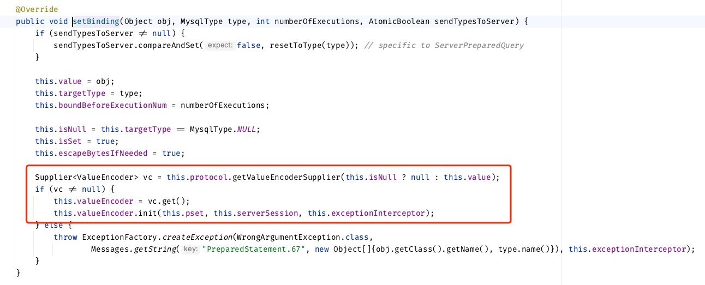

# MySQL的serverTimezone分析

## url中带着的serverTimezone参数

在url中的参数会被置入NativeProtocol（extends AbstractProtocol）类的实例中，可以通过`AbstractProtocol#getPropertySet().getStringProperty(String name)`得到对应值。

下面展示JDBC如何处理url中的serverTimezone参数：

对于JDBC来说，第一步是创建链接，即`Connection connection = DriverManager.getConnection(url, username, password)`，此时实际上创建的是`ConnectionImpl`对象或其包装对象。

`ConnectionImpl`在创建时会调用自己的`createNewIO(false);`方法，既而调用自己的`connectOneTryOnly`或`connectWithRetries`方法。


而NativeProtocol类的`initializePropsFromServer`方法会调用`NativeProtocol#initServerSession`方法。


该方法的第一步就是配置时区


首先拿到url中配置的serverTImezone或connectionTimeZone，然后实例化为`java.util.TimeZone`类，并调用`NativeServerSession#setSessionTimeZone`方法，为其设置`sessionTimeZone`方便后续使用。


## 向数据库发送timestamp

我们使用一个简单的`insert into test(t1, t2) values (?, ?)`和`PreparedStatement`来分析这一过程。

当使用pstmt需要向数据库中插入时间戳时，一般要执行两步：

1. pstmt.setTimestamp()，设置参数值
2. pstmt.executeUpdate()，执行语句

下面分别分析这两步

### pstmt.setTimestamp


实际上执行的是`NativeQueryBindings#setTimestamp`


然后执行`NativeQueryBindValue#setBinding`方法，主要是从protocol中取得合适的`ValueEncoder`，这里使用的是`SqlTimestampValueEncoder`。它承担了在后续执行SQL语句时如何将对象转换成字符串进而转成字节数组写入包的责任。而JDBC Client和服务器传输时一定是要使用字节数组的包交互的.



### pstmt.executeUpdate

executeUpdate实际上是执行的`executeUpdateInternal`方法，然后对结果进行了一点点封装。这里直接从该方法看起


获取到QueryBindings，然后使用它调用同名重写方法


红框中就是封装Message的过程


实际上是调用的`NativeMessageBuilder#buildComQuery`方法


之前已经说过这里的`valueEncoder`是`SqlTimestampValueEncoder`，其没有定义`encodeAsText`方法，所以从抽象类`AbstractValueEncoder`继承该方法


实际上调用的`SqlTimestampValueEncoder#getString`方法


其中`this.serverSession.getSessionTimeZone`刚好对应之前的`setSessionTimeZone`，所以其值即为url中传入的serverTimezone对应的TimeZone对象。简化后的逻辑如下：

```java
var sdf = new SimpleDateFormat('yyyy-MM-dd HH:mm:ss', Locale.US);
sdf.setTimeZone(serverTimezone);
var timestampStr = sdf.format(timestamp);
```

之后该timestampStr会通过一定的格式封装成帧，发送给MySQL服务器。

假设客户端时区为东八区，给到的时间为`2024-01-09 16:24:00`，当serverTimezone设置为东五区(GMT+5)时，实际上MySQL收到的日期字符串为`2024-01-09  13:24:00`。所以会拿这个日期字符串进行落库处理。

### ValueEncoder接口

数据从Java到JDBC客户端发送给MySQL服务器前需要经过`ValueEncoder`的处理，可以参考其实现类的名字快速定位转换逻辑。

比如，我们查看`StringValueEncoder#getString`方法，可以得知使用`string`对`datetime`列赋值时JDBC客户端的处理逻辑


`DATETIME_FORMATTER_WITH_OPTIONAL_MICROS`格式为`yyyy-MM-dd HH:mm:ss`，说明最后发送给MySQL服务器的时间字符串必须要这种格式

`adjustLocalDateTime`方法只是对纳秒精度的调整，可以忽略

我们主要关注`TimeUtil.parseToDateTimeObject`方法如何将`string`转化成`LocalDateTIme`


可以看到它主要对三种时间字符串格式做了处理。所以只要我们传入JDBC客户端的时间字符串满足这三种格式之一，都可以正确的转化成`yyyy-MM-dd HH:mm:ss`格式，并给到MySQL服务器。

## 从数据库接收timestamp

### 接收的主要逻辑

实际上最重要的部分是通过`SqlTimestampValueFactory#localCreateFromDate`使用InternalTimestamp生成Timestamp。


简化后为：

```java
// InternalTimestamp its是MySQL服务器给到JDBC客户端的时间字符串（年月日时分秒，纳秒）
var c = Calendar.getInstance(serverTimezone, Locale.US);
c.set(its.getYear(), its.getMonth() - 1, its.getDay(), its.getHours(), its.getMinutes(), its.getSeconds());
var ts = new Timestamp(c.getTimeInMillis());
ts.setNanos(its.getNanos());
// ts即为JDBC客户端给到JAVA应用程序的时间，它继承自`java.util.Date`，内部使用时间戳存储，但实际上是表示的时间字符串。
```

假设客户端时区为东八区，当serverTimezone设置为东五区(GMT+5)时，假设MySQL服务器存储的日期字符串为`2024-01-09  13:24:00`，即其发送给JDBC客户端的`InternalTimestamp`为`2024-01-09 13:24:00`。那么JDBC 客户端会交给JAVA应用程序一个类型为`java.sql.Timestamp`的对象，其时间字符串值为``2024-01-09 16:24:00`。

### resultSet.getTimestamp调用栈跟踪

具体的调用栈帧如下：

`ResultSetImpl#getTimestamp`进行基本的校验，并委托给thisRow处理


因为MySQL给到的是字节数组格式，所以调用的是`ByteArrayRow#getValue`方法


`getValueFromBytes`方法是在抽象类`AbstractResultsetRow`中定义的


该发放实际上是判断MySQL该列的类型，然后调用valueDecoder对应的相关方法


这里会有两个主要实现`MysqlTextValueDecoder`和`MysqlBinaryValueDecoder`，两者只是创建InternalTimestamp的逻辑不太一样，推测应该是不同的封包方式导致，跟我们需要注意的代码没有关联性。所以直接看`MysqlTextValueDecoder`（实际上我这里debug是执行的`MysqlBinaryValueDecoder`的相关代码）逻辑。


主要是这里的`vf.createFromDatetime`逻辑。它执行的是`AbstractDateTimeValueFactory#createFromTimestamp`方法（这里因为`SqlTimestampValueFactory`没有重写该方法，所以会调用父类`AbstractDateTimeValueFactory`的）


从而执行`SqlTimestampValueFactory#localCreateFromTimestamp`方法从`InternalTimestamp`生成`Timestamp`


`vf = defaultTimestampValueFactory`是`SqlTimestampValueFactory`类的实现是因为`ResultSetImpl`构建时的时候给赋值的


### ValueFactory接口

另外，同理`ValueFactory`的其他实现的`createFromDatetime`方法定义了将数据库`datetime`格式转化到某java格式时的处理逻辑。如：StringValueFactory#createFromDatetime`方法，定义了如何使用string承接datetime


可以看到如果java应用使用string承接datetime，则时间字符串格式固定为`yyyy-MM-dd HH:mm:ss`。

## 总结

1. 我们可以认为JDBC客户端和MySQL服务器是通过时间字符串来传递时间数据的（实际上是字节数组）。

2. 当我们需要向数据库传递时间时，会执行

   ```java
   var sdf = new SimpleDateFormat('yyyy-MM-dd HH:mm:ss', Locale.US);
   sdf.setTimeZone(serverTimezone);
   var timestampStr = sdf.format(timestamp);
   ```

   从而导致时间字符串从java应用时区 -> jdbc connectionTimeZone（别名为serverTimezone）时区的转换。

3. 当我们从`ResultSet`中读取，即从JDBC客户端中读取时间字符串时，会被执行

   ```java
   // InternalTimestamp its是MySQL服务器给到JDBC客户端的时间字符串（年月日时分秒，纳秒）
   var c = Calendar.getInstance(serverTimezone, Locale.US);
   c.set(its.getYear(), its.getMonth() - 1, its.getDay(), its.getHours(), its.getMinutes(), its.getSeconds());
   var ts = new Timestamp(c.getTimeInMillis());
   ts.setNanos(its.getNanos());
   // ts即为JDBC客户端给到JAVA应用程序的时间，它继承自`java.util.Date`，内部使用时间戳存储，但实际上是表示的时间字符串。
   ```

   从而导致数据库给到的时间字符串进行从jdbc connectionTimeZone（别名为serverTimezone）时区 -> java应用时区的转换。

4. 数据从Java到JDBC客户端发送给MySQL服务器前需要经过`ValueEncoder`的处理，可以参考其实现类的名字快速定位转换逻辑。
5. 数据从JDBC客户端提取到Java应用前需要经过`ValueFactory`的处理，可以参考其实现类的名字快速定位转换逻辑。
