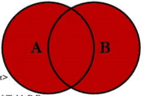

# 1.MySQL架构介绍

1. MySQL在linux下的相关文件：

    路径|解释
    --|--
    `/var/lib/mysql/`|MySQL数据库文件的存放路径
    `/usr/share/mysql/`|用于存放字符集、语言等信息
    `/usr/bin/`|用于放置一些可执行文件，如`mysqladmin`、`mysqldump`等
    `/etc/my.cnf`|MySQL的配置文件

2. 修改字符集和数据的存储路径（mysql8默认就是utf8，不需要修改）
   1. 查看字符集

        ```mysql
        MariaDB [db01]> show variables like 'character%';
        +--------------------------+----------------------------+
        | Variable_name            | Value                      |
        +--------------------------+----------------------------+
        | character_set_client     | utf8                       |
        | character_set_connection | utf8                       |
        | character_set_database   | utf8mb4                    |
        | character_set_filesystem | binary                     |
        | character_set_results    | utf8                       |
        | character_set_server     | utf8mb4                    |
        | character_set_system     | utf8                       |
        | character_sets_dir       | /usr/share/mysql/charsets/ |
        +--------------------------+----------------------------+
        ```

   2. 修改：`\etc\my.cnf`引入了`\etc\my.cnf.d\`文件夹下的所有文件。所以，我们只需要修改对应的文件
      1. 为[client]添加`default-character-set=utf8`
      2. 为[mysqld]添加:
         1. `character_set_server=utf8`
         2. `character_set_client=utf8`
         3. `collation-server=utf8_general_ci`
      3. 为[mysql]添加`default-character-set=utf8`
3. 主要配置文件：
   1. 二进制日志log-bin——可以用于主从复制
   2. 错误日志log-error——默认关闭。记录严重的警告和错误信息，每次启动和关闭的详细信息等
   3. 查询日志log——默认关闭。记录查询的sql语句，如果开启会降低MySQL的整体性能，因为记录日志也需要消耗系统资源
   4. 数据文件：
      1. 表名.frm文件：存放表结构
      2. 表名.MYD文件：存放表数据
      3. 表名.MYI文件：存放表索引
4. MySQL的4层架构：
   1. **连接层**：最上层是一些客户端和连接服务，包含本地sock通信和大多数基于客户端/服务端工具实现的类似于tcp/ip的通信。主要完成一些类似于连接处理、授权认证及相关的安全方案。在该层上引入了线程池的概念，为通过认证安全接入的客户端提供线程。同样在该层上可以实现基于SSL的安全链接。服务器也会为安全接入的每个客户端验证它所具有的操作权限
   2. **服务层**：第二层架构主要完成核心服务功能，如SQL接口，并完成缓存的查询，SQL的分析和优化及部分内置函数的执行。所有跨存储引擎的功能也在这一层实现，如过程、函数等。在该层，服务器会解析查询并创建相应的内部解析树，并对其完成相应的优化如确定查询表的顺序，是否利用索引等，最后生成相应的执行操作。如果是select语句，服务器还会查询内部的缓存。如果缓存空间足够大，这样在解决大量读操作的环境中能够很好的提升系统的性能
   3. **引擎层**：存储引擎层，存储引擎真正的负责了MySQL中数据的存储和提取，服务器通过API与存储引擎进行通信。不同的存储引擎具有的功能不同，这样我们可以根据自己的实际需要进行选取。常用InnoDB、MyISAM
   4. **存储层**：数据存储层，主要是将数据存储在运行于裸设备的文件系统之上，并完成与存储引擎的交互
5. 查看MySQL现在已提供的存储引擎：`show engines;`
6. 查看你的MySQL当前和默认的存储引擎：`show variables like '%storage_engine%';`
7. MyISAM和InnoDB的区别：

    对比项|MyISAM|InnoDB
    --|--|--
    主外键|不支持|支持
    事务|不支持|支持
    行表锁|表锁，即使操作一条记录也会锁住整个表，不适合高并发的操作|行锁，操作时只锁住某一行，不对其它行有影响，适合高并发的操作
    缓存|只缓存索引，不缓存真实数据|不仅缓存索引还缓存真实数据，对内存要求较高，而且内存大小对性能有决定性的影响
    表空间|小|大
    关注点|性能|事务
8. SQL性能差的原因：
   1. 查询语句写的烂，未创建索引
   2. 索引失效
   3. 关联查询太多join
   4. 服务器未调优及各个参数（缓冲、线程数）设置不合理
9. MySQL查询语句机读顺序：

   ```SQL
   FROM <left_table>
   ON <join_condition>
   <join_type> JOIN <right_table>
   WHERE <where_condition>
   GROUP BY <group_by_list>
   HAVING <having_condition>
   SELECT
   DISTINCT <select_list>
   ORDER BY <order_by_condition>
   LIMIT <limit_number>
   ```

## 常见的JOIN查询

1. `SELECT <select_list> FROM A INNER JOIN B ON A.Key = B.Key;`

2. `SELECT <select_list> FROM A LEFT JOIN B ON A.Key = B.Key;`

3. `SELECT <select_list> FROM A RIGHT JOIN B ON A.Key = B.Key;`

4. `SELECT <select_list> FROM A LEFT JOIN B ON A.Key = B.Key where B.Key is NULL;`

5. `SELECT <select_list> FROM A RIGHT JOIN B ON A.Key = B.Key where A.Key is NULL`

6. `SELECT <select_list> FROM A OUTER JOIN B ON A.Key = B.Key;`，因为MySQL语法不支持全外连接，应该用连接加右连接并去重代替，实际代码如下：`SELECT <select_list> FROM A LEFT JOIN B ON A.Key = B.Key union SELECT <select_list> FROM A RIGHT JOIN B ON A.Key = B.Key;`

1. `SELECT <select_list> FROM A OUTER JOIN B ON A.Key = B.Key where A.Key is NULL OR B.Key is NULL;`，其实际代码如下：`SELECT <select_list> FROM A LEFT JOIN B ON A.Key = B.Key where B.Key is NULL union SELECT <select_list> FROM A RIGHT JOIN B ON A.Key = B.Key where A.Key is NULL;`
