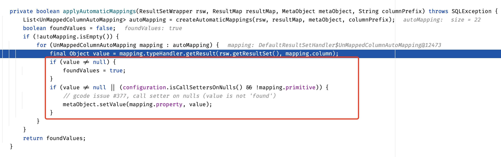

# 重塑Mybatis认知

> 这里会记录会重塑的Mybatis认知。主要是在开发中遇到的框架的执行不像自己想要的那样的关键点。

## Mybatis不会对数据库中的NULL值进行实体的setter

核心依据代码如红框所示：当数据库中该列的值为NULL时(`value = null`)，根本不执行任何逻辑，也就不会调用对应的setter器了，所以如果实体有默认值，数据库中该列为NULL，则查询后的实体该列值时默认值而不是NULL。

