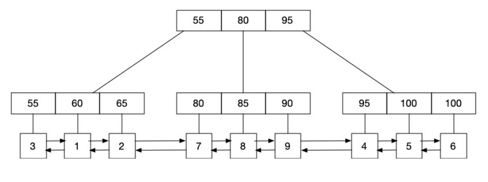
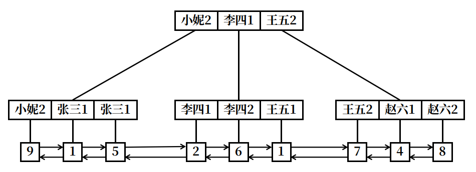

# mysql基础讲座笔记

- [mysql基础讲座笔记](#mysql基础讲座笔记)
  - [InnoDB索引](#innodb索引)
    - [B+树索引](#b树索引)
      - [主键索引](#主键索引)
      - [二级索引](#二级索引)
      - [聚合索引](#聚合索引)
      - [测验](#测验)
    - [Hash索引](#hash索引)
  - [数据安全](#数据安全)
  - [事物和一致性](#事物和一致性)

## InnoDB索引

InnoDB引擎有两种索引，一种是B+树索引，一种是Hash索引。

让我们通过如下的数据表(表名为：student_score)，分别讨论其使用B+树索引和Hash索引时的不同：

| id(PK) | name | gender | score | update_time         |
| ------ | ---- | ------ | ----- | ------------------- |
| 1      | 张三 | 1      | 60    | 2021-01-01 08:00:00 |
| 2      | 李四 | 1      | 65    | 2021-01-01 08:01:00 |
| 3      | 王五 | 1      | 55    | 2021-01-01 08:00:10 |
| 4      | 赵六 | 2      | 95    | 2021-01-01 08:00:10 |
| 5      | 张三 | 1      | 100   | 2021-01-01 08:02:00 |
| 6      | 李四 | 2      | 100   | 2021-01-01 08:02:00 |
| 7      | 王五 | 2      | 80    | 2021-01-01 08:03:00 |
| 8      | 赵六 | 1      | 85    | 2021-01-01 08:03:06 |
| 9      | 小妮 | 2      | 90    | 2021-01-01 08:04:10 |

### B+树索引

#### 主键索引

对于该数据表，假如其使用的是3分叉的B+树索引，则其主键(PK)索引的简图如下图所示：


其全部数据存储在叶子节点。每个叶子都对应着表中的一条完整的记录。非叶子节点只负责记录索引信息。叶子节点使用双向链表按主键大小顺序相互链接。
这种索引被称作聚簇索引。

在命中主键索引进行单条记录查询时，只需要使用B+树的查询算法即可查询到相应数据;当进行范围查询时，只需要用单条记录查询的方式找到最左和最右范围的记录，然后从一端遍历双向链表到另一端即可。

#### 二级索引

假如我们在score列上建立了二级索引。其简图如下所示：



其叶子节点存储着跟该索引对应的记录的主键值。非叶子节点负责记录索引信息。叶子节点使用双向链表按照其对应的二级索引值的大小顺序进行链接。
这种索引被称为非聚簇索引。

在命中二级索引进行单条记录查询时，先使用B+树的查询算法从二级索引中查到该记录对应的主键，再从主键索引上通过该主键值进行查询;如果是范围查询，则先从二级索引上查询到最左和最右范围的叶子节点，然后遍历叶子节点找到所有的主键，遍历这些主键，依次在主键索引上应用查询单条记录的算法找到相对应的记录。

ps：**当二级索引的区分度(该列不同值的数量/该列的总记录)不够大时，mysql的优化器可能会选择不命中索引**。此时mysql会直接使用主键索引的叶子节点上的双向链表对所有记录进行查询，即进行全标扫描。这是因为：mysql优化器认为使用索引的效率远没有不使用来得高。如：对上表中的gender建立索引，那么我们使用`where gender = ?`的查询一般都不会命中索引，因为该字段只有两个值，区分度太低了。

#### 聚合索引

假如我们建立了一个(name, gender)的聚合索引，相当于建立了一个`name+gender`(两个列的值当作字符串拼接在一起)二级索引。其简图如下所示：



因为对于字符串的比较是从左到右的，这样建立的索引使用时也就要满足最左匹配原则了。如：查询条件`gender=1`是无法命中索引的，但是`gender=1 and name='张三'`会命中这个聚合索引(不要在意查询条件的写法顺序，mysql优化器会主动为我们进行查询条件顺序的调整。因而`gender=1 and name='张三'`和`name='张三 and gender=1'`经过优化器后是一样的，它们会同样的命中该聚合索引)。

#### 测验

定义如下函数：

`search_eq(index, x)`：在该索引index树下查询索引值等于x的叶子节点
`search_max_lt(index, x)`：在该索引index树下查询索引值最大的小于x的叶子节点
`search_max_leq(index, x)`：在该索引index树下查询索引值最大的小于等于x的叶子节点
`search_min_gt(index, x)`：在该索引index树下查询索引值最小的大于x的叶子节点
`search_min_geq(index, x)`：在该索引index树下查询索引值最小的大于等于x的叶子节点
`traverse_node(st_node, ed_node, func)`：在叶子节点依靠其双向链表遍历st_node到ed_node的所有记录，返回满足func函数的记录。func函数的形式为`func(node): bool`,传入该叶子节点，返回值为bool类型，表示该节点是否满足条件。

使用`head_<index>`表示该索引叶子节点的第一个元素
使用`tail_<index>`表示该索引叶子节点的最后一个元素
将最后得到的结果赋值给`res`

请描述下列语句的执行算法：

1. `select * from student_score where id = 3;`，命中主键，等值查找:

    ```python
    res = search_eq(id, 3);
    ```

2. `select * from student_score where id >= 2 and id <= 6;`，命中主键，范围查找：

    ```python
    st_node = search_min_geq(id, 2);
    ed_node = search_max_leq(id, 6);
    res = traverse_node(st_node, ed_node, lambda x: True);
    ```

3. `select * from student_score where score = 100;`，命中二级索引，等值查找：

    ```python
    x = search_eq(score, 100);
    res = search_eq(id, x);
    ```

4. `select * from student_score where score >= 60 and score < 70;`，命中二级索引，范围查找：

    ```python
    st_node = search_min_geq(score, 2);
    ed_node = search_max_leq(score, 6);
    pk_list = traverse_node(st_node, ed_node, lambda x: True);
    res = list(map(lambda x: search_eq(id, x), pk_list));
    ```

5. `select * from student_score where minute(update) > 2;`，无论update是否建有索引，都不会命中索引，这是因为建立索引时使用的是`update`而不是`minute(update)`：

    ```python
    res = traverse_node(head_pk, tail_pk, lambda x: minute(x.update) > 2)
    ```

6. `select * from student_score where gender = 1;`，无论`gender`是否建有索引，都不会命中索引，这是因为该字段区分度太小，mysql的优化器认为不使用索引效率更高：

    ```python
    res = traverse_node(head_pk, tail_pk, lambda x: minute(x.update) > 2)
    ```

### Hash索引

## 数据安全

## 事物和一致性
