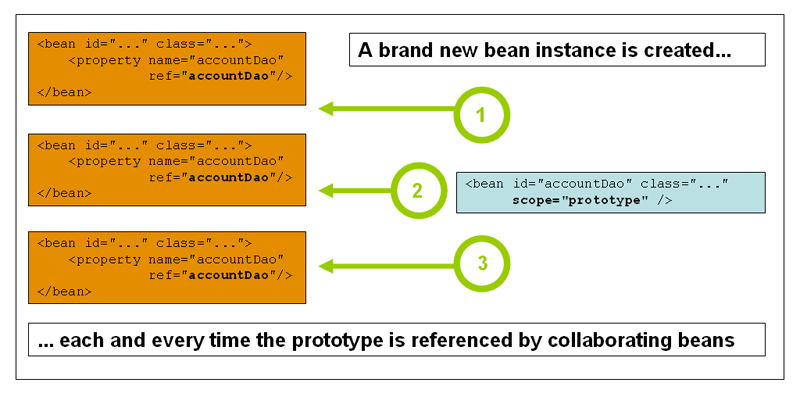

# spring-Core笔记

基于[5.3.2版本文档](https://docs.spring.io/spring-framework/docs/5.3.2/reference/html/core.html#spring-core)

- [spring-Core笔记](#spring-core笔记)
  - [IoC容器](#ioc容器)
    - [容器概述](#容器概述)
    - [Bean概述](#bean概述)
      - [Bean Naming](#bean-naming)
      - [Instantiating Beans](#instantiating-beans)
    - [Dependencies(依赖)](#dependencies依赖)
      - [Dependency Injection](#dependency-injection)
        - [Constructor-based Dependency Injection](#constructor-based-dependency-injection)
        - [Setter-based Dependency Injection](#setter-based-dependency-injection)
        - [Dependency Resolution Process(依赖解析过程)](#dependency-resolution-process依赖解析过程)
      - [Dependencies and Configuration in Detail](#dependencies-and-configuration-in-detail)
        - [Straight Values (Primitives, Strings, and so on)](#straight-values-primitives-strings-and-so-on)
        - [References to Other Beans (Collaborators)](#references-to-other-beans-collaborators)
        - [内部Beans](#内部beans)
        - [集合](#集合)
        - [Null and Empty String Values](#null-and-empty-string-values)
        - [使用`p-namespace`的XML缩写](#使用p-namespace的xml缩写)
        - [使用`c-namespace`的XML缩写](#使用c-namespace的xml缩写)
        - [复合属性名称](#复合属性名称)
      - [depends-on](#depends-on)
      - [延迟初始化Bean](#延迟初始化bean)
      - [Autowiring Collaborators](#autowiring-collaborators)
      - [Method injection(方法注入)](#method-injection方法注入)
    - [Bean Scopes(作用域)](#bean-scopes作用域)
      - [Singleton Scope](#singleton-scope)
      - [Prototype Scope](#prototype-scope)
      - [Request, Session, Application, and WebSocket Scopes](#request-session-application-and-websocket-scopes)
        - [Request scope](#request-scope)
        - [Session scope](#session-scope)
        - [Application scope](#application-scope)
      - [带作用域的Bean作为依赖项](#带作用域的bean作为依赖项)
      - [选择要创建的代理类型](#选择要创建的代理类型)
      - [自定义作用域](#自定义作用域)
    - [自定义Bean的特性](#自定义bean的特性)
      - [生命周期回调](#生命周期回调)
        - [初始化回调](#初始化回调)
        - [销毁回调](#销毁回调)
        - [默认初始化和销毁方法](#默认初始化和销毁方法)
        - [生命周期行为的组合机制](#生命周期行为的组合机制)
        - [启动和停止回调](#启动和停止回调)
      - [ApplicationContextAware和BeanNameAware](#applicationcontextaware和beannameaware)
      - [其他感知接口](#其他感知接口)
    - [Bean定义的继承机制](#bean定义的继承机制)

## IoC容器

### 容器概述

简而言之，BeanFactory提供了配置框架和基本功能，而ApplicationContext添加了更多企业特定的功能。

Bean是由Spring IoC容器实例化，组装和管理的对象。

Spring IoC容器几乎可以管理您要管理的任何类。大多数Spring用户更喜欢实际的JavaBean，它仅具有默认（无参数）构造函数，并具有根据容器中的属性建模的适当的setter和getter。

Bean及其之间的依赖关系反映在容器使用的配置元数据中。

`org.springframework.context.ApplicationContext`接口表示Spring IoC容器，并负责实例化，配置和组装Bean。

Bean默认为pre-instantiate singleton beans。这意味着`ApplicationContext`会在创建时进行这些bean的单例实例化，这会使得Context的初始化变慢，但可以提早暴露某些bean实例化失败的问题。

### Bean概述

在容器本身内，这些bean定义表示为`BeanDefinition`对象，其中包含（除其他信息外）以下元数据：

- **包限定的类名称**：通常，定义了Bean的实际实现类。
- **Bean行为配置元素**：用于声明Bean在容器中的行为（作用域，生命周期回调等）。
- **依赖项**：引用该bean完成其工作所需的其他bean。这些引用也称为协作者或依赖项。
- **要在新创建的对象中设置的其他配置设置**：例如，池的大小限制或在管理连接池的bean中要使用的连接数。

该元数据转换为构成每个bean定义的一组属性。下表描述了这些属性：

| Property                 | Explained in…​           |
| ------------------------ | ------------------------ |
| Class                    | Instantiating Beans      |
| Name                     | Naming Beans             |
| Scope                    | Bean Scopes              |
| Constructor arguments    | Dependency Injection     |
| Properties               | Dependency Injection     |
| Autowiring mode          | Autowiring Collaborators |
| Lazy initialization mode | Lazy-initialized Beans   |
| Initialization method    | Initialization Callbacks |
| Destruction method       | Destruction Callbacks    |

使用`Class<?> BeanFactory.getType("beanName")`来获取容器中的bean类型
使用`T BeanFactory.getBean("beanName", Class<T>)`来获取容器中的bean对象

#### Bean Naming

在定义时，通过`id`命名bean,通过`name`为bean起别名。

bean可以不定义id,此时容器会自动为其生成id,这种情况一般发生在`inner beans`或`autowiring collaborators`。

bean命名一般遵循标准的Java对象命名规范。

通过在类路径中进行组件扫描，Spring会按照前面描述的规则为未命名的组件生成Bean名称：从本质上讲，采用简单的类名称并将其初始字符转换为小写。但是，在（不寻常的）特殊情况下，如果有多个字符并且第一个和第二个字符均为大写字母，则会保留原始大小写。这些规则与`java.beans.Introspector.decapitalize`（Spring在此使用）定义的规则相同。

在bean定义外使用`alias`为bean起别名：`<alias name="fromName" alias="toName"/>`。如果使用Javaconfiguration，则@Bean批注可用于提供别名。有关详细信息，请参见使用@Bean注解。

#### Instantiating Beans

如果使用基于XML的配置元数据，则在`<bean />`元素的class属性中指定要实例化的对象的类型（或类）。这个类属性（在内部是BeanDefinition实例的Class属性）通常是必需的。可以通过以下两种方式之一使用Class属性：

- 通常，在容器本身通过**反射性地**调用其**构造函数**直接创建Bean的情况下，指定要构造的Bean类，这在某种程度上等同于使用new运算符的Java代码。

    ```XML
    <bean id="exampleBean" class="examples.ExampleBean"/>
    <bean name="anotherExample" class="examples.ExampleBeanTwo"/>
    ```

- 在不太常见的情况下，容器将在类上调用**静态工厂方法**以创建Bean。从静态工厂方法的调用返回的对象类型可以是同一类，也可以是完全不同的另一类。

    ```XML
    <bean id="clientService"
    class="examples.ClientService"
    factory-method="静态工厂方法名"/>
    ```

- 还可以使用实例工厂方法实例化：类似于通过静态工厂方法进行实例化，使用实例工厂方法进行实例化会从容器中调用现有bean的非静态方法来创建新bean。

    ```XML
    <!-- the factory bean, which contains a method called createInstance() -->
    <bean id="serviceLocator" class="examples.DefaultServiceLocator">
        <!-- inject any dependencies required by this locator bean -->
    </bean>

    <!-- the bean to be created via the factory bean -->
    <bean id="clientService"
        factory-bean="serviceLocator"
        factory-method="createClientServiceInstance"/>
    ```

Inner class names: `外部类全限定名$内部类名`

### Dependencies(依赖)

#### Dependency Injection

DI存在两个主要变体：

- 基于构造函数的依赖注入：默认按对象类型注入，出现歧义时，需要指定`type`、`name`、`index`(从0开始)来消除歧义。详见[Constructor-based Dependency Injection](#constructor-based-dependency-injection)
- 基于Setter的依赖注入：详见[Setter-based Dependency Injection](#setter-based-dependency-injection)

由于可以混合使用`Constructor-based DI`和`Setter-based DI`，因此**将构造函数用于强制性依赖项**并**将setter方法或配置方法用于可选的依赖项**是一个很好的经验法则。

注意，在setter方法上使用`@Required`注解可以使该属性成为必需的依赖项。但是，最好使用带有程序验证参数的构造函数注入。

Spring团队通常提倡构造函数注入，因为它可以让您将应用程序组件实现为不可变对象，并确保所需的依赖项不为`null`。

然而，完全使用构造器注入可能会导致循环依赖(Circular dependencies)问题。例如：A类通过构造函数注入需要B类的实例，而B类通过构造函数注入需要A类的实例。如果为将要插入的类A和B配置Bean，Spring IoC容器将在运行时检测到此循环引用，并引发`BeanCurrentlyInCreationException`。一种可能的解决方案是将构造器注入改为setter注入。

##### Constructor-based Dependency Injection

构造函数参数解析匹配通过使用参数的类型进行。如果Bean定义的构造函数参数中没有潜在的歧义，则在实例化Bean时，在Bean定义中定义构造函数参数的顺序就是将这些参数提供给适当的构造函数的顺序。

```Kotlin
class ThingOne(thingTwo: ThingTwo, thingThree: ThingThree)
```

```XML
<beans>
    <bean id="beanOne" class="x.y.ThingOne">
        <constructor-arg ref="beanTwo"/>
        <constructor-arg ref="beanThree"/>
    </bean>
    <bean id="beanTwo" class="x.y.ThingTwo"/>
    <bean id="beanThree" class="x.y.ThingThree"/>
</beans>
```

当使用简单类型（例如`<value> true </ value>`）时，Spring无法确定值的类型，因此在没有帮助的情况下无法按类型进行匹配。

```Kotlin
class ExampleBean(
    private val years: Int,
    private val ultimateAnswer: String
)
```

```XML
<bean id="exampleBean" class="examples.ExampleBean">
    <constructor-arg type="int" value="7500000"/>
    <constructor-arg type="java.lang.String" value="42"/>
</bean>
```

您可以使用index属性来显式指定构造函数参数的索引：

```XML
<bean id="exampleBean" class="examples.ExampleBean">
    <constructor-arg index="0" value="7500000"/>
    <constructor-arg index="1" value="42"/>
</bean>
```

您还可以使用构造函数参数名称来消除歧义：

```XML
<bean id="exampleBean" class="examples.ExampleBean">
    <constructor-arg name="years" value="7500000"/>
    <constructor-arg name="ultimateAnswer" value="42"/>
</bean>
```

要立即使用该功能，必须在启用调试标志的情况下编译代码，以便Spring可以从构造函数中查找参数名称。如果您不能或不想使用debug标志编译代码，则可以使用@ConstructorProperties JDK批注显式命名构造函数参数。

```Kotlin
class ExampleBean
@ConstructorProperties("years", "ultimateAnswer")
constructor(val years: Int, val ultimateAnswer: String)
```

##### Setter-based Dependency Injection

`ApplicationContext`支持它管理的bean的基于构造函数和基于setter的DI。在已经通过构造函数方法注入了某些依赖项之后，它还支持基于setter的DI。

##### Dependency Resolution Process(依赖解析过程)

容器执行bean依赖项解析，如下所示：

1. 使用描述所有bean的配置元数据创建和初始化`ApplicationContext`。可以通过XML，Java代码或注释指定配置元数据。
2. 对于每个bean，其依赖项都以属性，构造函数参数或static-factory方法的参数的形式表示（如果使用它而不是普通的构造函数）。实际创建Bean时，会将这些依赖项提供给Bean。
3. 每个属性或构造函数参数都是要设置的值的实际定义，或者是对容器中另一个bean的引用。
4. 作为值的每个属性或构造函数参数都将从其指定的格式转换为该属性或构造函数参数的实际类型。默认情况下，Spring可以将以字符串格式提供的值转换为所有内置类型，例如int，long，String，boolean等。

在创建容器时，Spring容器会验证每个bean的配置。但是，在实际创建Bean之前，不会设置Bean的属性。创建容器时，将创建具有单例作用域并设置为预先实例化（默认）的Bean。其他Bean仅在请求时才创建。

#### Dependencies and Configuration in Detail

##### Straight Values (Primitives, Strings, and so on)

```XML
    <bean id="myDataSource" class="org.apache.commons.dbcp.BasicDataSource" destroy-method="close">
    <!-- results in a setDriverClassName(String) call -->
    <property name="driverClassName" value="com.mysql.jdbc.Driver"/>
    <property name="url" value="jdbc:mysql://localhost:3306/mydb"/>
    <property name="username" value="root"/>
    <property name="password" value="misterkaoli"/>
</bean>
```

下面的示例使用p-namespace进行更简洁的XML配置：

```XML
<beans xmlns="http://www.springframework.org/schema/beans"
    xmlns:xsi="http://www.w3.org/2001/XMLSchema-instance"
    xmlns:p="http://www.springframework.org/schema/p"
    xsi:schemaLocation="http://www.springframework.org/schema/beans
    https://www.springframework.org/schema/beans/spring-beans.xsd">

    <bean id="myDataSource" class="org.apache.commons.dbcp.BasicDataSource"
        destroy-method="close"
        p:driverClassName="com.mysql.jdbc.Driver"
        p:url="jdbc:mysql://localhost:3306/mydb"
        p:username="root"
        p:password="misterkaoli"/>

</beans>
```

Spring容器通过使用JavaBeans PropertyEditor机制将`<value />`元素内的文本转换为`java.util.Properties`实例

```XML
<!-- You can also configure a java.util.Properties instance -->
<bean id="mappings"
    class="org.springframework.context.support.PropertySourcesPlaceholderConfigurer">

    <!-- typed as a java.util.Properties -->
    <property name="properties">
        <value>
            jdbc.driver.className=com.mysql.jdbc.Driver
            jdbc.url=jdbc:mysql://localhost:3306/mydb
        </value>
    </property>
</bean>
```

使用idref标签可以让container在初始化时验证引用的元素是否存在

```XML
<bean id="theTargetBean" class="..."/>

<bean id="theClientBean" class="...">
    <property name="targetName">
        <idref bean="theTargetBean"/>
    </property>
    <!-- 
        等价于<property name="targetName" value="theTargetBean"/>，但这种方式下容器在初始化时不对传递给客户端bean的targetName属性的值执行验证。拼写错误仅在实际实例化客户端bean时才发现
    -->
</bean>
```

##### References to Other Beans (Collaborators)

如果引用同一容器中的bean,则使用`ref`元素的`name`属性：

```XML
<ref bean="someBean"/>
```

通过parent属性指定目标Bean将创建对当前容器的父容器中的Bean的引用。父属性的值可以与目标Bean的`id`属性或目标Bean的`name`属性中的值相同：

```XML
<!-- in the parent context -->
<bean id="accountService" class="com.something.SimpleAccountService">
    <!-- insert dependencies as required as here -->
</bean>
```

```XML
<!-- in the child (descendant) context -->
<bean id="accountService" <!-- bean name is the same as the parent bean -->
    class="org.springframework.aop.framework.ProxyFactoryBean">
    <property name="target">
        <ref parent="accountService"/> <!-- notice how we refer to the parent bean -->
    </property>
    <!-- insert other configuration and dependencies as required here -->
</bean>
```

##### 内部Beans

```XML
<bean id="outer" class="...">
    <!-- instead of using a reference to a target bean, simply define the target bean inline -->
    <property name="target">
        <bean class="com.example.Person"> <!-- this is the inner bean -->
            <property name="name" value="Fiona Apple"/>
            <property name="age" value="25"/>
        </bean>
    </property>
</bean>
```

##### 集合

```XML
<bean id="moreComplexObject" class="example.ComplexObject">
    <!-- results in a setAdminEmails(java.util.Properties) call -->
    <property name="adminEmails">
        <props>
            <prop key="administrator">administrator@example.org</prop>
            <prop key="support">support@example.org</prop>
            <prop key="development">development@example.org</prop>
        </props>
    </property>
    <!-- results in a setSomeList(java.util.List) call -->
    <property name="someList">
        <list>
            <value>a list element followed by a reference</value>
            <ref bean="myDataSource" />
        </list>
    </property>
    <!-- results in a setSomeMap(java.util.Map) call -->
    <property name="someMap">
        <map>
            <entry key="an entry" value="just some string"/>
            <entry key ="a ref" value-ref="myDataSource"/>
        </map>
    </property>
    <!-- results in a setSomeSet(java.util.Set) call -->
    <property name="someSet">
        <set>
            <value>just some string</value>
            <ref bean="myDataSource" />
        </set>
    </property>
</bean>
```

Spring容器还支持合并集合。子集合可以从父集合继承并覆盖父集合的值：

```XML
<beans>
    <bean id="parent" abstract="true" class="example.ComplexObject">
        <property name="adminEmails">
            <props>
                <prop key="administrator">administrator@example.com</prop>
                <prop key="support">support@example.com</prop>
            </props>
        </property>
    </bean>
    <bean id="child" parent="parent">
        <property name="adminEmails">
            <!-- the merge is specified on the child collection definition -->
            <props merge="true">
                <prop key="sales">sales@example.com</prop>
                <prop key="support">support@example.co.uk</prop>
            </props>
        </property>
    </bean>
<beans>
```

子集合中实际的值如下：

```TXT
administrator=administrator@example.com
sales=sales@example.com
support=support@example.co.uk
```

在集合中，只有`List`集合拥有顺序语义，在集合合并中，其中父List的值在子List值之前。

您可以使用强类型集合。也就是说，可以声明一个Collection类型，使其只能包含（例如）String元素：

```Kotlin
class SomeClass {
    lateinit var accounts: Map<String, Float>
}
```

```XML
<beans>
    <bean id="something" class="x.y.SomeClass">
        <property name="accounts">
            <map>
                <entry key="one" value="9.99"/>
                <entry key="two" value="2.75"/>
                <entry key="six" value="3.99"/>
            </map>
        </property>
    </bean>
</beans>
```

其实配置起来是一样的。只是因为Java5引入了泛型。Spring在处理时会得到value要求的类型，并将其转换为该类型。

##### Null and Empty String Values

```XML
<bean class="ExampleBean">
    <property name="email" value=""/>
</bean>
```

等价于：

```Kotlin
exampleBean.email = ""
```

```XMl
<bean class="ExampleBean">
    <property name="email">
        <null/>
    </property>
</bean>
```

等价于：

```Kotlin
exampleBean.email = null
```

##### 使用`p-namespace`的XML缩写

`p-namespace`是`spring-core`提供的一种`<property/>`元素的缩写

`p:name="John Doe"`表示`<property name="name" value="John Doe">`
`p:spouse-ref="jane"`表示`<property name="spouse" ref="jane">`

```XML
<beans xmlns="http://www.springframework.org/schema/beans"
    xmlns:xsi="http://www.w3.org/2001/XMLSchema-instance"
    xmlns:p="http://www.springframework.org/schema/p"
    xsi:schemaLocation="http://www.springframework.org/schema/beans
        https://www.springframework.org/schema/beans/spring-beans.xsd">

    <bean name="john-classic" class="com.example.Person">
        <property name="name" value="John Doe"/>
        <property name="spouse" ref="jane"/>
    </bean>

    <bean name="john-modern"
        class="com.example.Person"
        p:name="John Doe"
        p:spouse-ref="jane"/>

    <bean name="jane" class="com.example.Person">
        <property name="name" value="Jane Doe"/>
    </bean>
</beans>
```

##### 使用`c-namespace`的XML缩写

`c-namespace`是`spring-core`提供的一种`<constructor-arg/>`元素的缩写

`c:email="something@somewhere.com"`表示`<constructor-arg name="email" value="something@somewhere.com"/>`
`p:spouse-ref="jane"`表示`<constructor-arg name="thingTwo" ref="beanTwo"/>`
`c:_0-ref="beanTwo"`表示`<constructor-arg index="0" ref="beanTwo"/>`

```XML
<beans xmlns="http://www.springframework.org/schema/beans"
    xmlns:xsi="http://www.w3.org/2001/XMLSchema-instance"
    xmlns:c="http://www.springframework.org/schema/c"
    xsi:schemaLocation="http://www.springframework.org/schema/beans
        https://www.springframework.org/schema/beans/spring-beans.xsd">

    <bean id="beanTwo" class="x.y.ThingTwo"/>
    <bean id="beanThree" class="x.y.ThingThree"/>

    <!-- traditional declaration with optional argument names -->
    <bean id="beanOne" class="x.y.ThingOne">
        <constructor-arg name="thingTwo" ref="beanTwo"/>
        <constructor-arg name="thingThree" ref="beanThree"/>
        <constructor-arg name="email" value="something@somewhere.com"/>
    </bean>

    <!-- c-namespace declaration with argument names -->
    <bean id="beanOne" class="x.y.ThingOne" c:thingTwo-ref="beanTwo"
        c:thingThree-ref="beanThree" c:email="something@somewhere.com"/>

</beans>
```

使用索引（从0开始）：

```XML
<!-- c-namespace index declaration -->
<bean id="beanOne" class="x.y.ThingOne" c:_0-ref="beanTwo" c:_1-ref="beanThree"
    c:_2="something@somewhere.com"/>
```

##### 复合属性名称

```XML
<bean id="something" class="things.ThingOne">
    <property name="fred.bob.sammy" value="123" />
</bean>
```

如果`fred`或者`fred.bob`为`NULL`，则会抛出`NullPointerException`

#### depends-on

`depends-on`用来指定`bean`初始化和销毁的顺序。
`A depends-on B`，则表明`A`一定在`B`之后初始化，在`B`之前销毁。

```XML
<bean id="beanOne" class="ExampleBean" depends-on="manager"/>
<bean id="manager" class="ManagerBean" />
```

#### 延迟初始化Bean

默认情况下，作为初始化过程的一部分，`ApplicationContext`实现会急于创建和配置所有单例bean，jin所谓的`pre-instantiation`。通常，这种预先安装是可取的，因为会立即发现配置或周​​围环境中的错误。如果您不希望这种行为，则可以通过将bean定义标记为`lazy-initialized`来防止单例bean的预实例化。
延迟初始化bean要求IoC容器在首次请求时（而不是在启动时）创建一个bean实例。

```XML
<bean id="lazy" class="com.something.ExpensiveToCreateBean" lazy-init="true"/>
```

但是，当延迟初始化的Bean是未延迟初始化的单例Bean的依赖项时，ApplicationContext在启动时会创建延迟初始化的Bean。

您还可以使用`<beans />`元素上的default-lazy-init属性在容器级别控制延迟初始化，如以下示例所示：

```XML
<beans default-lazy-init="true">
    <!-- no beans will be pre-instantiated... -->
</beans>
```

#### Autowiring Collaborators

可以在`<bean/>`元素上指定`autowire`属性来配置`Autowiring Collaborators`，它有4中模式：

| 模式        | 解释                                                                                                                        |
| ----------- | --------------------------------------------------------------------------------------------------------------------------- |
| no          | 默认值）无自动装配。Bean引用必须由ref元素定义。                                                                             |
| byName      | 按属性名称自动装配。Spring查找与需要自动装配的属性同名的bean。                                                              |
| byType      | 如果容器中恰好存在一个属性类型的bean，则使该属性自动装配。如果存在多个，则抛出异常。如果没有匹配的bean,则不进行该属性的设置 |
| constructor | 与byType类似，但适用于构造函数参数。如果容器中不存在构造函数参数类型的一个bean，则将引发致命错误。                          |

注意：

1. 自动装配会被属性和构造器参数设置中的显式依赖关系覆盖。
2. 自动装配不适用于`primitives`、`Strings`、`Classes`。
3. 自动装配在有歧义时无法生效

#### Method injection(方法注入)

当在一个单例Bean A想依赖于一个原型Bean B，即A需要一个有状态的BeanB来帮助其工作。这时，如果我们直接在A的定义中使用`ref`来注入B，则容器会在实例化A时，同时实例化B的一个实例B1,之后使用B1来进行操作，单例的A中注入了一个单例作用域的B1。这就与我们的初衷相悖了。为了保证A调用的B仍然是原型作用域，我们可以从容器中拿回B的控制权，每次使用时调用`ApplicationContext`实现类的`getBean`方法来创建一个新的Bean B实例，然后使用新的实例进行操作。如下所示：

```Kotlin
// Spring-API imports
import org.springframework.context.ApplicationContext
import org.springframework.context.ApplicationContextAware

// 实现ApplicationContextAware接口，可以让Spring容器自动注入容器到实例
class CommandManager : ApplicationContextAware {

    private lateinit var applicationContext: ApplicationContext

    fun process(commandState: Map<*, *>): Any {
        // grab a new instance of the appropriate Command
        val command = createCommand()
        // set the state on the (hopefully brand new) Command instance
        command.state = commandState
        return command.execute()
    }

    // notice the Spring API dependency!
    protected fun createCommand() =
            applicationContext.getBean("command", Command::class.java)

    override fun setApplicationContext(applicationContext: ApplicationContext) {
        this.applicationContext = applicationContext
    }
}
```

但是，这种写法会导致业务代码知道并耦合到Spring框架。方法注入是`Spring IoC`容器的一项高级功能，使您可以干净地处理此用例。

方法注入使用`CGLIB`代理实现，要保证所定义的注入对象满足代理的条件，如：类不能是java的`final`类型

```Kotlin
// no more Spring imports!
abstract class CommandManager {

    fun process(commandState: Any): Any {
        // grab a new instance of the appropriate Command interface
        val command = createCommand()
        // set the state on the (hopefully brand new) Command instance
        command.state = commandState
        return command.execute()
    }

    // okay... but where is the implementation of this method?
    protected abstract fun createCommand(): Command
}
```

```XML
<!-- a stateful bean deployed as a prototype (non-singleton) -->
<bean id="myCommand" class="fiona.apple.AsyncCommand" scope="prototype">
    <!-- inject dependencies here as required -->
</bean>

<!-- commandProcessor uses statefulCommandHelper -->
<bean id="commandManager" class="fiona.apple.CommandManager">
    <lookup-method name="createCommand" bean="myCommand"/>
</bean>
```

也可以使用注解进行配置：

```Kotlin
abstract class CommandManager {

    fun process(commandState: Any): Any {
        val command = createCommand()
        command.state = commandState
        return command.execute()
    }

    @Lookup("myCommand")
    protected abstract fun createCommand(): Command
}
```

或者，更惯用的是，您可以依赖于目标bean根据lookup方法的声明的返回类型来解析：

```Kotlin
abstract class CommandManager {

    fun process(commandState: Any): Any {
        val command = createCommand()
        command.state = commandState
        return command.execute()
    }

    @Lookup
    protected abstract fun createCommand(): Command
}
```

spring在使用`CGLIB`代理引入方法注入后，提供了更通用的功能：**任意方法替换**，可以要求spring通过代理模式替换某个bean的某方法。

```Kotlin
// 要被替换的类
class MyValueCalculator {

    fun computeValue(input: String): String {// 要被替换的方法
        // some real code...
    }

    // some other methods...
}
```

```Kotlin
/**
* meant to be used to override the existing computeValue(String)
* implementation in MyValueCalculator
*/
class ReplacementComputeValue : MethodReplacer {
    // MethodReplacer的实现类，其reimplement用来描述对方法的替换
    override fun reimplement(obj: Any, method: Method, args: Array<out Any>): Any {
        // get the input value, work with it, and return a computed result
        val input = args[0] as String;
        ...
        return ...;
    }
}
```

```XML
<bean id="myValueCalculator" class="x.y.z.MyValueCalculator">
    <!-- arbitrary method replacement -->
    <replaced-method name="computeValue" replacer="replacementComputeValue">
        <arg-type>String</arg-type>
    </replaced-method>
</bean>

<bean id="replacementComputeValue" class="a.b.c.ReplacementComputeValue"/>
```

### Bean Scopes(作用域)

Spring框架支持六种`Scopes`，其中只有在使用`web-aware`的`ApplicationContext`时才可用。您也可以创建自定义的`scope`。

| Scope       | 描述                                                                                                                        |
| ----------- | --------------------------------------------------------------------------------------------------------------------------- |
| singletion  | （默认值）每个Spring IoC容器只会为该bean创建一个对象实例。同一个`ApplicationContext`实现类的`getBean`方法返回的是同一个实例 |
| prototype   | 将单个bean定义的作用域限定为任意数量的对象实例。每次调用`ApplicationContext`实现类的`getBean`方法都会创建一个新的实例       |
| request     | 将单个bean定义的作用域限定为HTTP `request`的生命周期。只在`web-aware`的`ApplicationContext`中可用。                         |
| session     | 将单个bean定义的作用域限定为HTTP `session`的生命周期。只在`web-aware`的`ApplicationContext`中可用。                         |
| application | 将单个bean定义的作用域限定为ServletContext的生命周期。只在`web-aware`的`ApplicationContext`中可用。                         |
| webscoket   | 将单个bean定义的作用域限定为`WebSocket`的生命周期。只在`web-aware`的`ApplicationContext`中可用。                            |

通常，应将原型作用域用于所有`有状态Bean`，将单例作用域用于`无状态Bean`。

#### Singleton Scope

当您定义一个bean定义并且其作用域为单例时，Spring IoC容器将为该bean定义所定义的对象创建一个实例。该单个实例存储在此类单例bean的高速缓存中，并且对该命名bean的所有后续请求和引用都返回该高速缓存的对象。


```XML
<bean id="accountService" class="com.something.DefaultAccountService"/>

<!-- the following is equivalent, though redundant (singleton scope is the default) -->
<bean id="accountService" class="com.something.DefaultAccountService" scope="singleton"/>
```

Spring的单例Bean(singleton bean)与(singleton pattern)不太一样。单例模式是指在同一个`classLoader`中使用同一个对象;而单例Bean是指在同一个`Spring Container`中使用同一个Bean。

#### Prototype Scope

每次对特定bean提出请求时，原型作用域的bean都会导致创建一个新bean实例。



```XML
<bean id="accountService" class="com.something.DefaultAccountService" scope="prototype"/>
```

尽管在不考虑范围的情况下在所有对象上都调用了初始化生命周期回调方法，但对于原型，则不会调用已配置的销毁生命周期回调。客户端代码必须清除原型作用域内的对象，并释放原型Bean拥有的资源。为了使Spring容器释放原型作用下的bean所拥有的资源，请尝试使用自定义bean的`post-processor`，该处理器包含对需要清理的bean的引用。

注意：singleton作用域的bean依赖于prototype作用域的bean时。如果直接引用，则容器在为singleton作用域的bean初始化时，创建一个该prototype作用域的bean，之后，一直使用该bean，相当于prototype作用域被变为了singleton作用域。如果想每次都会该prototype作用域bean创建一个新的实例，则必须使用`Method Injection`。

#### Request, Session, Application, and WebSocket Scopes

这几个作用域只能在使用`web-aware`的spring `ApplicationContext`(如：`ClassPathXmlApplicationContext`)实现时有效。如果在其他实现中使用，则会抛出`IllegalStateException`。

使用这几种作用域，可能需要初始Web配置。对于使用`Spring Web MVC`，则不需要配置，因为`DispatcherServlet`中已经进行了相关的初始化配置。其他情况请参见手册。

##### Request scope

使用XML配置，只需指定`scope="request"`：

```XML
<bean id="loginAction" class="com.something.LoginAction" scope="request"/>
```

使用注解配置，只需添加`@RequestScope`注解：

```Kotlin
@RequestScope
@Component
class LoginAction {
    // ...
}
```

##### Session scope

使用XML配置，只需指定`scope="session"`：

```XML
<bean id="userPreferences" class="com.something.UserPreferences" scope="session"/>
```

使用注解配置，只需添加`@SessionScope`注解：

```Kotlin
@SessionScope
@Component
class UserPreferences {
    // ...
}
```

##### Application scope

application作用域即`ServletContext`作用域。

使用XML配置，只需指定`scope="application"`：

```XML
<bean id="appPreferences" class="com.something.AppPreferences" scope="application"/>
```

使用注解配置，只需添加`@ApplicationScope`注解：

```Kotlin
@ApplicationScope
@Component
class AppPreferences {
    // ...
}
```

#### 带作用域的Bean作为依赖项

Spring IoC容器不仅管理对象（bean）的实例化，而且还管理协作者（或依赖项）的装配。如果要将（例如）HTTP请求范围的Bean注入（例如）另一个作用域更长的Bean，则可以选择注入AOP代理来代替作用域的Bean。（类似于方法注入）

```XML
<?xml version="1.0" encoding="UTF-8"?>
<beans xmlns="http://www.springframework.org/schema/beans"
    xmlns:xsi="http://www.w3.org/2001/XMLSchema-instance"
    xmlns:aop="http://www.springframework.org/schema/aop"
    xsi:schemaLocation="http://www.springframework.org/schema/beans
        https://www.springframework.org/schema/beans/spring-beans.xsd
        http://www.springframework.org/schema/aop
        https://www.springframework.org/schema/aop/spring-aop.xsd">

    <!-- an HTTP Session-scoped bean exposed as a proxy -->
    <bean id="userPreferences" class="com.something.UserPreferences" scope="session">
        <!-- instructs the container to proxy the surrounding bean -->
        <aop:scoped-proxy/> 
    </bean>

    <!-- a singleton-scoped bean injected with a proxy to the above bean -->
    <bean id="userService" class="com.something.SimpleUserService">
        <!-- a reference to the proxied userPreferences bean -->
        <property name="userPreferences" ref="userPreferences"/>
    </bean>
</beans>
```

#### 选择要创建的代理类型

默认情况下，当Spring容器为使用`<aop：scoped-proxy />`元素标记的bean创建代理时，将创建基于`CGLIB`的类代理。

ps：**CGLIB代理仅拦截公共方法调用！**不要在此类代理上调用非公共方法。它们没有被委派给实际的作用域目标对象。

您可以通过为`<aop：scoped-proxy />`元素的`proxy-target-class`属性值指定`false`，来配置Spring容器为此类作用域的bean创建基于`标准JDK接口`的代理。使用`基于JDK接口的代理`意味着您不需要应用程序类路径中引入其他代理库。但是，这也意味着作用域Bean的类必须实现至少一个接口，并且作用域Bean注入的所有协作者必须通过其接口之一引用该Bean。以下示例显示了基于接口的代理：

```XML
<!-- DefaultUserPreferences implements the UserPreferences interface -->
<bean id="userPreferences" class="com.stuff.DefaultUserPreferences" scope="session">
    <aop:scoped-proxy proxy-target-class="false"/>
</bean>

<bean id="userManager" class="com.stuff.UserManager">
    <property name="userPreferences" ref="userPreferences"/>
</bean>
```

#### 自定义作用域

`Request`, `Session`, `Application`, and `WebSocket` Scopes 本质上都是自定义作用域。

要将自定义范围集成到Spring容器中，需要实现`org.springframework.beans.factory.config.Scope`接口。

```JAVA
public interface Scope {
    // 从当前作用域中获取对象
    Object get(String name, ObjectFactory<?> objectFactory);
    // 从当前作用域中删除对象
    Object remove(String name);
    // 以下方法注册一个回调，当销毁作用域或销毁作用域中的指定对象时，应调用该回调
    void registerDestructionCallback(String name, Runnable callback);
    Object resolveContextualObject(String key);
    // 获取底层作用域的会话标识符：
    String getConversationId();
}
```

没看懂。。。

### 自定义Bean的特性

#### 生命周期回调

为了与容器对bean生命周期的管理进行交互，您可以实现`Spring InitializingBean`和`DisposableBean`接口。
容器为前者调用`afterPropertiesSet()`方法，并为后者调用`destroy()`，以使Bean在初始化和销毁时执行某些操作。

JSR-250的`@PostConstruct`和`@PreDestroy`注解通常被认为是在现代Spring应用程序中接收生命周期回调的最佳实践。使用这些注解意味着您的bean没有耦合于Spring的特定接口。

如果您不想使用JSR-250注解，但仍然想删除耦合，请考虑使用`init-method`和`destroy-method` Bean定义元数据。

在内部，Spring框架使用`BeanPostProcessor`实现类来处理它可以找到的任何回调接口并调用适当的方法。如果您需要自定义功能或其他生命周期行为，您可以自己实现`BeanPostProcessor`。

除了初始化和销毁​​回调，Spring管理的对象还可以实现`Lifecycle`接口，以便这些对象可以在容器自身生命周期的驱动下参与启动和关闭过程。

##### 初始化回调

实现`org.springframework.beans.factory.InitializingBean`接口，容器在设置了bean所有必要的属性后，bean即可执行初始化工作。 `InitializingBean`接口指定一个方法：`fun afterPropertiesSet()`

```XML
<bean id="exampleInitBean" class="examples.AnotherExampleBean"/>
```

```Kotlin
class AnotherExampleBean : InitializingBean {

    override fun afterPropertiesSet() {
        // do some initialization work
    }
}
```

比起实现Spring自身的接口，其更推荐采用`init-method`属性或`@PostConstruct`注解。其中`init-method`指定的bean的一个方法，会在初始化时bean后执行。

```XML
<bean id="exampleInitBean" class="examples.ExampleBean" init-method="init"/>
```

```Kotlin
class ExampleBean {

    fun init() {
        // do some initialization work
    }
}
```

##### 销毁回调

实现`org.springframework.beans.factory.DisposableBean`接口，容器在设置了bean所有必要的属性后，bean即可执行初始化工作。 `DisposableBean`接口指定一个方法：`fun destroy()`

```XML
<bean id="exampleInitBean" class="examples.AnotherExampleBean"/>
```

```Kotlin
class AnotherExampleBean : DisposableBean {

    override fun destroy() {
        // do some destruction work (like releasing pooled connections)
    }
}
```

比起实现Spring自身的接口，其更推荐采用`destroy-method`属性或`@@PreDestroy`注解。其中`destroy-method`指定的bean的一个方法，会在销毁bean前执行。

```XML
<bean id="exampleInitBean" class="examples.ExampleBean" destroy-method="cleanup"/>
```

```Kotlin
class ExampleBean {

    fun cleanup() {
        // do some destruction work (like releasing pooled connections)
    }
}
```

##### 默认初始化和销毁方法

当编写不使用Spring特定的`InitializingBean`和`DisposableBean`回调接口的初始化和销毁​​方法回调时，通常使用诸如`init()`，`initialize()`，`dispose()`等名称。理想情况下，此类生命周期回调方法的名称应在整个项目中标准化，以便所有开发人员都使用相同的方法名称并确保一致性。

```Kotlin
class DefaultBlogService : BlogService {

    private var blogDao: BlogDao? = null

    // this is (unsurprisingly) the initialization callback method
    fun init() {
        if (blogDao == null) {
            throw IllegalStateException("The [blogDao] property must be set.")
        }
    }

    // this is (unsurprisingly) the dispose callback method
    fun dispose() {
        // do somthing before destroy
    }
}
```

```XML
<beans default-init-method="init" default-destroy-method="dispose">

    <bean id="blogService" class="com.something.DefaultBlogService">
        <property name="blogDao" ref="blogDao" />
    </bean>

</beans>
```

如果现有的bean类已经有了与约定不一致的回调方法，那么可以通过使用`<bean/>`本身的`init-method`和`destroy-method`属性（在XML中）来指定特殊方法名来覆盖默认值。

##### 生命周期行为的组合机制

从Spring 2.5开始，您可以使用三个选项来控制Bean生命周期行为：

- `InitializingBean`和`DisposableBean`回调接口
- 自定义的`init()`和`destroy()`方法
- `@PostConstruct`和`@PreDestroy`注解。

您可以结合使用这些机制来控制给定的bean。

如果为一个bean配置了多个生命周期机制，并且为每个机制配置了不同的方法名称，则每个配置的方法都将按照顺序运行。但是，如果为多个生命周期机制中的多个生命周期配置了相同的方法名称（例如，为初始化方法使用`init()`），则该方法将只运行一次。

初始化方法的执行顺序：

1. `@PostConstruct`注解的方法
2. 在`InitializingBean`接口中定义的`afterPropertiesSet()`回调方法
3. 自定义配置的`init()`方法

销毁方法的执行顺序：

1. `@PreDestroy`注解的方法
2. 在`DisposableBean`接口中定义的`destroy()`回调方法
3. 自定义配置的`destroy()`方法

##### 启动和停止回调

Lifecycle接口为具有自己的生命周期要求（例如启动和停止某些后台进程）的任何对象定义了基本方法：

```Java
public interface Lifecycle {
    void start();
    void stop();
    boolean isRunning();
}
```

#### ApplicationContextAware和BeanNameAware

```Java
public interface ApplicationContextAware {

    void setApplicationContext(ApplicationContext applicationContext) throws BeansException;
}
```

继承`ApplicationContextAware`方法的Bean在创建时会被调用`setApplicationContext()`方法来将其创建容器的引用注入到该bean。也可以使用自动装配的方式，如使用`@Autowired`注解。

```Java
public interface BeanNameAware {

    void setBeanName(String name) throws BeansException;
}
```

实现`BeanNameAware`接口的Bean将被setBeanName注入其bean名。

ps：**这些感知回调方法都是在填充正常的bean属性之后，但在初始化回调（例如InitializingBean，afterPropertiesSet或自定义init-method）之前调用。**

#### 其他感知接口

| 感知接口名                     | 注入的依赖                                                                 |
| ------------------------------ | -------------------------------------------------------------------------- |
| ApplicationContextAware        | 感知该bean所在的Spring容器(ApplicationContext)                             |
| ApplicationEventPublisherAware | 感知Spring事件发布者(ApplicationEventPublisher)                            |
| BeanClassLoaderAware           | 感知该bean所用的类加载器(ClassLoader)                                      |
| BeanFactoryAware               | 感知创建该bean所用的Bean工厂(BeanFactory)                                  |
| BeanNameAware                  | 感知创建该bean的名字(String)                                               |
| LoadTimeWeaverAware            | 感知该AspectJ对应本Bean的LTW(LoadTimeWeaver)                               |
| MessageSourceAware             | 注入MessageSource对象(MessageSource)                                       |
| NotificationPublisherAware     | 注入Spring JMX通知发布者(NotificationPublisher)                            |
| ResourceLoaderAware            | 配置较底层访问资源的加载器(ResourceLoader)                                 |
| ServletConfigAware             | 注入运行容器的`ServletConfig`,仅当`ApplicationContext`是`web-aware`时有效  |
| ServletContextAware            | 注入运行容器的`ServletContext`,仅当`ApplicationContext`是`web-aware`时有效 |

### Bean定义的继承机制

```XML
<bean id="inheritedTestBean" abstract="true"
        class="org.springframework.beans.TestBean">
    <property name="name" value="parent"/>
    <property name="age" value="1"/>
</bean>

<bean id="inheritsWithDifferentClass"
        class="org.springframework.beans.DerivedTestBean"
        parent="inheritedTestBean" init-method="initialize">  
    <property name="name" value="override"/>
    <!-- the age property value of 1 will be inherited from parent -->
</bean>
```
