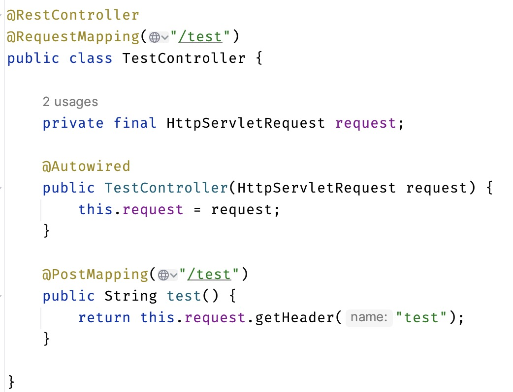
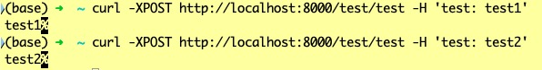

# 单例bean自动注入request

今天遇到了这样一份代码，下面是精简后的例子



初看这一份代码，我感觉有点奇怪，这里`TestController`是一个单例作用域的bean，在其中自动注入了`HttpServletRequest`类型的`request`。按照正常的bean生命周期，`testController`这个bean会在容器启动时创建，并完成初始化。此时其已经持有了`request`，并不会在后续进行改变了。那么每次调用`/test`端点，其响应应该都是空的。



但实际上却不是这样，每次`/test`端点都可以正确返回当此请求request携带的test请求头。

很明显，spring容器对它进行了代理封装，这里注入的实际上是一个代理对象，它负责根据作用域委派实际的request对象。我之前只知道`Scope`及其衍生注解标识的类会根据`proxyMethod`决定是否生成作用域代理类来维护实际的作用域。而`HttpServletRequest`是一个接口，spring也没有给他一个带有`request`作用域声明的默认实现，于是我翻阅了一下源码。

## spring对于`HttpServletRequest`的处理

首先`ServletWebServerApplicationContext`的postProcessBeanFactory`方法中调用了`registerWebApplicationScopes`方法。
而`registerWebApplicationScopes`方法调用了`WebApplicationContextUtils`的`registerWebApplicationScopes`方法。

```java
public class ServletWebServerApplicationContext extends GenericWebApplicationContext implements ConfigurableWebServerApplicationContext {
    @Override
    protected void postProcessBeanFactory(ConfigurableListableBeanFactory beanFactory) {
        // ...省略其他代码....
        registerWebApplicationScopes();
    }

    private void registerWebApplicationScopes() {
        // ...省略其他代码....
        WebApplicationContextUtils.registerWebApplicationScopes(getBeanFactory());
        // ...省略其他代码....
    }
}
```

这里`registerWebApplicationScopes`方法调用了`ConfigurableListableBeanFactory#registerResolvableDependency`，其实现位于`DefaultListableBeanFactory`。
本质上是放入了`resolvableDependencies`map中，会在自动注入`findAutowireCandidates`时，通过`Proxy#newProxyInstance`注入一个代理类。
该类在每次该方法执行时都会先调用`ObjectFactory#getObject`方法获取对象，并执行对象的对应方法。

```java
public abstract class WebApplicationContextUtils {
    public static void registerWebApplicationScopes(ConfigurableListableBeanFactory beanFactory) {
        registerWebApplicationScopes(beanFactory, null);
    }
    public static void registerWebApplicationScopes(ConfigurableListableBeanFactory beanFactory, @Nullable ServletContext sc) {
        // ...省略其他代码....
        beanFactory.registerResolvableDependency(ServletRequest.class, new RequestObjectFactory());
        // ...省略其他代码....
    }
}
```

```java
public class DefaultListableBeanFactory extends AbstractAutowireCapableBeanFactory implements ConfigurableListableBeanFactory, BeanDefinitionRegistry, Serializable {
    private final Map<Class<?>, Object> resolvableDependencies = new ConcurrentHashMap<>(16);
    public void registerResolvableDependency(Class<?> dependencyType, @Nullable Object autowiredValue) {
        Assert.notNull(dependencyType, "Dependency type must not be null");
        if (autowiredValue != null) {
            if (!(autowiredValue instanceof ObjectFactory || dependencyType.isInstance(autowiredValue))) {
                throw new IllegalArgumentException("Value [" + autowiredValue + "] does not implement specified dependency type [" + dependencyType.getName() + "]");
            }
            this.resolvableDependencies.put(dependencyType, autowiredValue); // 在map中添加一个元素
        }
    }
    protected Map<String, Object> findAutowireCandidates(@Nullable String beanName, Class<?> requiredType, DependencyDescriptor descriptor) {
        // ...省略其他代码....
        Map<String, Object> result = CollectionUtils.newLinkedHashMap(candidateNames.length);
        for (Map.Entry<Class<?>, Object> classObjectEntry : this.resolvableDependencies.entrySet()) {
            Class<?> autowiringType = classObjectEntry.getKey();
            if (autowiringType.isAssignableFrom(requiredType)) {
                Object autowiringValue = classObjectEntry.getValue();
                autowiringValue = AutowireUtils.resolveAutowiringValue(autowiringValue, requiredType); // 主要是这里
                if (requiredType.isInstance(autowiringValue)) {
                    result.put(ObjectUtils.identityToString(autowiringValue), autowiringValue);
                    break;
                }
            }
        }
        // ...省略其他代码....
    }
}
```

```java
abstract class AutowireUtils {
    public static Object resolveAutowiringValue(Object autowiringValue, Class<?> requiredType) {
        if (autowiringValue instanceof ObjectFactory && !requiredType.isInstance(autowiringValue)) {
            ObjectFactory<?> factory = (ObjectFactory<?>) autowiringValue;
            if (autowiringValue instanceof Serializable && requiredType.isInterface()) {
                autowiringValue = Proxy.newProxyInstance(requiredType.getClassLoader(), new Class<?>[] {requiredType}, new ObjectFactoryDelegatingInvocationHandler(factory)); // 主要是这一句
            } else {
                return factory.getObject();
            }
        }
        return autowiringValue;
    }
}
```

```java
private static class ObjectFactoryDelegatingInvocationHandler implements InvocationHandler, Serializable {
    @Override
    public Object invoke(Object proxy, Method method, Object[] args) throws Throwable {
        try {
            /* 主要是这里，每次调用代理对象的方法时，先调用了objectFactory的getObject()获取对象
             * 然后调用获取到的对象的对应方法
             */
            return method.invoke(this.objectFactory.getObject(), args);
        }
        catch (InvocationTargetException ex) {
            throw ex.getTargetException();
        }
    }
}
```

那么`RequestObjectFactory`如果做到在每次被调用`getObject`方法时，根据需要返回合适的`ServletRequest`的呢？

```java
public abstract class WebApplicationContextUtils {

    private static ServletRequestAttributes currentRequestAttributes() {
        RequestAttributes requestAttr = RequestContextHolder.currentRequestAttributes();
        if (!(requestAttr instanceof ServletRequestAttributes)) {
            throw new IllegalStateException("Current request is not a servlet request");
        }
        return (ServletRequestAttributes) requestAttr;
    }

    private static class RequestObjectFactory implements ObjectFactory<ServletRequest>, Serializable {
        public ServletRequest getObject() {return currentRequestAttributes().getRequest();}
        public String toString() {return "Current HttpServletRequest";}
    }
}
```

```java
public abstract class RequestContextHolder  {
    private static final ThreadLocal<RequestAttributes> requestAttributesHolder = new NamedThreadLocal<>("Request attributes"); // 这个实现父子线程相互隔离
    private static final ThreadLocal<RequestAttributes> inheritableRequestAttributesHolder = new NamedInheritableThreadLocal<>("Request context"); // 这个实现允许子线程拿到父线程的数据
    
    /**
     * 取了一个线程作用域的RequestAttributes对象
     */
    public static RequestAttributes getRequestAttributes() {
        RequestAttributes attributes = requestAttributesHolder.get();
        if (attributes == null) {
            attributes = inheritableRequestAttributesHolder.get();
        }
        return attributes;
    }

    public static RequestAttributes currentRequestAttributes() throws IllegalStateException {
        return getRequestAttributes(); // 这里省略了异常处理的代码
    }

}
```

```java
public class ServletRequestAttributes extends AbstractRequestAttributes {
    /**
     * Exposes the native HttpServletRequest that we're wrapping.
     */
    public final HttpServletRequest getRequest() {
        return this.request;
    }
}
```

通过`RequestContextListener`监听器或者加强的`FrameworkServlet`在收到请求时将`request`和`response`封装到`ServletRequestAttributes`中，并通过`RequestContextHolder`为当前线程保持该`attribute`。这时在当前线程中调用`RequestContextHolder.currentRequestAttributes().getRequest()`即可拿到实际的`request`，不需要在通过参数进行传递。`RequestObjectFactory`的`getObject`即是这样拿到的`request`。而`AutowireUtils`对于`ObjectFactory`定义的bean会生成一个代理类，该代理类在方法被调用时都会执行`ObjectFactory#getObject`获取实际对象，在实际对象上调用对应方法。

如此这般，你可以在`静态工具类`、`单例作用域bean`中直接注入`HttpServletRequest`，并可以享受到`spring`对其真实寿命周期的维护。
