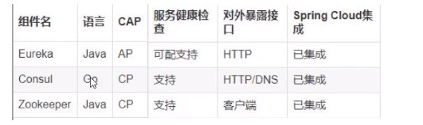
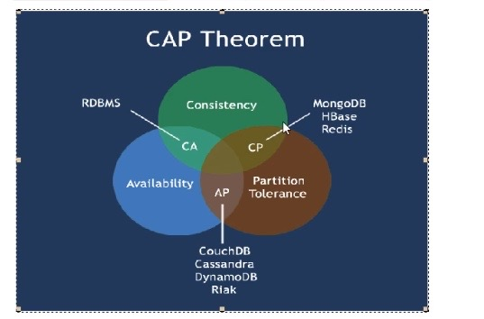
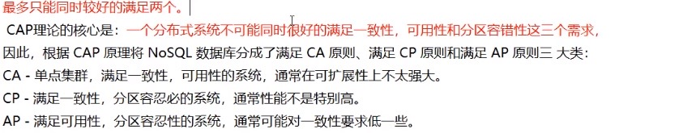

# 服务注册与发现

## Eureka

## Zookeeper

## Consul

## 三个注册中心的异同点

CAP理论关注粒度是否是数据,而不是整体系统设计的策略（分布式架构一定要保证P，所以只会有AP和CP两种组合）:

- C: Consistency(强一致性)
- A: Availability(可用性)
- P: Parttition tolerance(分区容错性)

