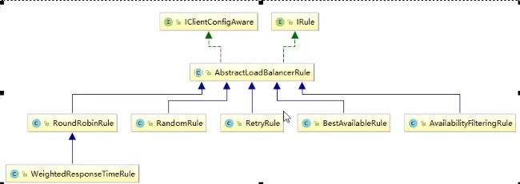

# 远程过程调用(rpc)与负载均衡(lb)

## LoadBalance的基本概念

负载均衡LB就是将用户的请求平摊到多个服务上，从而达到系统的HA（高可用）。常见的LB主要有：Nginx、LVS、硬件F5等。主要分为两类：集中式LB、进程内LB

### 集中式LB

在服务的提供方和消费方之间提供独立的LB设施（可以是硬件，如F5，也可以是软件，如nginx），由该设施负责把请求通过某种策略转发至服务的提供方

### 进程内LB

将LB逻辑集成到消费方，消费方从服务注册中心获知哪些地址可用，然后自己再从这些地址中选出一个合适的服务器。

## Ribbon

Ribbon是netflix提供的负载均衡解决方案。

Eureka天生整合了Ribbon，所以引入了Eureka，就不用再额外引入Ribbon了。

### 核心组件IRule



Ribbon提供的LB策略主要有如下几个实现（均位于`com.netflix.loadbalancer`包下）：

实现类|解释
---|---
RoundRobinRule|轮询
RandomRule|随机
RetryRule|先按照RoundRobinRule的策略获取服务,如果获取服务失败则在指定时间内进行重试,获取可用的服务
WeightedResponseTimeRule|对RoundRobinRule的扩展,响应速度越快的实例选择权重越多大,越容易被选择
BestAvailableRule|会先过滤掉由于多次访问故障而处于断路器跳闸状态的服务,然后选择一个并发量最小的服务
AvailabilityFilteringRule|先过滤掉故障实例,再选择并发较小的实例
ZoneAvoidanceRule|复合判断server所在区域的性能和server的可用性选择服务器

## OpenFeign

```pom
<dependency>
    <groupId>org.springframework.cloud</groupId>
    <artifactId>spring-cloud-starter-openfeigin</artifactId>
</dependency>
```

OpenFeign天生就整合了Ribbon，所以也具有负载均衡的功能。其默认超时时间是1s，这实际上是Ribbon的配置。所以想要更改超时时间，配置ribbion超时时间即可。

```yml
# 设置feign客户端超时时间，即设置ribbon超时时间
ribbon:
  # 指的是建立连接所用的时间，适用于网络状况正常情况下，两端连接所用的时间
  ReadTimeout: 5000
  # 指的是建立连接后，从服务器读取到可用资源所用的时间
  ConnectTimeout: 5000
```

### 日志级别设置

OpenFeign支持以下几种日志级别：

1. NONE：默认的，不显示任何日志
2. BASIC：仅记录请求方法、URL、响应状态码及执行时间
3. HEADERS：除了BASIC中定义的信息之外，还有请求和响应的头信息
4. FULL：除了HEADERS中定义的信息之外，还有请求和响应的正文及元数据

可以通过创建配置类来配置，如：

```java
@Configuration
public class FeignConfig {
    @Bean
    Logger.Level feignLoggerLevel() {
        return Logger.Level.FULL;
    }
}
```

另外，请注意，这些日志实际上是DEBUG级别的，因此要将对应类的日志级别改为DEBUG。

```yml
logging:
  level: 
    # 日志系统对该类开启DEBUG级别的日志打印
    com.wfb.learn.springcloud.service.PaymentFeignService: DEBUG
```
