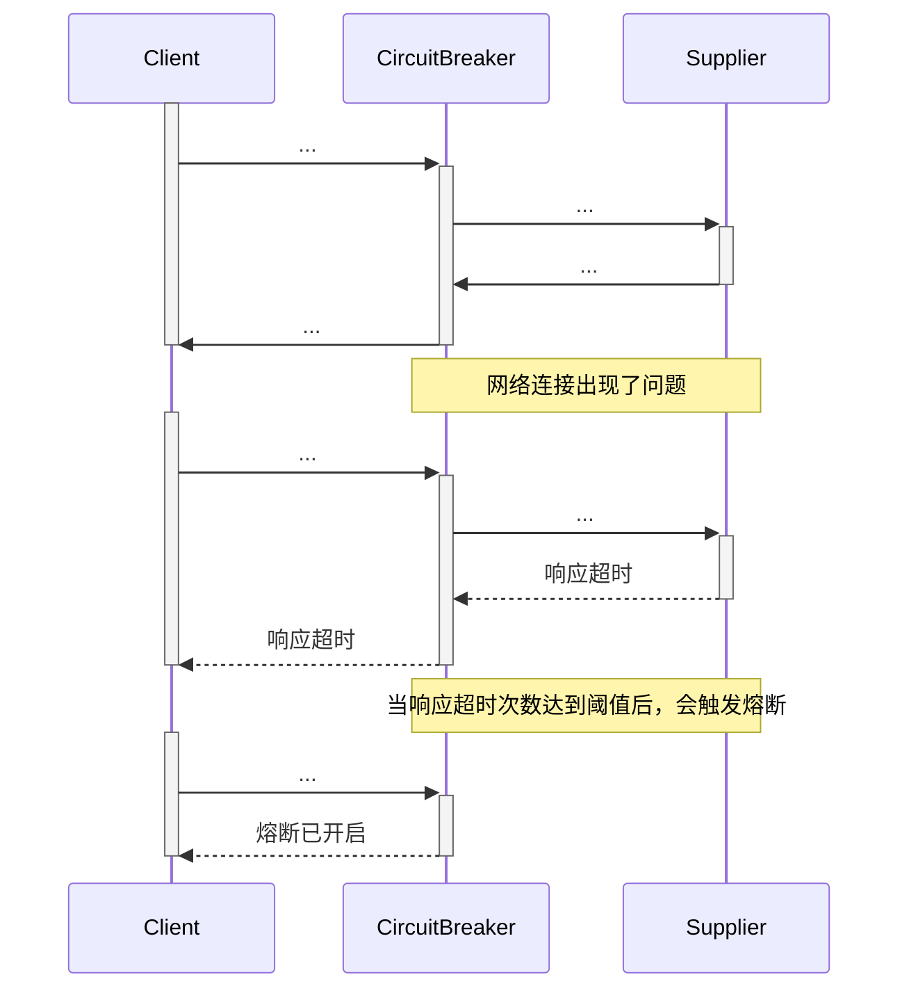
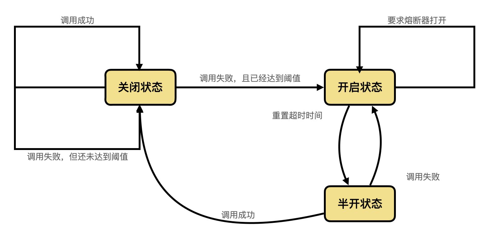

# 熔断器（CircuitBreaker）

> 文章链接：`https://martinfowler.com/bliki/CircuitBreaker.html`

软件系统远程调用运行在其他处理器上的软件是一种很常见的现象。内存（本地）调用和远程调用之间的一个很大的不同就是远程调用可能会失败或者挂起没有响应，直到达到某个超时限制（如客户端设置了请求超时时间）。更糟糕的是，如果你有很多等待提供者响应的调用存在，你可能会用尽关键资源（如tcp链接数），从而在多个系统之间引起级联错误（如A调用B，B有问题导致A出现问题）。在Michael Nygard的书《Release It》中，他提出了一种名为熔断器的模式用来防止这种灾难性的级联。

熔断器的基本设计思想是很简单的。你可以在熔断器对象中包装一个受保护的函数调用，该对象会对失败进行监控。一旦故障达到某个阈值，熔断器就会跳闸，并且对该函数的所有进一步调用都会直接返回错误，而根本不会对该服务发起调用。通常，如果熔断器跳闸，您还需要监视器通过某种方式警报。



下面是 Ruby 中这种行为的一个简单示例，用于防止超时。

我用一个块 (Lambda) 设置了断路器，它是受保护的调用:

```Ruby
cb = CircuitBreaker.new { |arg|
 @supplier.func arg
}
```

熔断器存储块，初始化各种参数（用于阈值、超时和监控），并将其重置为关闭状态。

```Ruby
class CircuitBreaker...
    attr_accessor :invocation_timeout, :failure_threshold, :monitor

    def initialize &block
        @circuit = block # 需要熔断器保护的调用块
        @invocation_timeout = 0.01 # 每次响应的超时时间
        @failure_threshold = 5 # 熔断器设置的连续超时阈值
        @monitor = acquire_monitor #报警监视器，用来监视当前熔断器的状态，并向我们进行报警通知
        reset # 将熔断器重置为初始状态。
    end
end
```

如果电路关闭，调用断路器将调用底层块，但如果它打开则返回错误。

```Ruby
# client code
aCircuitBreaker.call(5)

# call
class CircuitBreaker...
    def call args
        case state
        when :closed # 如果当前熔断器处于关闭状态
            begin
                do_call args # 由熔断器进行实际的远程调用
            rescue Timeout::Error # 如果当前调用超时，就调用超时的处理方法
                record_failure
                raise $!
            end
        when :open then raise CircuitBreaker::Open # 如果熔断器已经打开，就不进行实际请求了。直接告知熔断器已开启
        else raise "Unreachable Code"
        end
    end
    
    def do_call args
        result = Timeout::timeout(@invocation_timeout) do
            @circuit.call args
        end
        reset # 调用成功，所以将熔断器重置为初始状态
        return result
    end
end
```

如果我们得到一个超时，我们就让失败计数器的值加一，对于成功的调用，将计数器重置为零。

```Ruby
class CircuitBreaker...
    def record_failure # 当前调用失败时的处理逻辑
        @failure_count += 1
        @monitor.alert(:open_circuit) if :open == state
    end

    def rest #将熔断器设置为初始状态
        @failure_count = 0
        @monitor.alert :reset_circuit
    end
end
```

通过将故障计数与阈值进行比较来确定断路器的状态：

```Ruby
class CircuitBreaker...
    def state
        # 如果连续超时次数大于设置的阈值，那么熔断器状态为打开，否则为关闭状态
        (@failure_count >= @failure_threadshold) ? :open : :closed
    end
end
```

这个简单的熔断器很好的避免了在其处于打开状态时对于其保护的方法的实际调用，但是但是当事情再次好转时它需要外部干预来进行重置。对于在建筑物中使用的电气熔断器来说，这样的设计很合理。但是对于软件来说，熔断器应能自动检测并进行重置操作。我们可以通过在适当的时间间隔后再次尝试对其保护的调用来实现这种自重置行为，在成功时进行熔断器的重置。



创建这种熔断器意味着添加一个阈值来尝试重置并设置一个变量来保存最后一次调用请求错误的时间。

```Ruby
class ResetCircuitBreaker...
    def initialize &block
        @circuit = block # 需要熔断器保护的调用块
        @invocation_timeout = 0.01 # 每次响应的超时时间
        @failure_threadshold = 5 # 熔断器设置的连续超时阈值
        @monitor = BreakerMonitor.new # 报警监视器，用来监视当前熔断器的状态，并向我们进行报警通知
        @reset_timeout = 0.1 # 熔断器进行重置超时时间的间隔时间（即尝试跳转到半开状态的时间）
        reset # 重置熔断器
    end

    def reset # 重置熔断器
        @failure_count = 0
        @last_failure_time = nil
        @monitor.alert :reset_circuit
    end
end
```

现在存在第三种状态：半开。该状态意味着电路已准备好进行实验性的调用（这时发起的是真正的调用），以查看问题是否已解决。

```Ruby
class ResetCircuitBreaker...
    def state
        when (@failure_count >= @failure_threadshold) && (Timeout.now - @last_failure_time) > @reset_timeout
            # 如果连续超时次数已达阈值且距上次超时调用已达设置的重置超时时间，则尝试进行超时重置，即熔断器进入半开状态
            :half_open
        when (@failure_count >= @failure_threadshold)
            # 如果熔断器不在半开状态，且连续超时次数已达阈值，则会打开状态
            :open
        else
            # 否则，熔断器处于关闭状态。
            :closed
        end
    end
end
```

在半开状态下进行调用会导致试调用，如果成功则重置断路器，否则将重新启动超时。

```Ruby
class ResetCircuitBreaker...
    def call args
        case state
        when :closed, :half_open
            # 在熔断器的关闭或半开状态，都是进行的真实的远程调用
            begin
                do_call args
            rescue Timeout::Error
                record_failure
                raise $!
            end
        when :open
            # 在熔断器的开启状态，直接抛出熔断器开启异常
            raise CircuitBreaker::Open
        else
            raise "Unreachable"
        end
    end

    def record_failure
        @failure_count += 1
        @last_failure_time = Time.now
        @monitor.alert(:open_circuit) if :open == state
    end
end
```

这只是一个简单的示例，实际上熔断器提供了更多的特性和参数化。通常，它们会防止受保护的调用可能引发的一系列错误，例如网络连接失败。并非所有错误都应使电路跳闸，有些错误应反映正常故障并作为常规逻辑的一部分进行处理。

在大流量的情况下，可能会遇到许多呼叫只是等待初始化就超时的问题。由于远程调用通常很慢，因此最好将每个调用放在不同的线程上，使用future或promise在它们返回时处理结果。通过从线程池中提取这些线程，可以安排在线程池耗尽时断开电路。

该示例显示了一种使熔断器跳闸的简单方法：在成功调用时重置的计数。更复杂的方法可能会查看错误频率，一旦您获得 50% 的错误率就会跳闸。对于不同的错误，您可能还有不同的阈值，例如超时阈值为10，而连接失败阈值为3。

该示例只能用于同步调用，但实际上熔断器也可用于异步通信。异步通信的一种常见技术是将所有请求放在一个队列中，服务提供者以它的速度进行消费。这是一种避免服务器过载的有用技术。在这种情况下，当队列填满时电路会熔断。

就其本身而言，熔断器有助于减少可能失败的操作所占用的资源。熔断器避免了等待客户端超时和在岌岌可危的服务器上增加更大的负载。虽然在这里只是谈论的远程调用（这是熔断器的常见情况），但它可用于任何想要保护系统的某些部分免受其他部分故障的情况。

熔断器是监控的有效位置。其状态的任何改动都应该被记录，并且熔断器应显示其状态的详细信息以进行更深入的监视。熔断器的行为通常是环境中更深层次问题告警的良好来源。操作人员应该能够打开或重置熔断器。

熔断器本身很有价值，但使用它们的客户需要对熔断器故障做出反应。与任何远程调用一样，您需要考虑在失败时该怎么做。它是否会使您正在执行的操作失败，或者您可以采取哪些变通方法？如：信用卡授权可以放在队列中以便稍后处理，通过显示一些足以显示的陈旧数据可以减轻无法获取某些数据的情况。
