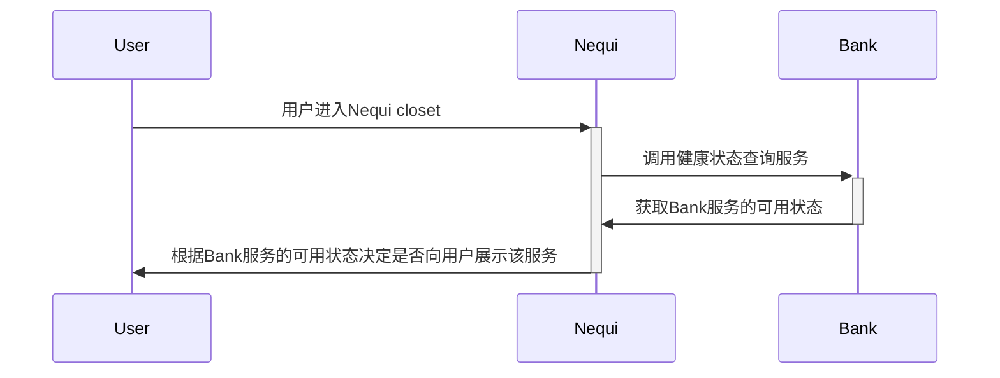
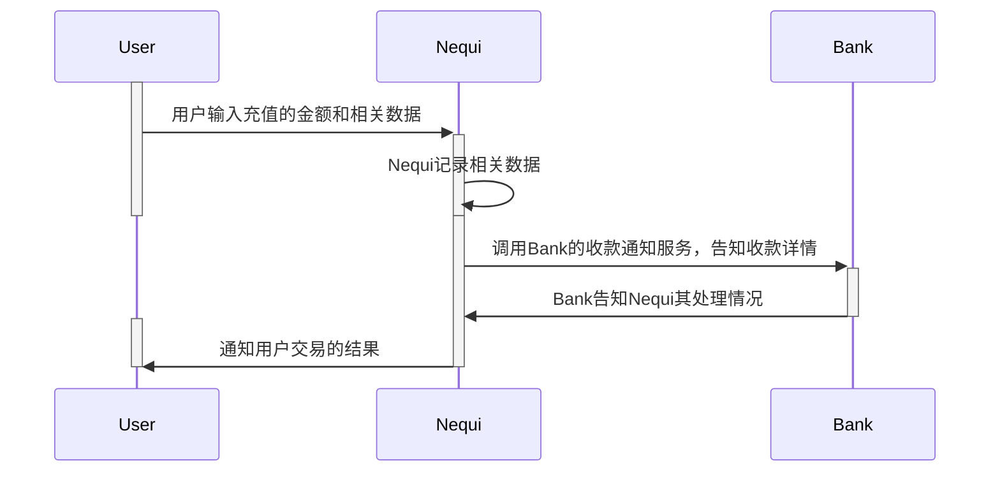
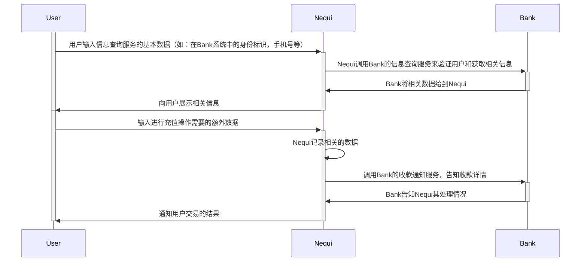
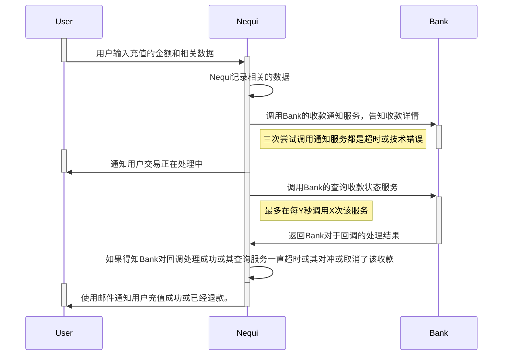
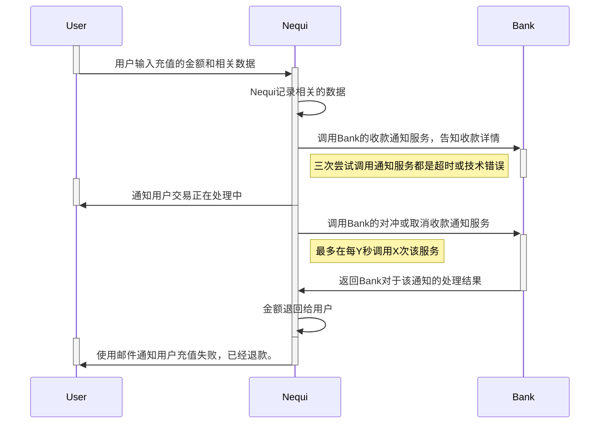
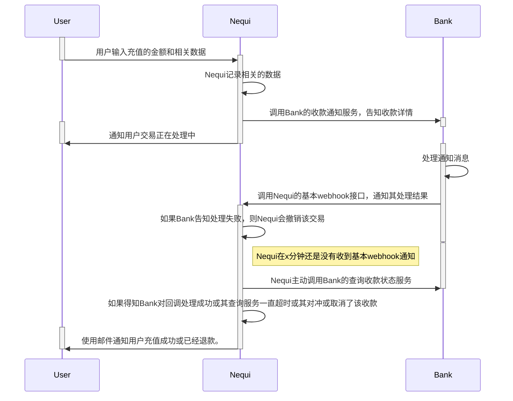

# What is Nequi Collection

> 此文档是[Nequi简介](https://conecta.nequi.com.co/content/recaudos-nequi)的中文翻译，翻译时间为：2021-12-17

- [What is Nequi Collection](#what-is-nequi-collection)
  - [Introduction](#introduction)
  - [标准实现的序列流](#标准实现的序列流)
    - [健康查询服务](#健康查询服务)
    - [收款可能的集成模式](#收款可能的集成模式)
      - [不使用数据库](#不使用数据库)
      - [使用数据库](#使用数据库)
      - [使用咨询服务处理异常通信](#使用咨询服务处理异常通信)
      - [使用对冲或取消收款通知服务来处理异常通信](#使用对冲或取消收款通知服务来处理异常通信)
      - [使用Nequi基本的webhook接口来通知Bank对收款通知的处理结果](#使用nequi基本的webhook接口来通知bank对收款通知的处理结果)
  - [服务要求](#服务要求)
  - [服务规范](#服务规范)
    - [健康状态检查服务](#健康状态检查服务)
    - [用户信息查询服务](#用户信息查询服务)
    - [收款通知](#收款通知)
    - [查询收款状态服务](#查询收款状态服务)
    - [对冲或取消收款通知服务](#对冲或取消收款通知服务)
    - [Nequi的基本webhook端点](#nequi的基本webhook端点)

## Introduction

该产品允许您轻松地和我们的平台集成从而从我们的`Nequi Closet`用户那里收款。

集成机制允许您创建一个通过数据库校验或者不校验的收款，可以让您得知为您在线转账的用户信息，并让您可以控制和验证从我们平台发起的用户发起的向您转账。

在一天的收款结束后，您收到的钱会被我们系统汇总，然后在减去协商的手续费和增值税后，在下一天转到您的哥伦比亚银行账户上。另外，我们会通过向您的个人邮箱发送邮件、为您提供SFTP链接或者S3桶来为您提供这些交易的流水报表（以AsoBancaria 2001、AsoBancaria 2011或CSBV格式组织数据）。

您有多种方式可以和我们系统进行集成，这取决于您的系统设计。总的来说，您的系统必须暴露下面的服务：

1. 健康状态检查服务：该服务主要是让我们的Nequi平台可以检查您系统的状态，从而让Nequi可以决定是否向用户开启您的服务。
2. 用户信息、余额或用户存在性的查询服务：该服务是可选的。增加该服务的主要目的是在收款流程中添加查询和校验，从而可以让Nequi得知该交易涉及的用户的信息，用户应该支付的金额，也可以用来验证该用户是否是您的用户，从而拒绝或允许其向您进行转账。
3. 收款通知：该服务主要用来接收我们系统向您发送的收款完成的通知。除了收款相关的基本数据（data、Identifier、value、customer）外，你也可以要求Nequi添加不超过6个的额外的引用（它们也会出现在报表中）。另外，如果您实现了前面说明的信息查询服务（即第2个服务），那么该服务的返回值将自动作为6个引用中的一个，添加到收款通知的请求中。
4. 查询收款状态服务：该服务主要是为了让我们平台基于一个已经发送的`收款通知`的标识符，来查询您的系统是否正确处理（会有以下几个状态：successfully processed, not exist, reject）。该服务主要是作为收款通知服务的补充，当收款通知服务超时或返回500时，我们平台将会尝试每Y秒调用X次该查询服务，从而决定如何关闭该交易流。（另外，您也可以实现我们标准的webhook方案，在交易正确处理或出现故障时主动通知我们平台，从而避免来自Nequi的重复查询）
5. 对冲或取消收款通知服务：该服务是否要实现取决于您的系统设计。该服务主要用来接受Nequi向您发送的逆转或取消收款通知。只有在 Nequi 内发生技术故障或通过使用您必须公开的上述收集通知服务时，才会使用此服务。

## 标准实现的序列流

### 健康查询服务



### 收款可能的集成模式

根据所描述的能力或服务，可以呈现两种收款场景

#### 不使用数据库

在这种场景下，不需要信息查询服务，在收款的过程中主要是由用户输入的数据完成的。他必须知道支付的金额，并直接在Nequi的app中输入。



#### 使用数据库

在这种模式下，用户输入充值的初始化信息，然后Nequi使用用户信息查询服务来获取额外的信息



在收款通知过程中，面对以下场景，可能会出现技术错误或通讯故障，导致Nequi平台在其服务中无法得知收款处理的最终结果。为此，有两种模式，一种是咨询服务，一种是对冲服务，它们允许关闭交易流程并及时通知用户交易状态。

#### 使用咨询服务处理异常通信

带有超时和事物通知的查询服务



#### 使用对冲或取消收款通知服务来处理异常通信



对于Nequi的集成，您可以选择集成是否需要基于数据库实现信息查询服务，以及是否要实现查询收款状态服务及取消收款通知服务。此外，您的系统也可以使用我们的基本webhook接口来主动的告知我们您系统中对某个收款通知的处理结果，这可以大大节约调用成本。

#### 使用Nequi基本的webhook接口来通知Bank对收款通知的处理结果



请明确要使用的集成模型和要实现的服务，请牢记以下技术要求：

## 服务要求

bank提供的服务必须满足以下技术要求：

1. 连接通过VPN或使用Internet
2. 服务必须使用HTTPS和TLS 1.2协议，并基于RSETful风格
3. API的验证方式必须为：OAuth，JWT，JWS（Nequi规定），如果使用VPN进行连接，也可以使用简单的基本认证(Basic Authentication)。
4. Bank服务的请求体和响应必须遵循Nequi的文档和规范。
5. 所有服务正常情况下应在25s内返回结果，超过则视为接口调用异常
6. 对于服务的域和路径，您可以进行自定义。我们只规定了协议和规范。

此外，请记住，您的服务和/或系统必须通过 Nequi 应用程序收款服务的操作和支持条件准则，这些条件会在与Nequi合作最终确定后在签署的条款和条件的技术附件中指定。

## 服务规范

每个服务的签名和规范详述如下：

### 健康状态检查服务

Http method: `GET`

Request:

```txt
--- no body ---
```

Response:

- HTTP 200

    ```txt
    OK
    ```

- HTTP 500 (服务不可用)

    ```txt
    {
        "errors": [
            {
                "code": "20-07C",
                "description": "Technical Error"
            }
        ]
    }
    ```

### 用户信息查询服务

HTTP method: `GET`

Query Params:

- required

    name|description
    ---|---
    messageId|请求的标识符

    其他字段支持自定义，且都是必须的。如：

    name|description
    ---|---
    documentType|用户身份类型
    contractNumber|用户该类型的身份编号

Response

- HTTP 200

    ```json
    {
        "products": [
            {
                "cardNumber": 6136977,
                "id": "1"
            }
        ]
    }
    ```

    该查询服务可以返回确切的支付金额（在`products`数组使用`value`作为键），如果没有返回，则交由用户来决定支付的金额。如果`products`数组只有一条记录，则Nequi不会展示下拉选择框，而是直接将用户送到该记录的付款处。如果该Nequi用户是您系统的用户，但是没有等待支付的款项，那么您可以直接返回空的`products`数组。

- HTTP 400 (Bad parameters)

    ```json
    {
        "errors": [
            {
                "code": "20-05C",
                "description": "Bad params"
            }
        ]
    }
    ```

- HTTP 401 (Invalid credentials)

    ```json
    {
        "errors": [
            {
                "code": "20-10C",
                "description": "Incorrect credentials."
            }
        ]
    }
    ```

- HTTP 403 (You do not have access to this service)

    ```json
    {
        "errors": [
            {
                "code": "20-10C",
                "description": "You do not have permissions to access the resource."
            }
        ]
    }
    ```

- HTTP 404 (With the data sent, it was not possible to find information on your system)

    ```json
    {
        "errors": [
            {
                "code": "20-08C",
                "description": "Not Found"
            }
        ]
    }
    ```

- HTTP 420 (The query could not be made due to some rule of your business)

    ```json
    {
        "errors": [
            {
                "code": "",
                "description": ""
            }
        ]
    }
    ```

- HTTP 500 (The service is not available)

    ```json
    {
        "errors": [
            {
                "code": "20-07C",
                "description": "Technical Error"
            }
        ]
    }
    ```

### 收款通知

HTTP method: `POST`

Headers:

```txt
Content-type: application/json
```

Request:

```json
{
    "messageId": "123456789", // 交易ID
    "value": "1", // 金额
    "fields": { // 付款所需的字段（通常从咨询服务中获得）
        "cardNumber": 6136977,
        "id": 1,
        // ....
    },
    "asynchronous": true, // 指示处理请求的方式
    "reportUrl": { // 包含获取支付报告的url的相关数据，只有异步（asynchronous为true）时，才需要调用。如果异步但没有给出url数据，则请求默认端点
        "host": "l5o5ir2tv7.execute-api.us-east-1.amazonaws.com",
        "path": "/qa/test",
        "port": "443"
    }
}
```

Response:

- HTTP 200

    ```json
    {
        "paymentMessageId": "123456789", // 对应收款通知中发送的付款关联的messageId
        "fields": { // bank返回的数据，Nequi调用4和5这两个接口时，会携带其中的数据，由bank进行定义
            "externaltransactionId": "123456789",
            "transactionDate": "2020-02-20T14:19:10"
        }
    }
    ```

- HTTP 400 (Bad parameters)

    ```json
    {
        "errors": [
            {
                "code": "20-05C",
                "description": "Bad params"
            }
        ]
    }
    ```

- HTTP 401 (Invalid credentials)

    ```json
    {
        "errors": [
            {
                "code": "20-10C",
                "description": "Incorrect credentials."
            }
        ]
    }
    ```

- HTTP 403 (You do not have access to this service)

    ```json
    {
        "errors": [
            {
                "code": "20-10C",
                "description": "You do not have permissions to access the resource."
            }
        ]
    }
    ```

- HTTP 404 (With the data sent, it was not possible to find information on your system)

    ```json
    {
        "errors": [
            {
                "code": "20-08C",
                "description": "Not Found"
            }
        ]
    }
    ```

- HTTP 420 (The query could not be made due to some rule of your business)

    ```json
    {
        "errors": [
            {
                "code": "",
                "description": ""
            }
        ]
    }
    ```

- HTTP 500 (The service is not available)

    ```json
    {
        "errors": [
            {
                "code": "20-07C",
                "description": "Technical Error"
            }
        ]
    }
    ```

如果您想要在在付款后将该接口返回的信息添加到交易流水报告或展示给用户。请联系Nequi的销售人员。

### 查询收款状态服务

HTTP method: GET

Query params:

- Required

    name|description
    ---|---
    messageId|请求唯一标识
    paymentMessageId|想要查询的收款通知的id

Response:

- HTTP 200:

    ```json
    {
        "data": { // Bank的附加信息
            "externaltransactionId": 2570364,
            "transactionId": 4002700
        },
        "statusPayment": "0", // 交易处理状态
        "paymentMessageId": "1234567" // 即请求中的messageId
    }
    ```

    其中`statusPayment`可能的值如下：

    statusPayment|description
    ---|---
    0|支付成功
    1|支付失败
    2|等待确认，重试
    3|付款被退回

- HTTP 400 (Bad parameters)

    ```json
    {
        "errors": [
            {
                "code": "20-05C",
                "description": "Bad params"
            }
        ]
    }
    ```

- HTTP 401 (Invalid credentials)

    ```json
    {
        "errors": [
            {
                "code": "20-10C",
                "description": "Incorrect credentials."
            }
        ]
    }
    ```

- HTTP 403 (You do not have access to this service)

    ```json
    {
        "errors": [
            {
                "code": "20-10C",
                "description": "You do not have permissions to access the resource."
            }
        ]
    }
    ```

- HTTP 404 (With the data sent, it was not possible to find information on your system)

    ```json
    {
        "errors": [
            {
                "code": "20-08C",
                "description": "Not Found"
            }
        ]
    }
    ```

- HTTP 420 (The query could not be made due to some rule of your business)

    ```json
    {
        "errors": [
            {
                "code": "",
                "description": ""
            }
        ]
    }
    ```

- HTTP 500 (The service is not available)

    ```json
    {
        "errors": [
            {
                "code": "20-07C",
                "description": "Technical Error"
            }
        ]
    }
    ```

如果您想要在在付款后将该接口返回的信息添加到交易流水报告或展示给用户。请联系Nequi的销售人员。

### 对冲或取消收款通知服务

HTTP method: PUT

Headers:

```txt
Content-type: application/json
```

Request:

```json
{
    "messageId": "1581954124512", // 请求消息ID
    "value": "1", // 金额
    "paymentMessageId": "123456789", // 支付时的消息ID
    "fields": { // bank在收款通知接口返回的额外数据（即data数据）
        "externalTransactionId": 4002621
    }
}
```

Response:

- HTTP 200:

    ```json
    {
        "statusPayment": "3"
    }
    ```

- HTTP 400 (Bad parameters)

    ```json
    {
        "errors": [
            {
                "code": "20-05C",
                "description": "Bad params"
            }
        ]
    }
    ```

- HTTP 401 (Invalid credentials)

    ```json
    {
        "errors": [
            {
                "code": "20-10C",
                "description": "Incorrect credentials."
            }
        ]
    }
    ```

- HTTP 403 (You do not have access to this service)

    ```json
    {
        "errors": [
            {
                "code": "20-10C",
                "description": "You do not have permissions to access the resource."
            }
        ]
    }
    ```

- HTTP 404 (With the data sent, it was not possible to find information on your system)

    ```json
    {
        "errors": [
            {
                "code": "20-08C",
                "description": "Not Found"
            }
        ]
    }
    ```

- HTTP 420 (The query could not be made due to some rule of your business)

    ```json
    {
        "errors": [
            {
                "code": "",
                "description": ""
            }
        ]
    }
    ```

- HTTP 500 (The service is not available)

    ```json
    {
        "errors": [
            {
                "code": "20-07C",
                "description": "Technical Error"
            }
        ]
    }
    ```

### Nequi的基本webhook端点

要集成Nequi的基本webhook端点，需要将您的通知发送到以下端点：

QA: 待定
PDN: 待定

HTTP method: POST

Request:

```json
{
    "data": { // 附加的收款信息
        "externaltransactionId": 2570364,
        "transactionId": 4002700
    },
    "statusPayment": "0", // 交易处理状态
    "paymentMessageId": "1234567", // Nequi发送的收款通知的messageId
    "code": "NIT_1_00", // Nequi 内业务的标识符，在 Nequi业务中注册。
    "productName": "RECARGA" // 产品标识，以防bank有多个产品
}
```

此服务在“即发即弃”方案下工作，因此您将始终收到带有 HTTP 代码 200 的正确响应。

这个 webhook 的安全性基于附加的 webhook 请求签名指南，Nequi 会给你一个秘密/私钥和 appId，你必须用它来签名。
