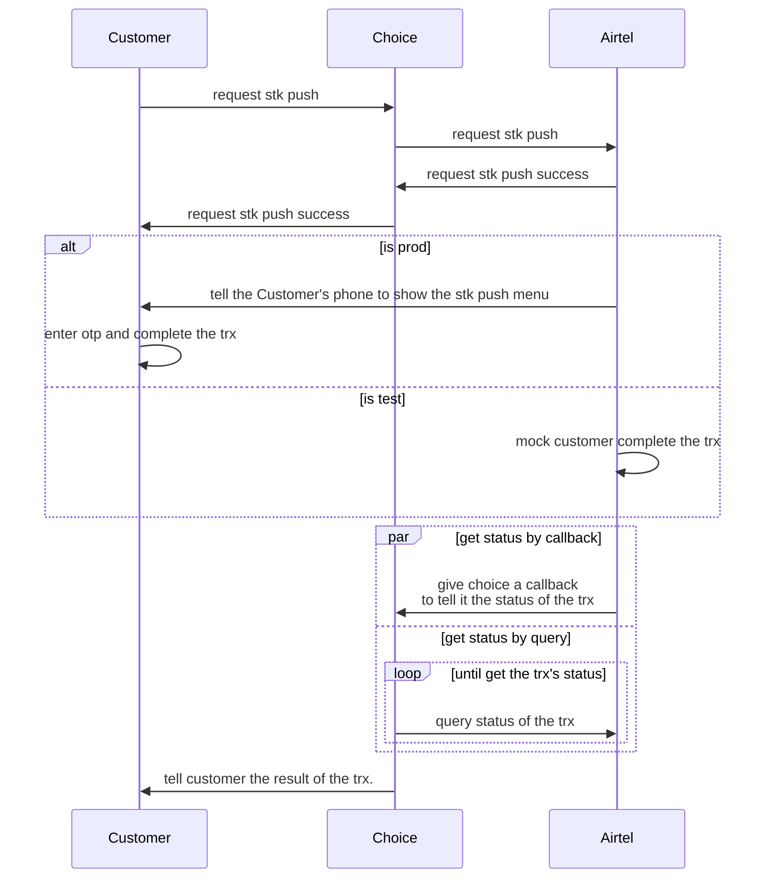
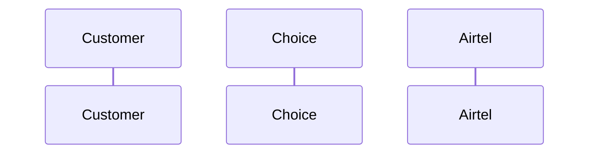

# 手机钱包时序图

## STK Push入金

```mermaid
sequenceDiagram
	participant u as Customer
	participant c as Choice
	participant a as Airtel
	u ->> c: request stk push
	c ->> a: request stk push
	a ->> c: request stk push success
  c ->> u: request stk push success
  alt is prod
   	a ->> u: tell the Customer's phone to show the stk push menu
  	u ->> u: enter otp and complete the trx
  else is test
  	a ->> a: mock customer complete the trx 
  end
  par get status by callback
  	a ->> c: give choice a callback <br/> to tell it the status of the trx
  and get status by query
    loop until get the trx's status
      c ->> a: query status of the trx
    end
   end
  c ->> u: tell customer the result of the trx.
```

## Pay Bill入金

```mermaid
sequenceDiagram
	participant u as Customer
	participant c as Choice
	participant a as Airtel
	
```

