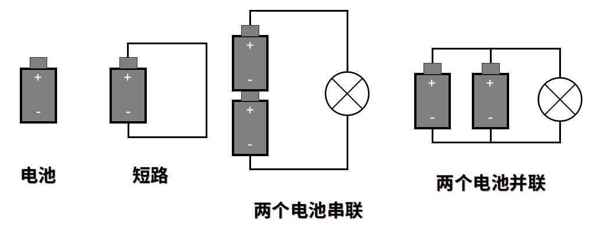

# 《编码——隐匿在计算机软硬件背后的语言》笔记

## 使用手电筒来通信

### 编码

编码这个词的意思是指一种用来在机器和人之间传递信息的方式。

#### 莫尔斯电码

莫尔斯电码用用长闪(划dash)和短闪(点dot)来表示26个英文字母的一种编码方式,如：`... --- ...`可以用来表示*SOS*。它也可以用一组由点和划组成的五元序列来表示数字。大部分标点符号由5、6、7个点和划的组合序列来表示。还有一些编码则用来表示某些欧洲语言中的重音字母。

- 莫尔斯电码的缺点是没有区分大小写。
- 莫尔斯电码是伴随着电报机的问世而被方明的。
- 莫尔斯电码码字的数目=$2^{点和划的数目}$
- 莫尔斯电码也被称作二进制码，因为这种编码的组成元素只有两个——点和划。

#### 布莱叶盲文与二进制码

- 在布莱叶盲文中，每个在书写文字中用到的符号——具体来说就是字母、数字和标点符号——都被编码成为$2\times3$的点码单元中的一个或者多个凸起的点。这个点码单元包含的点通常使用1到6的数字来编号。
- 这些点码都是二进制的，一个单独的点不是平的就是凸起的。
- 每组有6个点，并且每个点有平和凸两种状态，因此6个可平可凸的点的组合数就是$2^6=64$。
- 布莱叶盲文可以表示全部的大小写字母数字和很多标点符号，还用了一部分码点来表示缩写，很明显数量已经超过了64个码点。能完成这种壮举是因为其引入了优先码和逃逸码。
- **数字标识符**和取消数字标识状态的**字母标识符**，它们改变了后面编码的意义——从表示字母到表示数字，又从表示数字回到表示字母。像这样的编码通常被称作 **“优先码”(precedence codes)**或者 **“换档码”(shift codes)**。**它们改变着作用域内编码的含义，直到作用域结束。**
- 大写字母标识符表示紧随它的字母(而且仅仅是紧随它的字母)应该被译为大写。类似这样的编码被成为 **“逃逸码”(escape codes)**。**逃逸码让你“逃离”对编码串单调的、一成不变的解析，而转入一种新的解析方式。**

### 关于电的基本理论

- 我们所能看到和感觉到的事物都是由**原子(atom)**组成的。每一个原子又由三种粒子构成：**中子(neutron)**、**质子(proton)**和**电子(electron)**。
- 在“电子理论”中认为**电流是由电子的运动产生的**。
- 原子之间可以通过化学的方式结合形成**分子**。分子的性质通常与组成它的原子大相径庭。
- 一个原子中电子的数目一般情况下与质子数目相同。但是在某些情况下，**电子可能从原子中脱离**。这就是电流产生的原因。

- 如果原子在最外电子层中只含有一个电子，那么这个电子很容易逃逸，这就是易导电物质所需具备的特性。这些物质对于电流来说是“导通”的，因而被称为**导体**。最好的导体是*铜、银和金*。
- 如果一种物体有着很强的阻抗性——也就是说它几乎不能传导任何电流——它就被称为**绝缘体**。*橡胶和塑料*都是很好的绝缘体。

- **导线越长**，它的阻抗就越高;
- **导线越粗**，他的阻抗就越低。

- **电压**表征了电流做功的“势”，也就是电势能的大小。不管电池是否被连接到电路中，电压都是存在的。单位是**伏特**
- **电流**与流经电路的电子数有关。单位是**安培**
- **电阻**——一般来说物质都倾向于阻拦电子的通过——其单位是**欧姆**
- $I = \frac{E}{R}$,其中$I$表示电流，$E$表示电压，$R$表示电阻。
- 如果导线电阻较低的话，当有较大电流时，它将**变热并且发光**，此时电阻也会变大。这就是白炽灯发光的原理。
- **瓦特**是**功率**的计量单位，它的计算公式是：$P = E \times I$。

### 手电筒的电路图

- 单独放置的电池，没有连接任何设备。它的电压是1.5v,代表着做功的势能。因为正负极通过空气也有连通，其电阻非常非常大，其电流等于1.5伏除以一个极大的数，几乎等于0安。
- 用一小段铜导线将电池正负极连接起来的情形被称为“短路”。电压仍为1.5伏，但是现在电阻非常非常小，导致电路中的电流非常非常大。大量的电子流经导线。在现实情况下，电流会因为电池的型号大小而受到限制，电池或许无法导通如此大的电流，且实际电压也将低于1.5伏。如果电池足够大的话，导线将会发热，因为电能被转化成了热能。如果导线继续变热，它将会发光甚至熔化。
- 两个电池正负极拼接后组合成一个新的电池，组合后的电池电压变成3伏，这种连接方式被成为串联。
- 将两个电池并联组合成的电池其电压仍为1.5伏，但相应的使用寿命延长了一倍。
