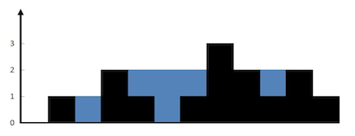
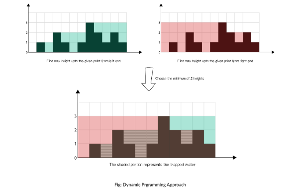

# 接雨水

## 题目描述

给定 n 个非负整数表示每个宽度为 1 的柱子的高度图，计算按此排列的柱子，下雨之后能接多少雨水。



上面是由数组 [0,1,0,2,1,0,1,3,2,1,2,1] 表示的高度图，在这种情况下，可以接 6 个单位的雨水（蓝色部分表示雨水）

**示例：**

输入: [0,1,0,2,1,0,1,3,2,1,2,1]
输出: 6

## 方法一：暴力

直接按问题描述进行。对于数组中的每个元素，我们找出下雨后水能达到的最高位置，等于两边最大高度的较小值减去当前高度的值。

```java
class Solution {
    public int trap(int[] height) {
        int cnt = 0;
        for(int i=1; i<height.length-1; ++i) {
            cnt += f(height, i);
        }
        return cnt;
    }
    private int f(int[] height, int k) { //第k点可以存储多少水量
        int maxLeftHeight = 0;
        int maxRightHeight = 0;
        for(int i=k-1; i>=0; --i) maxLeftHeight = Math.max(maxLeftHeight, height[i]);
        for (int i=k+1; i<height.length; ++i) maxRightHeight = Math.max(maxRightHeight, height[i]);
        int max = Math.min(maxLeftHeight, maxRightHeight);
        return Math.max(0, max - height[k]);
    }
}
```

## 方法二：动态规划

在暴力方法中，我们仅仅为了找到最大值每次都要向左和向右扫描一次。但是我们可以提前存储这个值。因此，可以通过动态规划解决。

这个概念可以见下图解释：



**算法：**

- 找到数组中从下标 i 到最左端最高的条形块高度 left_max。
- 找到数组中从下标 i 到最右端最高的条形块高度 right_max。
- 扫描数组 height 并更新答案：
- 累加 min(max_left[i],max_right[i])−height[i] 到 ans 上

```java
class Solution {
    public int trap(int[] height) {
        int cnt = 0;
        int[] leftHeight = new int[height.length];
        int leftMax = 0;
        for (int i=0; i<height.length; ++i) { //获取left_max
            leftHeight[i] = leftMax = Math.max(leftMax, height[i]);
        }
        int[] rightHeight = new int[height.length];
        int rightMax = 0;
        for (int i=height.length-1; i>=0; --i) { ////获取right_max
            rightHeight[i] = rightMax = Math.max(rightMax, height[i]);
        }

        for(int i=0; i<height.length; ++i) {
            cnt += Math.max(Math.min(leftHeight[i], rightHeight[i]) - height[i], 0);
        }
        return cnt;
    }
}
```

## 方法三：栈的应用


```java
class Solution {
    public int trap(int[] height) {
        if (height.length == 0) return 0;
        Stack<Integer> s = new Stack<>();
        int cur = 0;
        int ans = 0;
        while (cur < height.length) {
            while (!s.isEmpty() && height[s.peek()] < height[cur]) {
                int h = height[s.pop()];
                if (s.isEmpty()) break;
                ans += (Math.min(height[s.peek()], height[cur]) - h) * (cur - s.peek() - 1);
            }
            s.push(cur++);
        }
        return ans;
    }
}
```

## 方法 4：使用双指针

动态规划中，我们常常可以对空间复杂度进行进一步的优化。

例如这道题中，可以看到，max_left [ i ] 和 max_right [ i ] 数组中的元素我们其实只用一次，然后就再也不会用到了。所以我们可以不用数组，只用一个元素就行了。

```java
class Solution {
    public int trap(int[] height) {
        if (height.length == 0) return 0;
        int left = 0, right = height.length - 1;
        int leftMax = 0, rightMax = 0;
        int ans = 0;
        while (left < right) {
            if (height[left] < height[right]) {
                if (height[left] > leftMax) leftMax = height[left++];
                else ans += leftMax - height[left++];
            } else {
                if (height[right] > rightMax) rightMax = height[right--];
                else ans += rightMax - height[right--];
            }
        }
        return ans;
    }
}
```
