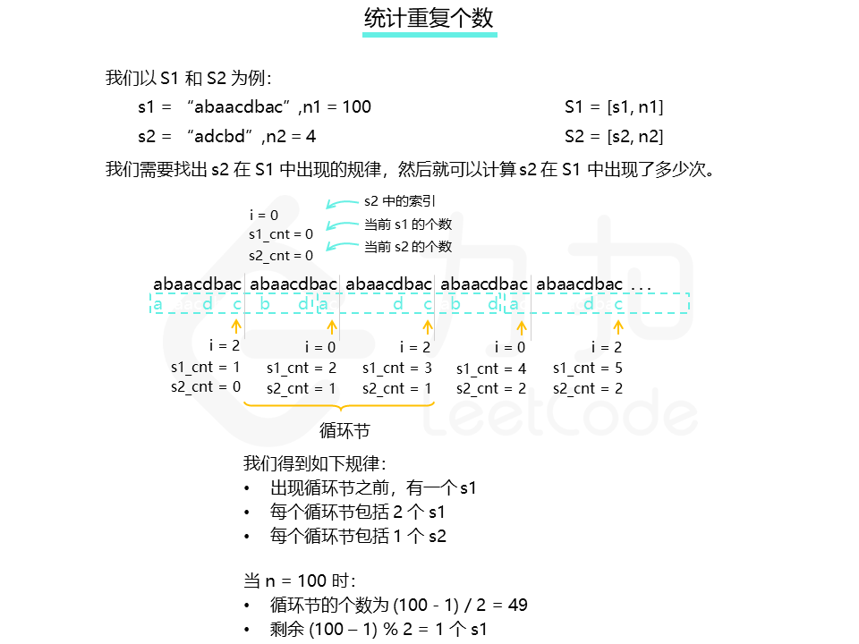

# 统计重复个数

## 算法描述

由 n 个连接的字符串 s 组成字符串 S，记作 S = [s,n]。例如，["abc",3]=“abcabcabc”。

如果我们可以从 s2 中删除某些字符使其变为 s1，则称字符串 s1 可以从字符串 s2 获得。例如，根据定义，"abc" 可以从 “abdbec” 获得，但不能从 “acbbe” 获得。

现在给你两个非空字符串 s1 和 s2（每个最多 100 个字符长）和两个整数 0 ≤ n1 ≤ 106 和 1 ≤ n2 ≤ 106。现在考虑字符串 S1 和 S2，其中 S1=[s1,n1] 、S2=[s2,n2] 。

请你找出一个可以满足使[S2,M] 从 S1 获得的最大整数 M 。

**示例：**

输入：
s1 ="acb",n1 = 4
s2 ="ab",n2 = 2

返回：
2

## 方法一：找出循环节

由于题目中的 n1 和 n2 都很大，因此我们无法真正把 S1 = [s1, n1] 和 S2 = [s2, n2] 都显式地表示出来。

但因为S1和S2都是由简单的字符串循环得到的。因此，我们可以快速的得到循环节，并利用数学运算可以快速的算出循环部分的答案。只需要加上循环开始前和循环结束后的部分，即可得到总的答案



```java
class Solution {
    public int getMaxRepetitions(String s1, int n1, String s2, int n2) {
        char[] ch1 = s1.toCharArray();
        char[] ch2 = s2.toCharArray();
        int s1Cnt = 0, s2Cnt = 0; //记录当前使用了几个s1，几个s2
        int index = 0; //记录下一个要遍历的s2的字符的位置，也可以说是s2中的第几个字符
        Map<Integer, Pair> recall = new HashMap<>(); //用来记录每用完一个s1时的状态，以index做key，(s1Cnt, s2Cnt)做value。
        Pair preLoop; //用来记录循环节出现前走过的s1和s2的数量
        Pair inLoop; //用来记录一个循环节包含几个s1和几个s2
        while (true) {
            ++s1Cnt; //再增加一个s1，去查询是否含有循环节
            for (char ch: ch1) { //遍历这个s1，用s2去做匹配
                if (ch == ch2[index]) {
                    index++;
                    if (index == ch2.length) {
                        s2Cnt++;
                        index = 0;
                    }
                }
            }
            if (s1Cnt == n1) { //如果没找到循环节就把S1中的s1用完了，就直接返回了
                return s2Cnt / n2;
            }
            if (recall.containsKey(index)) { //出现了循环节
                Pair pair = recall.get(index);
                preLoop = recall.get(index);
                inLoop = new Pair(s1Cnt-preLoop.s1Cnt, s2Cnt-preLoop.s2Cnt);
                break;
            } else { //遍历完了一个s1，但是没发现循环节，记录此时的状态信息
                recall.put(index, new Pair(s1Cnt, s2Cnt));
            }
        }
        //计算除剩余部分外，其他部分包含的s2的数量。其等于
        // 头部包含的s2的数量preLoop.s2Cnt+循环节包含的s2的数量inLoop.s2Cnt*循环节的数量(n1 - preLoop.s1Cnt) / inLoop.s1Cnt
        int ans = preLoop.s2Cnt + (n1 - preLoop.s1Cnt) / inLoop.s1Cnt * inLoop.s2Cnt;
        //对于剩余的部分进行处理
        int rest = (n1 - preLoop.s1Cnt) % inLoop.s1Cnt; //剩余的s1的数量
        for (int i = 0; i < rest; i++) {
            for (char ch: ch1) {
                if (ch == ch2[index]) {
                    index++;
                    if (index == ch2.length) {
                        ans++;
                        index = 0;
                    }
                }
            }
        }
        return ans / n2;//最终结果为：S1包含的s2的数量整除S2中s2的数量
    }
    static class Pair{
        int s1Cnt;
        int s2Cnt;

        public Pair(int s2Cnt, int index) {
            this.s1Cnt = s2Cnt;
            this.s2Cnt = index;
        }
    }
}
```
