# 综述

1. 词法分析(Lexical Analysis)：将程序文本分为一个个token
2. 语法分析(Parsing)：理解sentence的结构，生成语法树
3. 语义分析(Semantic Analysis)：捕获不一致
4. 优化(Optimization)：让程序使用更少的内容，运行的更快
5. 代码生成(Code Generation)：生成目标代码

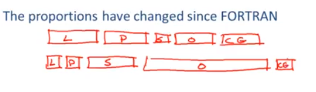

## 词法分析

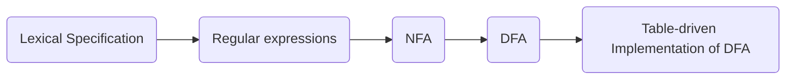

### 词法分析的目标

- 将程序子串根据角色分类(即识别出token,并为其标记类型)
- 将token(<class, string>)传递给parser

### 词法规范(Lexical Specification)

1. 为每一个token类的lexemes编写一个rexp(正则表达式)，即：$Number = digit+$、$Identifier = letter(letter|digit)*$、...
2. 构造R匹配所有tokens的所有lexemes，即：$R = Keyword + Identifier + Number + ...$
3. 让输入为$X_1...X_n$，对于$1 \le i \le n$检查$X_1...X_i \in L(R)$
4. 如果成立，则：$\exists j$ s.t. $X_1...X_i \in L(R_j)$
5. 那么，从输入中移除$X_1...X_i$，并重新执行(3)

上述过程有几个问题需要处理：

- 当$X_1...X_i \in L(R) \And X_1...X_j \in L(R) \And i \neq j$时，使用哪个输入：遵循最长匹配原则(如：`=`和`==`都是操作符，我们遵循最长匹配原则，去匹配`==`)
- 当$X_1...X_i \in L(R_i) \And X_1...X_i \in L(R_j)$时，使用哪个token：我们为token标定优先级，使用更高优先级的token来匹配(如：`if`即是`Keywords`也是`Identifiers`，`Keywords`优先级更高，我们认为他是关键字)
- 当$X_1...X_i \notin L(R)$时，该怎么办：我们设定一个最低优先级的token叫Error，用来表示所有不满足其他情况的输入串，这样就不存在$\notin$的情况了，当有输入子串属于Error token时，表明输入有错误

将上述情况总结后，词法分析需要引入如下扩展：

1. 解决二义性：
   - 对于输入串使用 __最长匹配原则__
   - 对于满足多个token的子串，使用 __最高优先级匹配原则__
2. 处理错误：
   - 引入 __Error__ 这一token,用来表示所有的错误情况

好的词法分析算法：

1. 只需输入一次即可通过
2. 每个字符操作尽可能小(table lookup)

### 有限自动机(正则表达式的一种实现)

一个有限自动机包含以下5部分：

- 一个输入字符集($\Sigma$)
- 一系列有限状态($S$)
- 一个开始状态($n$)
- 一系列可接受状态($F \subseteq S$)
- 一系列变迁($state \stackrel{input}{\longrightarrow} state$)

如果输入结束，且处于可接受状态，则 __accept__；否则 __reject__。即：L(FA) $=$ a set of accepted strings

下面是有限状态机的图示：

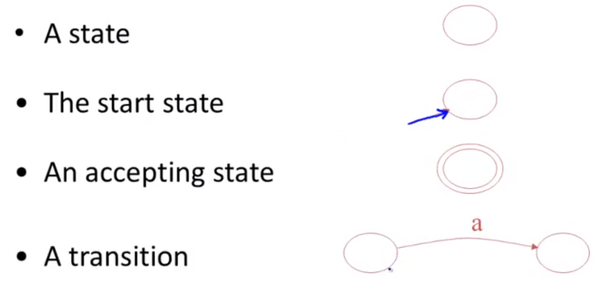

有限自动机是含有$\epsilon$-moves的，这种移动可以在无视输入下跳跃到另一种状态，这就使用对于每一个输入会有多种状态可以选。

### 确定性有限自动机(DFA: Deterministic Finite Automata)和非确定性有限自动机(NFA: Nondeterministic Finite Automata)

DFA的特点：

- 每个状态每个输入一个变迁
- 没有$\epsilon$-moves

NFA的特点：

- 对于给定的状态给定的输入，可能有多个变迁
- 有$\epsilon$-moves

#### 正则转NFA

对于每一类正则表达式，定义一个相等的NFA：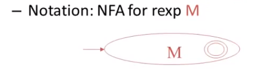

- 对于$\epsilon$：
    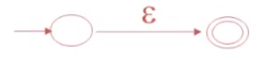

- 对于输入$a$：
    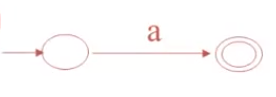

- 对于$AB$：
    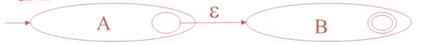

- 对于$A+B$：
    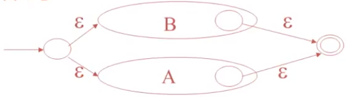

- 对于$A^*$：
    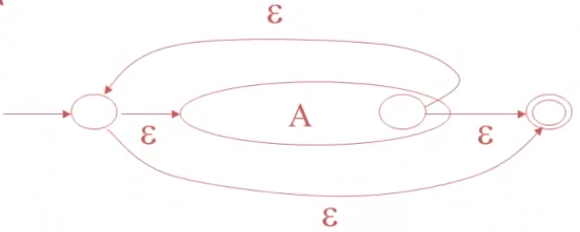

示例：对于正则表达式 $(1+0)*1$，其转换流程如下:

1. 首先绘制$1$和$0$：

    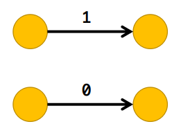

2. 其次绘制$1+0$：

    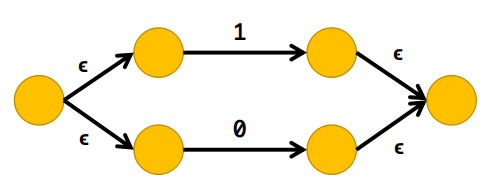

3. 之后绘制$(1+0)*$：

    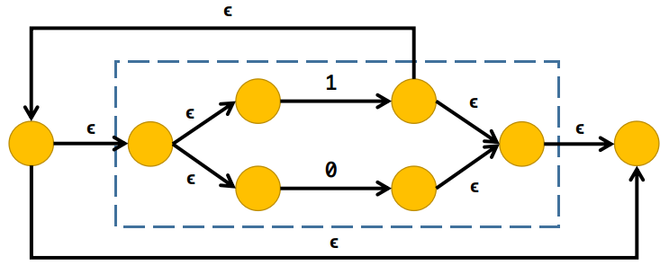

4. 最后绘制$(1+0)*1$：

    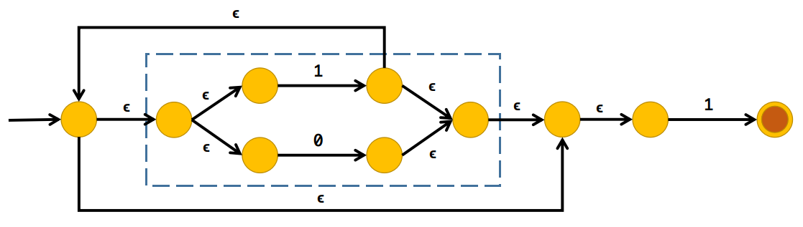

#### NFA转DFA

描述|NFA|DFA
--|--|--
总状态集|$S$|$S^1 \subseteq S$
开始状态集|$s \in S$|$\epsilon-closure(s)$
结束状态集|$F$|$\{X \vert X \cap F \neq \empty  \}$
a变迁|$a(X)=\{y \vert x \in X \cap x \stackrel{a}{\longrightarrow} y\}$|$\epsilon-closure(a(X))$

示例：对于正则表达式 $(1+0)*1$，的NFA图

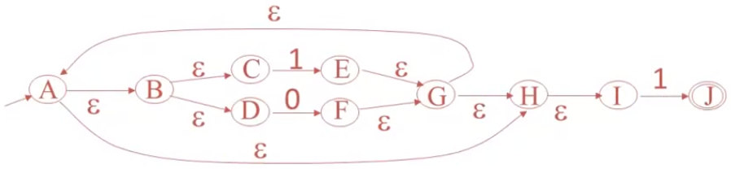

其转换流程如下:

1. 首先确定输入集(该例只有0和1)，然后求出$A^1=\epsilon-closure(A)=\{A,B,C,D,H,I\}$
2. 然后，计算各状态的$\epsilon-closure$集，此处用$m(X,a)$表示$\epsilon-closure(a(X))$

    新状态|输入0|输入1|是否是终态
    --|--|--|--
    $A^1\newline=\{A,B,C,D,H,I\}$|$m(A^1,0)\newline=\{A,B,C,D,F,G,H,I\}\newline=B^1$|$m(A^1,0)\newline=\{A,B,C,D,E,G,H,I,J\}\newline=C^1$|否
    $B^1\newline=\{A,B,C,D,F,G,H,I\}$|$m(B^1,0)\newline=\{A,B,C,D,F,G,H,I\}\newline=B^1$|$m(B^1,1)\newline=\{A,B,C,D,E,G,H,I,J\}\newline=C^1$|否
    $C^1\newline=\{A,B,C,D,E,G,H,I,J\}$|$m(C^1,0)\newline=\{A,B,C,D,F,G,H,I\}\newline=B^1$|$m(C^1,1)\newline=\{A,B,C,D,E,G,H,I,J\}\newline=C^1$|是

3. 根据新的状态转移表绘制DFA：

    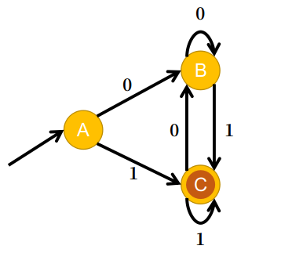

#### DFA转表驱动的DFA实现

一个DFA可以用一个二维表T来实现：

- 第一个维度是状态
- 另一个维度是输入字符
- 对于每一个变迁$S_i\stackrel{a}{\longrightarrow}S_k$，定义$T[i,a]=k$

通过该表实现的状态机的伪代码如下：

```Kotlin
def move(state: Char, input: Char[]): Char {
    // 该函数通过上述二维表，将输入状态在输入字符下转换成新状态
}
val input = inputStr.toCharArray(); // 输入字符
var state = 0; // 相当于开始状态
for(i in 0..input.length) {
    state = move(state, input[i])
}
```

示例：对于正则表达式 $(1+0)*1$，的NFA图

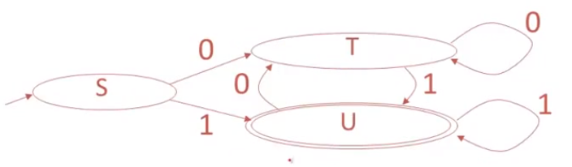

其对应的表如下：

状态|0|1
--|--|--
S|T|U
T|T|U
U|T|U

有时，也会直接将NFA转换成二维表，如：对于$(1+0)*1$对应的NFA,其二维表以$\{\epsilon,0,1\}$和$\{A,B,C,D,E,F,G,H,I,J\}$作为横纵坐标，以状态集作为表内容。

### 正则表达式和有限自动机的缺点

有些重要的语言无法使用正则表达式或有限自动机来表达，比如：$\{(^i)^i|i \ge 0\}$、全1串的长度(但可以表示奇偶性)

## 语法分析

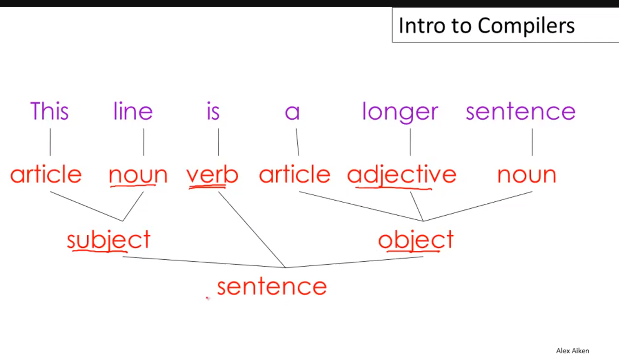

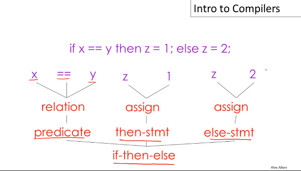

有的编译器会隐含实现parse,程序中没有清晰的语法树代码;有的编译器会将lexicer analysis和parse合并成parse。不过，大部分编译器仍然分别实现这两部分。

词法分析只能识别token,但无法得知该token是否符合语法

### 上下文无法语法

- 终态集：T
- 非终态：N
- 开始标识：S($S \subseteq N$)
- 产生式集：$X \longrightarrow Y_1...Y_N(X \in N \ \cap \ Y_i \in N \cup T \cup {\epsilon})$

上下文无关语法G的语言：$L(G) = \{a_1...a_n | \forall_i \ a_i \in T, \ S \stackrel{*}{\longrightarrow} a_1...a_n \}$，其中$S$是开始标识

如：$E \longrightarrow E+E | E*E | (E) | id$，可以表示：$id$、$id+id$、$id+id*id$、$(id+id)*id$等

### 推导(derivation)

推导是一系列的产生式，一个推导可以被换成一颗树：

- 开始标识是树的根节点
- 对于产生式$X \longrightarrow Y_1...Y_n$，添加子节点$Y_1...Y_n$到节点$X$

示例：对于语法 $E \longrightarrow E+E | E*E | (E) | id$ 和输入字符串 $id*id+id$，我们有如下语法树：

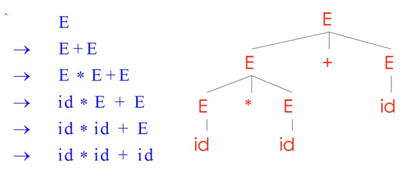

一个语法树有如下性质：

- 叶子节点都是终结符
- 非叶子节点都是非终结符
- 对叶子的中序遍历即是原输入字符串
- 语法树展示了各操作的联系，输入字符串没有

最左推导：在每一步都优先替换最左侧的非终结符
最右推导：在每一步都优先替换最右侧的非终结符

### 歧义

如果一个语法对于某些输入字符串含有不止一个语法树，我们就认为它是歧义的。

## 语义分析

## 优化

## 代码生成
