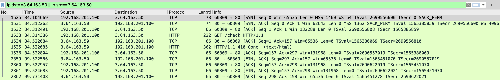

# Http请求跟踪

> 参考：https://xiaolincoding.com/network/1_base/what_happen_url.html
>
> 参考：https://mp.weixin.qq.com/s/uBzCJ6Kr0MZA23QUOo9pAQ

使用POSTMAN通过GET请求`http://www.flashhost.com/check`地址，并通过`Wireshark`捉包分析`HTTP`请求内容

响应如下：

```plaintext
<html>
  <head>
    <meta http-equiv='refresh' content='0; url=http://www.flashhost.com/' />
  </head>
</html>
```

抓包结果如下（`www.flashhost.com`域名的ip为`3.64.163.50`）：



现在主流的HTTP请求都是使用的HTTP/1.1协议，其使用的是TCP/IP协议簇。

## TCP链接的三次握手


1525，1531，1532分别为SYN，SYN+ACK和ACK请求的抓包。

## Http请求和响应


1533为HTTP GET请求`http://www.flashhost.com/check`，因为其传输层协议使用的是TCP协议，所以站在传输层的角度1533是客户端发起的TCP请求，而1534是服务器对1533请求的ACK。

1535是服务器对于1533的HTTP请求给出的响应。同样站在传输层的角度，1535是服务器向客户端发送的TCP请求，而1536是客户端对该TCP请求给出的ACK。

1533的报文详情如下：

```plaintext
0000   00 00 00 00 00 00 11 11 11 11 11 11 08 00 45 00
0010   00 d0 00 00 00 00 40 06 49 a9 c0 a8 c9 64 03 40
0020   a3 32 eb 95 00 50 31 a7 a7 82 d7 e9 ba 56 80 18
0030   08 13 10 40 00 00 01 01 08 0a a0 5e a3 8a 5d 4d
0040   e4 83 47 45 54 20 2f 63 68 65 63 6b 20 48 54 54
0050   50 2f 31 2e 31 0d 0a 55 73 65 72 2d 41 67 65 6e
0060   74 3a 20 50 6f 73 74 6d 61 6e 52 75 6e 74 69 6d
0070   65 2f 37 2e 33 37 2e 30 0d 0a 41 63 63 65 70 74
0080   3a 20 2a 2f 2a 0d 0a 48 6f 73 74 3a 20 77 77 77
0090   2e 66 6c 61 73 68 68 6f 73 74 2e 63 6f 6d 0d 0a
00a0   41 63 63 65 70 74 2d 45 6e 63 6f 64 69 6e 67 3a
00b0   20 67 7a 69 70 2c 20 64 65 66 6c 61 74 65 2c 20
00c0   62 72 0d 0a 43 6f 6e 6e 65 63 74 69 6f 6e 3a 20
00d0   6b 65 65 70 2d 61 6c 69 76 65 0d 0a 0d 0a
```

让我们从数据链路层依次拆包

### 数据链路层

TCP/IP协议簇数据链路层使用的是以太网协议，其协议头总共14个字节，格式如下：


```plaintext
0000   00 00 00 00 00 00 11 11 11 11 11 11 08 00
```

可以看到：

- 目标mac地址为：00:00:00:00:00
- 源mac地址为：11:11:11:11:11
- 协议类型为：0x0800 （即IPv4）

### 网络层

TCP/IP协议簇数据链路层使用的是IP协议，其格式如下（如果没有选项，则首部长度为20个字节）：


```plaintext
0000                                             45 00
0010   00 d0 00 00 00 00 40 06 49 a9 c0 a8 c9 64 03 40
0020   a3 32 后面省略188个字节
```

> 详细可以看：https://juejin.cn/post/7029588451896852517

可以看到：

- 版本：0x4，即版本4
- 首部长度：0x5，即5个32位，总共20个字节
- 服务类型：0x00
- 总长度：0x00d0，即208个字节
- 标识：0x0000
- 标志：0b000
- 片偏移：0b0000000000000
- TTL：0x40，即64
- 协议：0x06，即TCP协议
- 首部校验和：0x49a9
- 源IP地址：0xc0a8c964，即：192.168.201.100
- 目标IP地址：0x0340a332，即：3.64.163.50
- 选项：空。因为首部长度只有20个字节，而前面都就20个字节了，所以没有选项
- 数据：188个字节，总长度208个字节，减去首部长度20个字节。

### 传输层

TCP/IP协议簇数据链路层使用的是TCP协议，其格式如下（如果没有选项，则首部长度为20字节）：


```plaintext
0000                                                  
0010                                                  
0020         eb 95 00 50 31 a7 a7 82 d7 e9 ba 56 80 18
0030   08 13 10 40 00 00 01 01 08 0a a0 5e a3 8a 5d 4d
0040   e4 83 省略156个字节
```

> 详细协议解析可以看https://juejin.cn/post/6958440414336516110

可以看到：

- 源端口号：0xeb95，即60309端口
- 目的端口号：0x0050，即80端口
- 序号：0x31a7a782，即833070978
- 确认序号：0xd7e9ba56，即3622419030
- 首部长度：0x8，即8个32位，总共32个字节，这也意味着选项有32-20=12个字节
- 保留：0b000000
- flag：0b011000，即ACK，PSH
- 窗口大小：0x0813，即2067
- 校验和：0x1040
- 紧急指针：0x0000
- 选项：0x0101080aa05ea38a5d4de483
- 数据：156个字节

对于这里的选项：


包含3个选项：

- 0x01表示 无操作

- 0x01表示  无操作
- 0x 08 0a a05ea38a 5d4de483，表示时间戳：
  - 长度为10
  - 时间戳值为2690556810
  - 时间戳回显应答为1565385859

### 应用层协议

应用层协议即HTTP协议


```plaintext
0000                                                  
0010                                                  
0020                                                  
0030                                                  
0040         47 45 54 20 2f 63 68 65 63 6b 20 48 54 54
0050   50 2f 31 2e 31 0d 0a 55 73 65 72 2d 41 67 65 6e
0060   74 3a 20 50 6f 73 74 6d 61 6e 52 75 6e 74 69 6d
0070   65 2f 37 2e 33 37 2e 30 0d 0a 41 63 63 65 70 74
0080   3a 20 2a 2f 2a 0d 0a 48 6f 73 74 3a 20 77 77 77
0090   2e 66 6c 61 73 68 68 6f 73 74 2e 63 6f 6d 0d 0a
00a0   41 63 63 65 70 74 2d 45 6e 63 6f 64 69 6e 67 3a
00b0   20 67 7a 69 70 2c 20 64 65 66 6c 61 74 65 2c 20
00c0   62 72 0d 0a 43 6f 6e 6e 65 63 74 69 6f 6e 3a 20
00d0   6b 65 65 70 2d 61 6c 69 76 65 0d 0a 0d 0a
```

HTTP协议是超文本传输协议，它使用的是ascii字符而不是字节，所以将上述字节内容翻译为ascii字符：

```plaintext
GET /check HTTP/1.1
User-Agent: PostmanRuntime/7.37.0
Accept: */*
Host: www.flashhost.com
Accept-Encoding: gzip, deflate, br
Connection: keep-alive


```

其中：sp是0x20，cr是0x0d，lf是0x0a。

状态行和消息头的每一行都以0x0d0a结尾，而消息体和消息头之前额外有一个0x0d0a。

可以看到：

- 请求行：
  - 方法：GET
  - URL：/check
  - 版本：HTTP/1.1
- 消息头：
  - User-Agent
  - Accept
  - Host
  - Accept-Encoding
  - Connection
- 消息体：空。因为两个回车换行后没有别的内容

其对应的HTTP协议的响应是1535包，对应的响应内容如下（省略了非HTTP协议的14+20+32=66个字节）：

```plaintext
0000                                                  
0010                                                  
0020                                                  
0030                                                  
0040         48 54 54 50 2f 31 2e 31 20 34 31 30 20 47
0050   6f 6e 65 0d 0a 53 65 72 76 65 72 3a 20 6f 70 65
0060   6e 72 65 73 74 79 0d 0a 44 61 74 65 3a 20 46 72
0070   69 2c 20 31 39 20 41 70 72 20 32 30 32 34 20 30
0080   32 3a 33 30 3a 32 34 20 47 4d 54 0d 0a 43 6f 6e
0090   74 65 6e 74 2d 54 79 70 65 3a 20 74 65 78 74 2f
00a0   68 74 6d 6c 0d 0a 54 72 61 6e 73 66 65 72 2d 45
00b0   6e 63 6f 64 69 6e 67 3a 20 63 68 75 6e 6b 65 64
00c0   0d 0a 43 6f 6e 6e 65 63 74 69 6f 6e 3a 20 6b 65
00d0   65 70 2d 61 6c 69 76 65 0d 0a 0d 0a 37 0d 0a 3c
00e0   68 74 6d 6c 3e 0a 0d 0a 39 0d 0a 20 20 3c 68 65
00f0   61 64 3e 0a 0d 0a 34 64 0d 0a 20 20 20 20 3c 6d
0100   65 74 61 20 68 74 74 70 2d 65 71 75 69 76 3d 27
0110   72 65 66 72 65 73 68 27 20 63 6f 6e 74 65 6e 74
0120   3d 27 30 3b 20 75 72 6c 3d 68 74 74 70 3a 2f 2f
0130   77 77 77 2e 66 6c 61 73 68 68 6f 73 74 2e 63 6f
0140   6d 2f 27 20 2f 3e 0a 0d 0a 61 0d 0a 20 20 3c 2f
0150   68 65 61 64 3e 0a 0d 0a 38 0d 0a 3c 2f 68 74 6d
0160   6c 3e 0a 0d 0a 30 0d 0a 0d 0a
```

将上述字节内容翻译为ascii字符：

```plaintext
HTTP/1.1 410 Gone
Server: openresty
Date: Fri, 19 Apr 2024 02:30:24 GMT
Content-Type: text/html
Transfer-Encoding: chunked
Connection: keep-alive

<html>
  <head>
    <meta http-equiv='refresh' content='0; url=http://www.flashhost.com/' />
  </head>
</html>

```

可以看到：

- 状态行:
  - 版本：HTTP/1.1
  - 状态码：410
  - 短语：Gone
- 消息头:
  - Server
  - Date
  - Content-Type
  - Transfer-Encoding
  - Connection
- 消息体： `<html>....</html>\n`

## TCP链接的四次（三次）挥手

